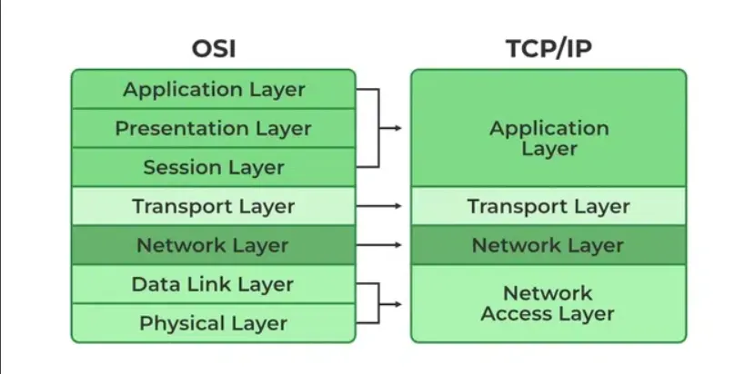
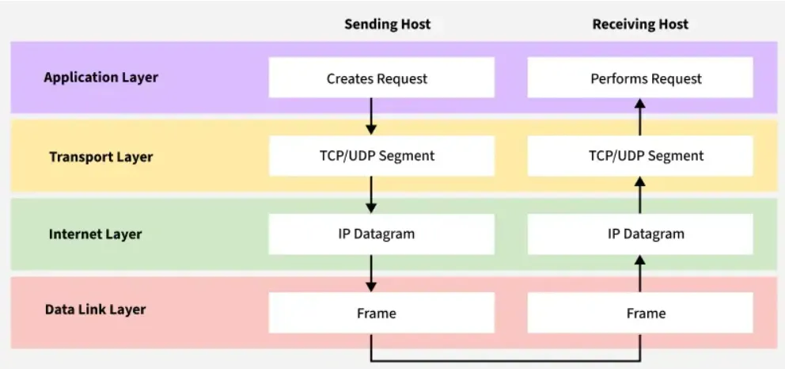
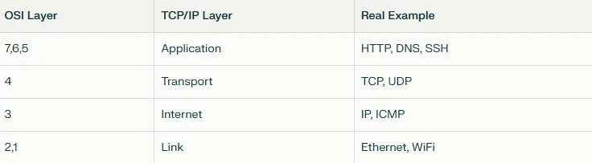
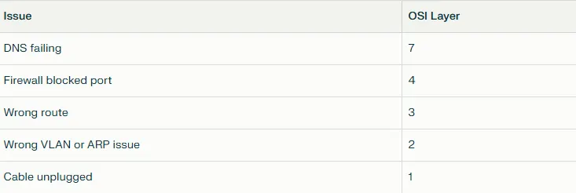
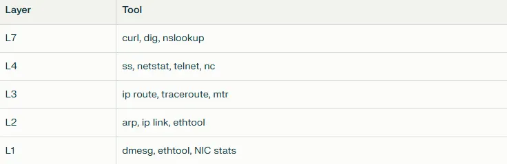
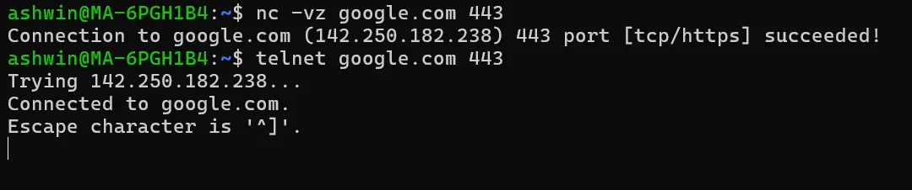
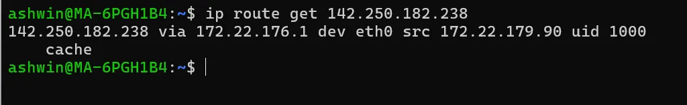
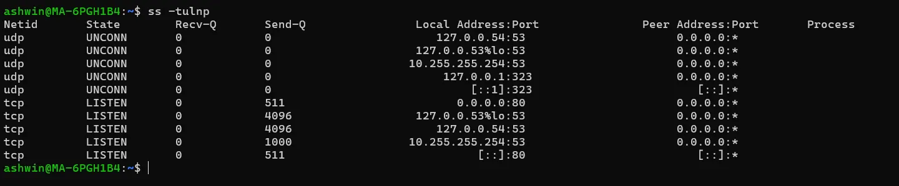

# დღე 1 — OSI მოდელი vs TCP/IP: კომპიუტერული ქსელების ბლუპრინტი (მარტივად ახსნილი)

## რატომ ვიწყებთ აქედან

ყველა ping, ყველა API გამოძახება, ყველა მოთხოვნა, რომელსაც თქვენი Kubernetes pod აკეთებს — მოძრაობს ლეიერებში. მაგრამ უმეტეს ადამიანს OSI მოდელი ცნობილია მხოლოდ როგორც დამახსოვრების პრობლემა გამოცდებზე.

დღეს თქვენ საბოლოოდ გაიგებთ:
* რატომ არსებობს ეს ლეიერები,
* როგორ ემთხვევიან ისინი რეალურ Linux ხელსაწყოებს (ping, tcpdump, ss და ა.შ.)
* და როგორ იყენებენ მათ DevOps/SRE-ები ყოველდღიურად მაშინაც კი, როცა ამის შესახებ არ ფიქრობენ.

ეს არის საფუძველი ყველაფრისთვის, რაც შემდეგ მოდის.



## OSI მოდელი (7 ლეიერი) — ახსნილი როგორც ადამიანისთვის

წარმოიდგინეთ ქსელი როგორც საჩუქრის გაგზავნა სხვა ქალაქში მყოფი ადამიანისთვის. თქვენი შეტყობინება გადის ნაბიჯებს — ყუთი, მისამართი, კურიერი, გზა, მიწოდება, გახსნა.

ანალოგიურად, OSI ჰყოფს ქსელს 7 ნაბიჯად:

```
7. Application (აპლიკაცია)     → თქვენი აპი: HTTP, DNS, gRPC
6. Presentation (პრეზენტაცია)   → მონაცემების ფორმატირება (JSON, TLS)
5. Session (სესია)              → სესიის კონტროლი (დამყარება/შენარჩუნება)
4. Transport (ტრანსპორტი)       → TCP/UDP: პორტის ნომრები, სანდოობა
3. Network (ქსელი)              → IP: მარშრუტიზაცია ქსელებს შორის
2. Data Link (მონაცემთა ბმული)  → MAC, ARP, ფრეიმები ლოკალურ ქსელში
1. Physical (ფიზიკური)          → კაბელები, WiFi სიგნალები, Ethernet
```

## მარტივი ანალოგია

* ლეიერი 7: თქვენ წერთ წერილს
* ლეიერი 6: თქვენ აკონვერტირებთ ხელწერას დაბეჭდილ ფონტში
* ლეიერი 5: თქვენ იწყებთ საუბარს ("გამარჯობა, იქ ხარ?")
* ლეიერი 4: კურიერი უზრუნველყოფს მიწოდებას (TCP) ან აგდებს მას (UDP)
* ლეიერი 3: საფოსტო ოფისი მარშრუტიზაციას ახდენს ქალაქებს შორის
* ლეიერი 2: სორტირების ცენტრი უვლის ლოკალურ მიწოდებას
* ლეიერი 1: გზა, ტრანსპორტი, სიგნალები


## TCP/IP მოდელი (რეალური სამყარო)

OSI მოდელი თეორიულია. TCP/IP არის ის, რასაც Linux, DevOps და ინტერნეტი რეალურად იყენებენ.

```
4. Application (აპლიკაცია)     → HTTP, DNS, TLS, SSH
3. Transport (ტრანსპორტი)      → TCP, UDP
2. Internet (ინტერნეტი)        → IP, ICMP, ARP
1. Link/Network (ბმული/ქსელი)  → Ethernet, WiFi დრაივერები
```




## OSI vs TCP/IP (სწრაფი რუკა)



## რატომ უნდა ზრუნავდნენ DevOps და SRE-ები

რადგან ყველა გაუმართაობის დებაგის სესია ძირითადად არის:
"რომელი ლეიერი გაფუჭებულია?"

### მაგალითები:



Linux ხელსაწყოები პირდაპირ ემთხვევა ამ ლეიერებს:



## რეალური DevOps მაგალითი

**"ჩემს pod-ს არ შეუძლია google.com-ის მიღწევა"**

გაყევით ლეიერებს:

### ლეიერი 7 — მუშაობს DNS?

```bash
dig google.com
nslookup google.com
```


### ლეიერი 4 — ნებადართულია TCP?

```bash
nc -vz google.com 443
telnet google.com 443
```



### ლეიერი 3 — default route? NAT?

```bash
ip route get 142.250.182.238
```



### ლეიერი 2 — ARP რეზოლუცია?

```bash
ip neigh
```

ქსელური პრობლემების 99% შეიძლება დადებაგდეს ამ ნაბიჯებით.

## სასარგებლო Linux ბრძანებები (დღე 1)

### სრული ქსელური სტეკის ნახვა:

```bash
ip a
ip r
ip link
```

### აქტიური კავშირების ნახვა:

```bash
ss -tulnp
```



### DNS ტესტირება:

```bash
dig google.com
nslookup google.com
```

### მარშრუტის ტრასირება ინტერნეტში:

```bash
mtr google.com
```

## სწრაფი შეჯამება

* OSI არის სასწავლო მოდელი, TCP/IP არის რეალური სამყარო.
* L7 → აპები, L4 → პორტები, L3 → IP, L2 → Ethernet, L1 → სიგნალები.
* DevOps/SRE დებაგი = შემოწმება, რომელი ლეიერი გაფუჭდა.
* Linux ხელსაწყოები სრულყოფილად ემთხვევა ლეიერებს.

## მომავალი (დღე 2)

ხვალ ჩავუღრმავდებით:
**დღე 2 — MAC, IP და პორტები: ინტერნეტის იდენტიფიკაციის სისტემა**