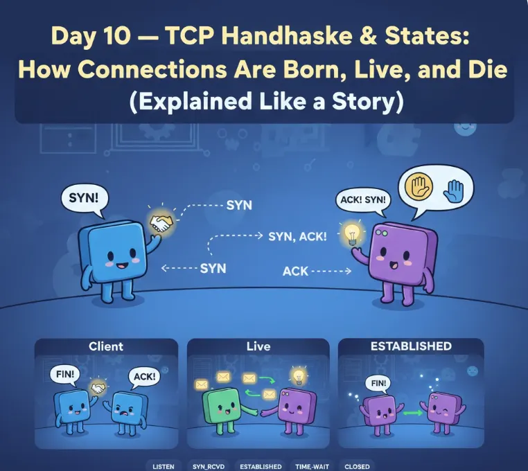
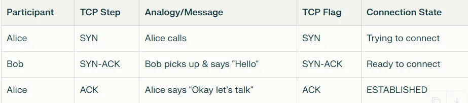
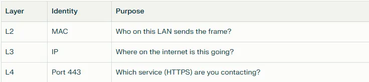
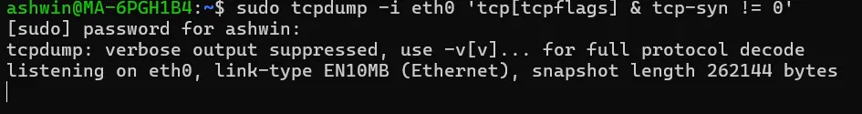
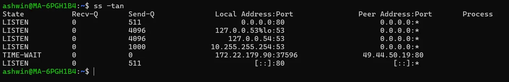
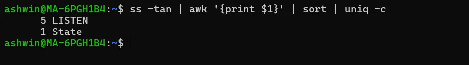
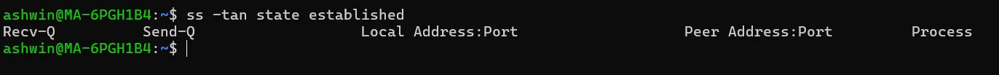

# დღე 10 — TCP Handshake & States: როგორ იბადებიან, ცხოვრობენ და კვდებიან კავშირები (ახსნილია როგორც ისტორია)

ღრმა ჩაძირვა, რომელიც გაარკვევს SYN, SYN-ACK, FIN, TIME_WAIT, CLOSE_WAIT, RST და მეტს — ანალოგიებით, ნაკადის დიაგრამებით და რეალური SRE შემთხვევებით.



## რატომ იმსახურებს TCP-მ მთელი დღე

TCP არის ერთ-ერთი ყველაზე მნიშვნელოვანი პროტოკოლი, რაც ოდესმე იქნა გამოგონებული.

ყოველ ჯერზე, როცა თქვენ:
- ხსნით ვებსაიტს
- უძახებთ REST API-ს
- უკავშირდებით მონაცემთა ბაზას
- SSH-ით შედიხართ სერვერზე
- აგზავნით POST-ს მიკროსერვისზე
- აგზავნით ლოგებს Elasticsearch-ში
- იყენებთ Kubernetes სერვისებს
- საუბრობთ ტვირთის გამანაწილებელთან

**თქვენ ეყრდნობით TCP-ს.**

მაგრამ უმეტესი ინჟინერი არასოდეს ესმის სრულად:
- როგორ იწყება TCP კავშირები
- როგორ სრულდება ისინი
- რატომ იჭერს ისინი
- რატომ არსებობს TIME_WAIT
- რატომ ხდება CLOSE_WAIT
- როგორ ერევიან ფაირვოლები
- რა არის SYN flood-ები

დღეს გაქვთ სრული სიცხადე — ისტორიისებრი ახსნით.

დავიწყოთ.

## ნაწილი 1 — TCP არის როგორც ტელეფონის ზარი

იდეალური ანალოგია კავშირების ასახსნელად.

წარმოიდგინეთ ორი ადამიანი: ელისი და ბობი.

- **ელისი = კლიენტი**
- **ბობი = სერვერი**

როცა ელისს სურს ესაუბროს ბობს, მან უნდა:
1. დარეკოს ბობს
2. დაელოდოს რომ ბობი შეიყვანოს
3. გაიგოს რომ ბობმა თქვა გამარჯობა
4. მაშინ საუბარი იწყება

**ეს არის TCP 3-გზიანი handshake.**

ახლა მოდით შევადაროთ ანალოგია:



## ნაწილი 2 — TCP 3-გზიანი Handshake (კავშირის დაბადება)

მოდით დეტალურად ვნახოთ.

### ნაბიჯი 1 — SYN (კლიენტი → სერვერი)

კლიენტი აგზავნის SYN-ს:
```
SYN = მინდა ვისაუბრო. ხარ აქ?
Sequence number = X
```

### ნაბიჯი 2 — SYN-ACK (სერვერი → კლიენტი)

სერვერი პასუხობს:
```
SYN-ACK = დიახ, აქ ვარ. მოდი ვისაუბროთ.
Acknowledgment = X+1
ჩემი sequence number = Y
```

### ნაბიჯი 3 — ACK (კლიენტი → სერვერი)

კლიენტი ადასტურებს:
```
ACK = კარგი, დავიწყოთ.
Acknowledgment = Y+1
```

**კავშირი ახლა არის: ESTABLISHED**

### ASCII დიაგრამა — TCP Handshake

```
კლიენტი                                     სერვერი
  |                                            |
  |------------ SYN (seq = X) ---------------->|
  |                                            |
  |<------- SYN-ACK (seq = Y, ack = X+1) ------|
  |                                            |
  |------------ ACK (ack = Y+1) -------------->|
  |                                            |
კავშირი დამყარებულია ------------------------+
```

## ნაწილი 3 — 4-გზიანი Teardown (როგორ კვდება TCP კავშირები)

TCP teardown არ არის 3-გზიანი.
ეს არის 4 ნაბიჯი.

**რატომ?**
რადგან ყველა მხარე დამოუკიდებლად წყვეტს გაგზავნას.

### ანალოგია:

ტელეფონის ზარის დასრულება:
1. თქვენ ამბობთ "ნახვამდის, მე დავასრულე საუბარი."
2. მეორე პირი ამბობს "კარგი, მე კიდევ ცოტა ვისაუბრებ."
3. ისინი ამთავრებენ საუბარს.
4. ისინი ამბობენ "ახლა მეც დავასრულე."
5. ზარი სრულდება.

მოდით შევადაროთ TCP-ს.

### ნაბიჯი 1 — FIN კლიენტისგან

```
მე დავასრულე მონაცემების გაგზავნა.
```
კლიენტი შედის: **FIN_WAIT_1**

### ნაბიჯი 2 — ACK სერვერისგან

```
მივიღე შენი FIN.
```
კლიენტი შედის: **FIN_WAIT_2**
სერვერი შედის: **CLOSE_WAIT**

### ნაბიჯი 3 — FIN სერვერისგან

```
მეც დავასრულე გაგზავნა.
```

### ნაბიჯი 4 — ACK კლიენტისგან

```
მივიღე შენი FIN.
```
კლიენტი შედის: **TIME_WAIT**

### ASCII დიაგრამა — TCP Teardown

```
კლიენტი                                     სერვერი
  |                                            |
  |------------ FIN -------------------------->|
  |                                            |
  |<----------- ACK ---------------------------|
  |                                            |
(კლიენტი FIN_WAIT_2-ში)    (სერვერი CLOSE_WAIT-ში)
  |                                            |
  |<----------- FIN ---------------------------|
  |                                            |
  |------------ ACK -------------------------->|
  |                                            |
(კლიენტი შედის TIME_WAIT-ში)  (სერვერი CLOSED)
```



## ნაწილი 4 — რატომ ხდება TIME_WAIT (მარტივად ახსნილი)

TIME_WAIT არის ერთ-ერთი ყველაზე გაუგებარი TCP მდგომარეობა.

**TIME_WAIT არ არის ბაგი.**
**ეს არის უსაფრთხოების მექანიზმი.**

TIME_WAIT = "მომე ცოტა დავლოდო სრულიად დახურვამდე იმ შემთხვევაში თუ ძველი პაკეტები ჯერ კიდევ დახეტიალობენ ქსელში."

წარმოიდგინეთ რომ ასრულებთ ტელეფონის ზარს, მაგრამ რჩებით ჩუმად 1 წუთით რათა დარწმუნდეთ რომ მეორე პირმა არ თქვა "გამარჯობა? ხარ ჯერ აქ?"

**ნაგულისხმევი ხანგრძლივობა:**
```
2 × Maximum Segment Lifetime  
~ 60 წამი
```

### რატომ არსებობს TIME_WAIT:

1. ხელს უშლის დაგვიანებული დუბლიკატი პაკეტებს
2. უზრუნველყოფს სწორ კავშირის რეციკლირებას
3. თავიდან აცილებს დაბნეულობას ახალ და ძველ კავშირებს შორის

**TIME_WAIT ᲧᲝᲕᲔᲚᲗᲕᲘᲡ ხდება იმ მხარეზე, რომელიც აგზავნის საბოლოო ACK-ს.**

## ნაწილი 5 — რატომ ხდება CLOSE_WAIT (და რატომ არის საშიში)

CLOSE_WAIT ხდება როცა:
1. დისტანციურმა მხარემ გაგზავნა FIN
2. თქვენმა აპლიკაციამ დაადასტურა ის
3. **მაგრამ თქვენმა აპლიკაციამ არ დახურა სოკეტი**

### სიმპტომები:

- ბევრი CLOSE_WAIT ჩანაწერი
- მაღალი CPU
- მეხსიერების გაჟონვა
- File descriptors ამოწურული

**ეს არის აპლიკაციის ბაგი, არა kernel-ის პრობლემა. აპლიკაციამ აშკარად უნდა დახუროს სოკეტები.**

## ნაწილი 6 — TCP State Machine (ვიზუალურად ახსნილი)

```
           +---------+
           | LISTEN  |
           +----+----+
                |
                | SYN
                |
                v
           +---------+
           | SYN_RCVD|
           +----+----+
                |
                | ACK
                |
                v
           +-----------+
           |ESTABLISHED|
           +-----+-----+
                |  |
    FIN <-------+  +---------> FIN
    (peer-სგან)             (ჩვენგან)
                |  |
                v  v
    +-----------+  +------------+
    |CLOSE_WAIT |  | FIN_WAIT_1 |
    +-----------+  +------------+
                      |
                      | ACK
                      v
                 +----------+
                 |FIN_WAIT_2|
                 +----------+
                      |
                      | FIN
                      v
                 +---------+
                 |TIME_WAIT|
                 +---------+
```

**არ დაიმახსოვროთ — გაიგეთ ისტორია.**

## ნაწილი 7 — რა ხდება SYN Flood შეტევაში?

**SYN flood** = თავდამსხმელი აგზავნის ათასობით SYN პაკეტს, მაგრამ არასოდეს პასუხობს ACK-ით.

სერვერი იჭერს: **SYN_RECV**
- მეხსიერება იავსება.
- სერვერს არ შეუძლია მიიღოს ახალი რეალური კავშირები.

### შემსუბუქება:

- SYN cookies
- rate limiting
- ფაირვოლები
- ტვირთის გამანაწილებლები

**Cloudflare, AWS და NGINX ძალიან იყენებენ SYN cookies-ს.**

## ნაწილი 8 — როგორ ერევიან ფაირვოლები Handshakes-ში

ფაირვოლები ხშირად აგდებენ:
- SYN
- SYN-ACK
- ACK
- FIN

### მაგალითი:

თუ SYN-ACK დაბლოკილია:
```
კლიენტი: SYN → სერვერი  
სერვერი: SYN-ACK → (დაბლოკილი)  
კლიენტი: თავიდან აგზავნის SYN… ცდილობს… timeout
```

ეს ჩნდება როგორც:
```
Connection timed out
```

**კლასიკური security group პრობლემა AWS/GCP-ში.**

## ნაწილი 9 — რეალური DevOps/SRE დებაგინგის სცენარები

### სცენარი 1 — "ჩემი სერვისი იჭერს CLOSE_WAIT-ში"

**მიზეზი:**
თქვენი აპლიკაცია არ უძახებს `close()`-ს.

**გამოსწორება:**
- შეამოწმეთ აპლიკაციის ლოგიკა
- დაამატეთ graceful shutdown
- გაზარდეთ FD ლიმიტები

**შეამოწმეთ სოკეტები:**
```bash
ss -tan | grep CLOSE_WAIT
```

### სცენარი 2 — "ძალიან ბევრი TIME_WAIT კავშირი"

**მიზეზები:**
- მაღალი კავშირის ცვალებადობა
- მოკლევადიანი კავშირები
- keep-alive გამოუყენებელი

**გამოსწორება:**
- ჩართეთ HTTP keep-alive
- გამოიყენეთ connection pooling
- დაარეგულირეთ TIME_WAIT პარამეტრები (ფრთხილად)

### სცენარი 3 — "ჩემი სერვერი გადატვირთულია SYN_RECV-ით"

**მიზეზი:**
- SYN flood
- ფაირვოლი/reverse proxy პრობლემები

**შეამოწმეთ:**
```bash
ss -tan | grep SYN_RECV
```

**გამოსწორება:**
ჩართეთ SYN cookies:
```bash
sysctl -w net.ipv4.tcp_syncookies=1
```

### სცენარი 4 — "კლიენტი უსასრულოდ ცდილობს მაგრამ სერვერი კარგად მუშაობს"

**სავარაუდო მიზეზი:**
- ფაირვოლი ბლოკავს SYN-ACK-ს
- ცუდი security group
- მარშრუტიზაციის ასიმეტრია

**დებაგი:**
```bash
tcpdump -i eth0 'tcp[tcpflags] & tcp-syn != 0'
```


### სცენარი 5 — "კავშირები იჭერენ LAST_ACK-ში"

**მიზეზი:**
- კლიენტი არ ასრულებს close handshake-ს
- ქსელის drop FIN-ის დროს
- აპლიკაციის არასწორი მოქმედება

### სცენარი 6 — "მონაცემთა ბაზის კავშირები არასოდეს თავისუფლდება"

**მიზეზი:**
- კლიენტ აპლიკაცია არ ხურავს სოკეტებს
- ან სერვერი არ აგზავნის FIN-ს

## ნაწილი 10 — სასარგებლო Linux ბრძანებები (დღე 10)

### ყველა TCP კავშირის ნახვა
```bash
ss -tan
```


### კავშირების დათვლა მდგომარეობის მიხედვით
```bash
ss -tan | awk '{print $1}' | sort | uniq -c
```


### დამყარებული კავშირების ნახვა
```bash
ss -tan state established
```


### შემოწმება syn flood-ზე
```bash
ss -tan | grep SYN_RECV
```

### handshake-ის რეალურ დროში თვალყურის დევნება
```bash
tcpdump -nn 'tcp[tcpflags] & (tcp-syn|tcp-fin|tcp-ack) != 0'
```

## შეჯამება (დღე 10)

დღეს ისწავლეთ:
- ✅ TCP-ის 3-გზიანი handshake
- ✅ 4-გზიანი teardown
- ✅ რატომ არსებობს TIME_WAIT
- ✅ რატომ არის CLOSE_WAIT საშიში
- ✅ TCP state machine
- ✅ SYN floods & SYN cookies
- ✅ როგორ არღვევენ ფაირვოლები handshakes-ს
- ✅ SRE დებაგი გაჭედილი კავშირებისა
- ✅ ინსტრუმენტები როგორიცაა `tcpdump`, `ss` და `netstat`

**TCP არის თანამედროვე ინტერნეტ კომუნიკაციის საფუძველი.**
**მისი გაგება გხდით უკეთეს DevOps-ს, SRE-ს, backend ინჟინერს ან cloud არქიტექტორს.**

## მომდევნო (დღე 11)

**UDP vs TCP: რეალური განსხვავებები ახსნილი (DevOps გამოყენების შემთხვევებით)**

ავხსნით:
- 🔹 სანდოობა
- 🔹 დალაგება
- 🔹 სიჩქარე
- 🔹 ზედნადები
- 🔹 გამოყენების შემთხვევები (DNS, VoIP, streaming, QUIC…)
- 🔹 რატომ იყენებს Kubernetes UDP-ს DNS-ისთვის
- 🔹 UDP multiplexing ტვირთის გამანაწილებლებში
- 🔹 როდის აირჩიოთ TCP vs UDP
- 🔹 პაკეტის სტრუქტურის განსხვავებები
- 🔹 UDP ტრაფიკის დებაგი

**ეს იქნება კიდევ ერთი ფანტასტიკური თავი.**