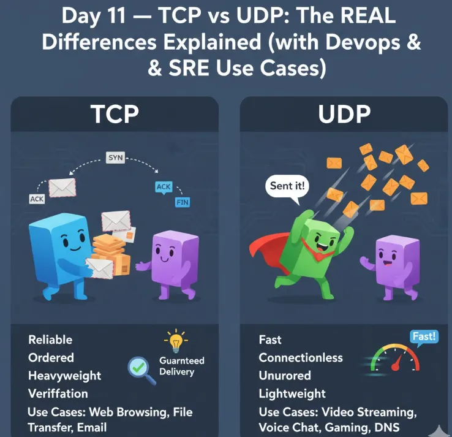
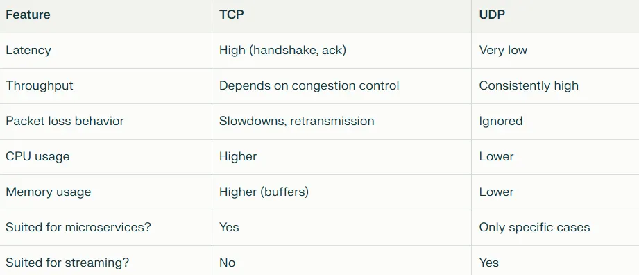
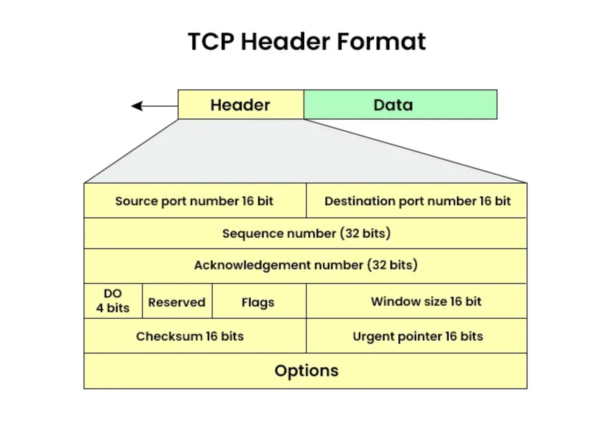
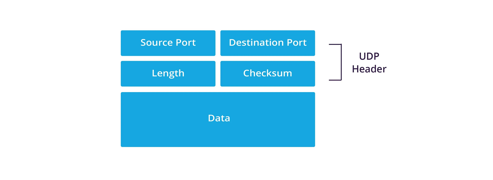
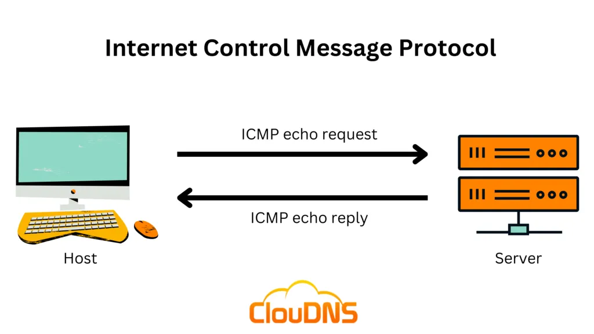
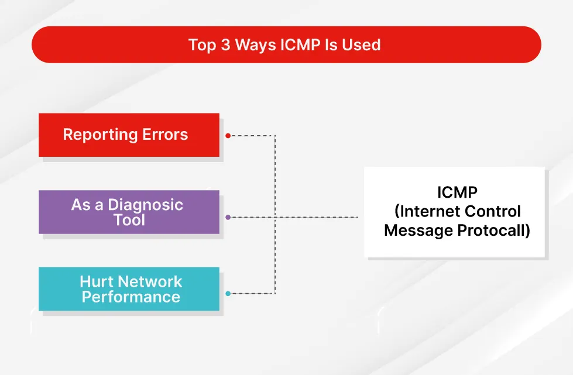
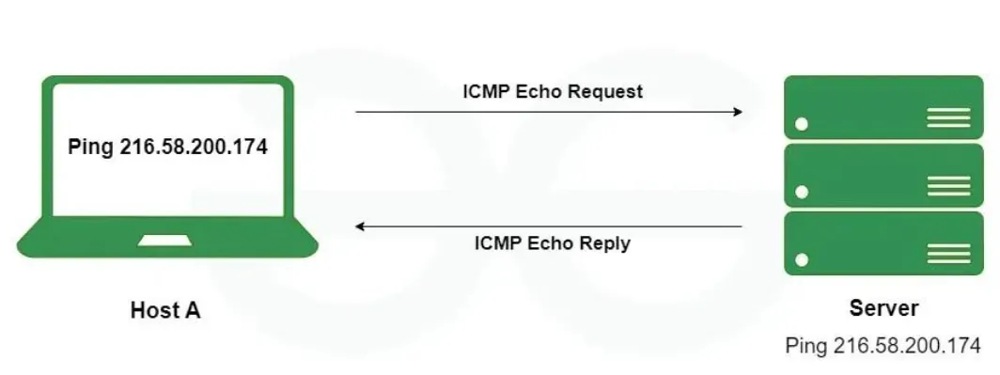
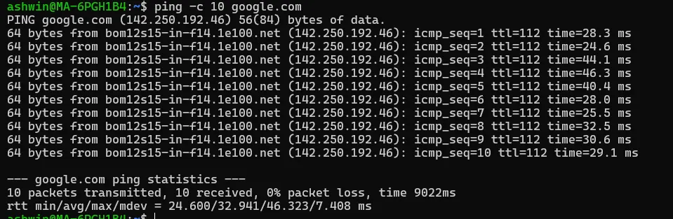

# დღე 11 — TCP vs UDP: რეალური განსხვავებები ახსნილი (DevOps & SRE გამოყენების შემთხვევებებით)

გრძელი, მკვეთრი, ღრმად პრაქტიკული სახელმძღვანელო მსოფლიოში ორი ყველაზე მნიშვნელოვანი ტრანსპორტული პროტოკოლის გასაგებად.



## რატომ არის ეს თემა მნიშვნელოვანი

TCP და UDP არის ტრანსპორტული შრის (Layer 4) ორი სვეტი.
ყველა პაკეტი, რომელსაც ინტერნეტით აგზავნით, იყენებს ერთ-ერთ მათგანს.

მაგრამ უმეტესობა ფიქრობს:
- TCP = სანდო
- UDP = სწრაფი
- TCP = კავშირი
- UDP = კავშირის გარეშე

მაგრამ ეს ძალიან გამარტივებულია.

დღეს საბოლოოდ გაიგებთ:
- როგორ მუშაობენ ისინი რეალურად
- რატომ არის ერთი უფრო ნელი
- რატომ არის ერთი უფრო სწრაფი
- როგორ იყენებს Kubernetes მათ
- როგორ არის დამოკიდებული DNS UDP-ზე
- რატომ იყენებს QUIC UDP-ს
- პაკეტის სტრუქტურის განსხვავებები
- რეალური SRE დებაგის ბრძანებები
- წარმადობის კომპრომისები

ეს არის ერთ-ერთი ყველაზე მნიშვნელოვანი თავი DevOps-ისთვის, SRE-ებისთვის, cloud ინჟინერებისთვის, პლატფორმის ინჟინერებისთვის და backend დეველოპერებისთვის.

## ნაწილი 1 — TCP vs UDP ერთ წინადადებაში

**TCP** = სანდო მიწოდება ბევრი წესით.
**UDP** = საუკეთესო მცდელობის მიწოდება თითქმის წესების გარეშე.

მოდით სწორად ავხსნათ ეს.

### ანალოგია: TCP არის ტელეფონის ზარი, UDP არის ღია ბარათი

#### TCP (ტელეფონის ზარი)

- თქვენ რეკავთ
- ადამიანი იღებს
- თქვენ საუბრობთ
- თქვენ ამბობთ "ნახვამდის"
- ისინი ადასტურებენ
- ყველაფერი თანმიმდევრობაშია
- ორივე მხარე მუდმივად ეთანხმება

#### UDP (ღია ბარათი)

- თქვენ ჩააგდებთ საფოსტო ყუთში
- შეიძლება მივიდეს
- შეიძლება არ მივიდეს
- დადასტურება არ არის
- თანმიმდევრობა არ არის
- გარანტია არ არის

## ნაწილი 2 — სანდოობა

### TCP გარანტიას იძლევა მიწოდებაზე

TCP უზრუნველყოფს:
- ყველა პაკეტი მიღებული
- თავიდან გაიგზავნება თუ დაკარგული
- მიწოდებული თანმიმდევრობაში
- დაზიანების გარეშე
- ნაკადის კონტროლი
- გადატვირთვის კონტროლი

თუ რაღაც არასწორია → TCP ასწორებს მას.

### UDP არ იძლევა გარანტიას მიწოდებაზე

UDP აგზავნის პაკეტებს და არასოდეს ამოწმებს მოვიდა თუ არა.

**რატომ?**
რადგან ზოგჯერ სანდოობა არ არის მნიშვნელოვანი.

**მაგალითი:**
ვიდეო ზარებში:
- ერთი კადრის დაკარგვა არ აქვს მნიშვნელობა
- მაგრამ retransmission-ის დალოდება შექმნის lag-ს

## ნაწილი 3 — თანმიმდევრობა

### TCP

პაკეტები უნდა მოვიდეს ზუსტად იმ თანმიმდევრობით, როგორც გაიგზავნა.
თუ პაკეტი 5 მოვა პაკეტ 4-მდე → TCP ბუფერს აკეთებს პაკეტ 5-ს → ელოდება 4-ს → შემდეგ მიაწოდებს.

ეს ზრდის:
- დაგვიანებას
- მეხსიერების გამოყენებას

მაგრამ უზრუნველყოფს სისწორეს.

### UDP

თანმიმდევრობა საერთოდ არ არის. პაკეტი 5 შეიძლება მოვიდეს პაკეტ 1-მდე → აპლიკაციამ უნდა გაუმკლავდეს მას.

## ნაწილი 4 — სიჩქარე

### TCP უფრო ნელია რადგან:

- 3-გზიანი handshake
- Retransmissions
- ACKs
- ნაკადის კონტროლი
- გადატვირთვის კონტროლი
- დალაგებული მიწოდება
- TIME_WAIT მდგომარეობა
- უფრო დიდი header (20 ბაიტი)

### UDP უფრო სწრაფია რადგან:

- Handshake არ არის
- თავიდან გაგზავნა არ არის
- ACKs არ არის
- თანმიმდევრობა არ არის
- Header პატარაა (8 ბაიტი)
- ნაკლები overhead
- კავშირის მდგომარეობა არ არის

## ნაწილი 5 — Overhead

### TCP Header (20–60 ბაიტი)

შეიცავს:
- Sequence number
- Acknowledgment
- Flags (SYN, ACK, FIN…)
- Window size
- Options

### UDP Header (8 ბაიტი)

შეიცავს მხოლოდ:
- წყაროს პორტი
- დანიშნულების პორტი
- სიგრძე
- Checksum

**UDP არის მინიმალისტური.**

## ნაწილი 6 — გამოყენების შემთხვევები (ძალიან პრაქტიკული)

### სად გამოიყენება TCP?

- HTTP / HTTPS
- REST APIs
- SSH
- MySQL / Postgres
- Kafka
- ფაილის გადაცემა
- ყველაფერი, რომელიც მოითხოვს სისწორეს

### სად გამოიყენება UDP?

- DNS
- DHCP
- VoIP
- ვიდეო სტრიმინგი
- Zoom/Meet
- ონლაინ თამაშები
- QUIC (HTTP/3)
- ცოცხალი სტრიმინგი
- Syslog UDP-ზე
- რეალურ დროში სენსორის მონაცემები

**UDP ირჩევა როცა:**
- სიჩქარე > სანდოობა
- დაგვიანება > სისწორე
- დაკარგვის ტოლერანტობა არსებობს

## ნაწილი 7 — რატომ იყენებს Kubernetes UDP-ს DNS-ისთვის

Kubernetes DNS (CoreDNS) იყენებს:
```
UDP პორტი 53
```

**რატომ?**

რადგან:
- DNS მოთხოვნები პატარაა
- DNS ელოდება გარკვეულ დაკარგვას
- Retries ჩაშენებულია
- UDP უფრო სწრაფია
- ნაკლები დაგვიანება კლასტერში
- კავშირის overhead არ არის
- ბევრი DNS მოთხოვნა pod-ზე → უფრო სწრაფი

**თუ DNS TCP-ზე იყო → Kubernetes ნელი იქნებოდა.**

## ნაწილი 8 — QUIC (თანამედროვე HTTP/3) გადის UDP-ზე (რატომ?)

QUIC (გამოიყენება HTTP/3-ში) იყენებს UDP-ს TCP-ს ნაცვლად.

**მიზეზები:**

- UDP საშუალებას იძლევა user-space კავშირის მენეჯმენტი
- თავიდან აცილებს TCP handshake დაგვიანებას
- საშუალებას იძლევა multiplexing head-of-line blocking-ის გარეშე
- უფრო სწრაფი კავშირის აღდგენა
- მობილური ქსელის მეგობრული

**Google აღმოაჩინა:**

QUIC UDP-ზე უფრო სწრაფია ვიდრე TCP + TLS ერთად.

## ნაწილი 9 — UDP ტვირთის გამანაწილებლებში (Multiplexing)

UDP არის stateless.

ტვირთის გამანაწილებლებს ეს უყვართ რადგან:
- კავშირის ცხრილი არ არის
- TIME_WAIT არ არის
- CLOSE_WAIT არ არის
- სწრაფი სესიის გადართვა
- მაღალი throughput

**ELB, NLB, Envoy და Istio ყველა შეუძლია UDP-ს მარშრუტიზაცია.**

**გამოყენების შემთხვევები:**
- DNS
- syslog
- მეტრიკები
- service discovery
- თამაშის სერვერები
- მედია სტრიმინგი

## ნაწილი 10 — წარმადობის განსხვავებები (ძალიან პრაქტიკული)



თუ თქვენს სისტემას სჭირდება:
- ⚡ ულტრა-დაბალი დაგვიანება
- 🎥 ცოცხალი სტრიმინგი
- 📡 რეალურ დროში ჩატი
- 🎮 თამაშები
- 🏎️ მაღალი throughput

→ **UDP იგებს.**

თუ თქვენს სისტემას სჭირდება:
- 🔐 სისწორე
- 📄 თანმიმდევრობა
- ⚙️ სანდოობა
- 📦 თანმიმდევრულობა

→ **TCP იგებს.**

## ნაწილი 11 — პაკეტის სტრუქტურა

### TCP პაკეტის სტრუქტურა:

```
+------------------+
| IP Header        |
+------------------+
| TCP Header (20B) |
+------------------+
| მონაცემები       |
+------------------+
```

### UDP პაკეტის სტრუქტურა:

```
+------------------+
| IP Header        |
+------------------+
| UDP Header (8B)  |
+------------------+
| მონაცემები       |
+------------------+
```



**TCP header ბევრად უფრო დიდია → მეტი overhead.**

## ნაწილი 12 — UDP ტრაფიკის დებაგი (SRE უნარები)

### გამოიყენეთ tcpdump:

```bash
tcpdump -i eth0 udp
```


### დებაგი DNS:

```bash
tcpdump -i eth0 port 53
```

### შეამოწმეთ მოვიდა თუ არა პაკეტები:

```bash
tcpdump -i eth0 udp and src host <ip>
```

### გადაიღეთ მხოლოდ headers:

```bash
tcpdump -vv udp
```

### შეამოწმეთ ღია UDP სოკეტები:

```bash
ss -lun
```


### შეამოწმეთ listening პორტები:

```bash
ss -tuln
```


### შეამოწმეთ პროცესები:

```bash
sudo lsof -i udp
```


## ნაწილი 13 — როდის გამოიყენოთ TCP vs UDP (გადაწყვეტილების სახელმძღვანელო)

### აირჩიეთ TCP როცა გჭირდებათ:

✔ სისწორე
✔ თანმიმდევრობა
✔ სანდოობა
✔ სტაბილური throughput
✔ idempotent ქცევა

**მაგალითები:**
- DB კომუნიკაცია
- APIs
- Message queues
- SSH
- ფაილის ატვირთვები
- გადახდის სისტემები

### აირჩიეთ UDP როცა გჭირდებათ:

✔ დაბალი დაგვიანება
✔ მაღალი throughput
✔ არ გაინტერესებთ პაკეტის დაკარგვა
✔ რეალურ დროში ქცევა
✔ stateless კომუნიკაცია

**მაგალითები:**
- DNS
- ცოცხალი ვიდეო
- თამაშები
- QUIC
- ტელემეტრია
- Heartbeats
- IoT

## შეჯამება (დღე 11)

დღეს ისწავლეთ:
- ✅ TCP = სანდო, ცოტა ნელი, დალაგებული
- ✅ UDP = სწრაფი, მარტივი, არასანდო
- ✅ TCP handshake → overhead
- ✅ UDP → მინიმალური 8-ბაიტიანი header
- ✅ UDP გამოიყენება DNS, VoIP, streaming, QUIC-სთვის
- ✅ TCP გამოიყენება APIs, databases, SSH-სთვის
- ✅ Kubernetes იყენებს UDP-ს კლასტერის DNS-ისთვის
- ✅ QUIC უსწრებს TCP-ს თანამედროვე ვებისთვის
- ✅ წარმადობის განსხვავებები
- ✅ როგორ დებაგდება UDP ტრაფიკი
- ✅ რეალური DevOps/SRE გავლენა

**ამის გაგება გეხმარებათ შექმნათ:**
- უკეთესი მიკროსერვისები
- უკეთესი Kubernetes კლასტერები
- უკეთესი load balancing
- უკეთესი დებაგის workflow-ები
- უკეთესი წარმადობის ოპტიმიზაცია

## მომდევნო (დღე 12)

**Netfilter, iptables & nftables — Linux-ის Firewall ტვინი**

ისწავლით:
- როგორ ფილტრავს Linux-ი პაკეტებს
- Connection tracking
- NAT (SNAT, DNAT, MASQUERADE)
- iptables ცხრილები & ჯაჭვები
- nftables (თანამედროვე ჩანაცვლება)
- როგორ იყენებენ CNI პლაგინები iptables-ს
- დებაგი მოგდებული პაკეტებისა
- NAT წესების სია
- რეალური SRE შემთხვევები: "რატომ ვერ აღწევს ჩემი pod-ი ინტერნეტს?"

**ეს იქნება ᲛᲐᲡᲘᲣᲠᲘ თავი.**