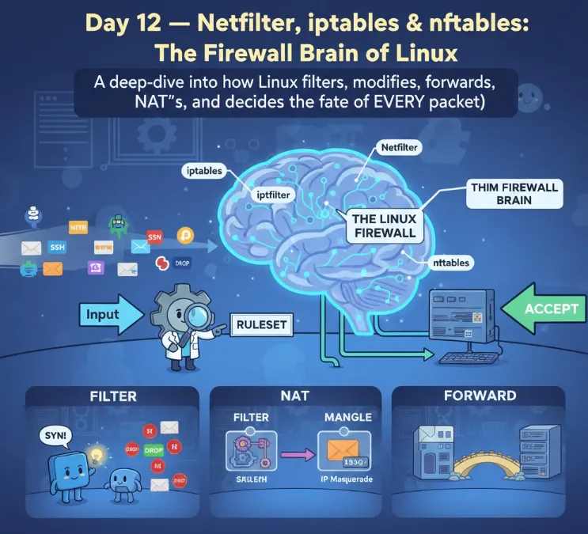
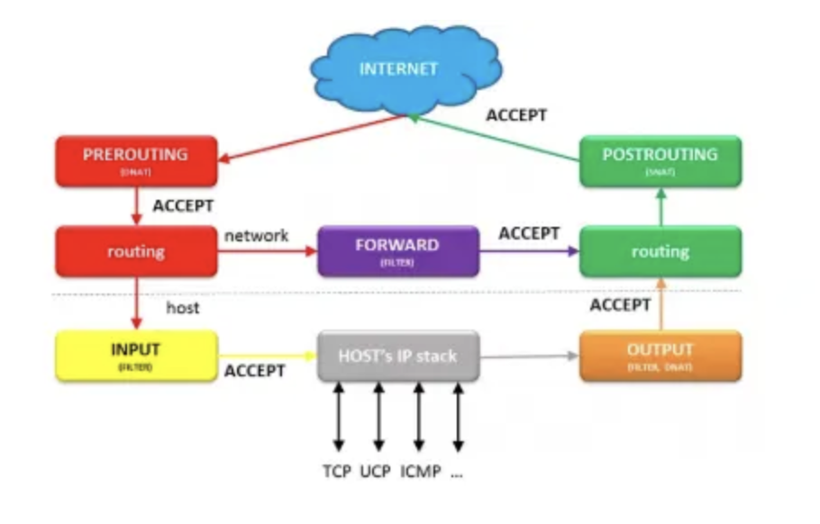
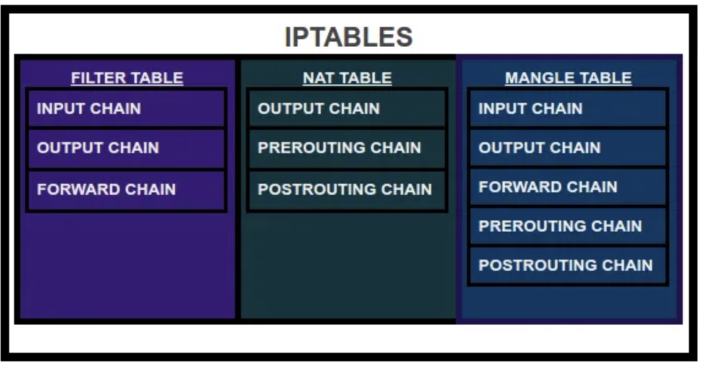
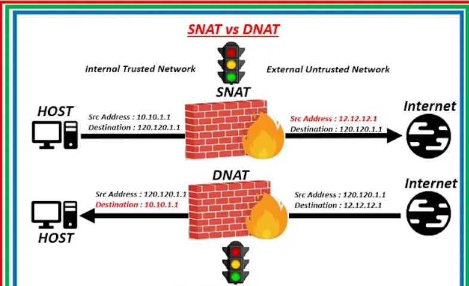
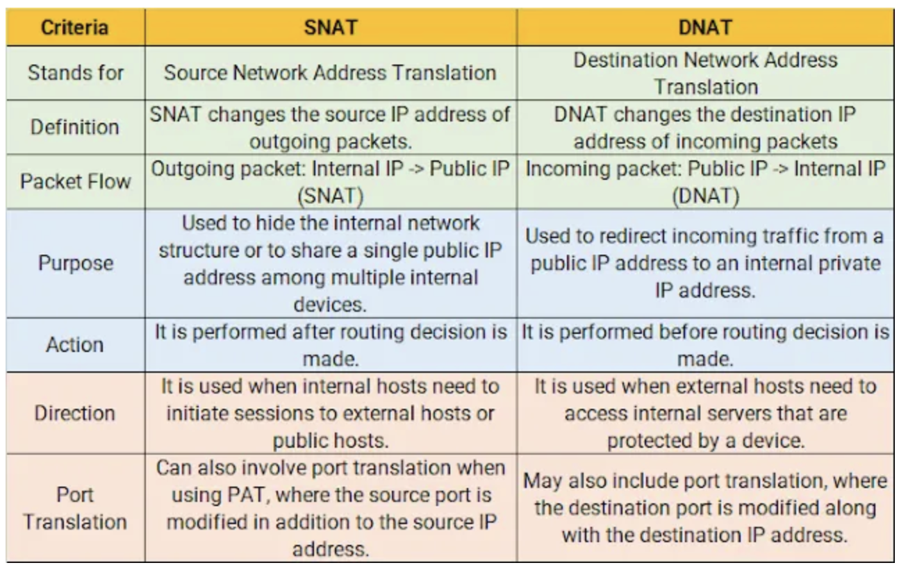
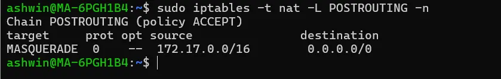
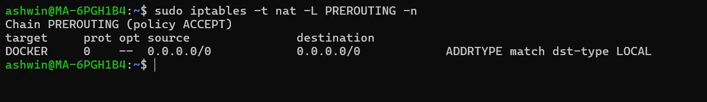
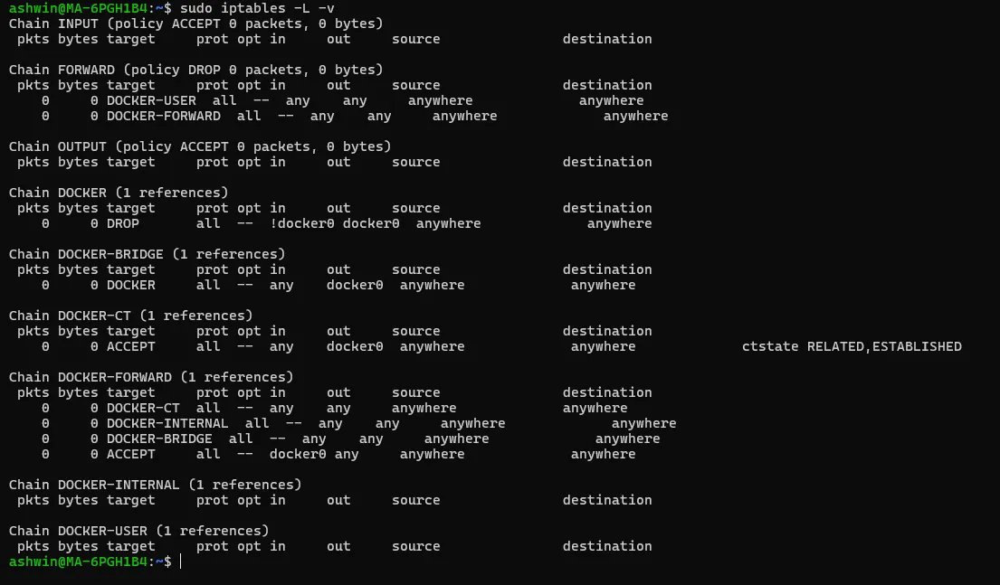
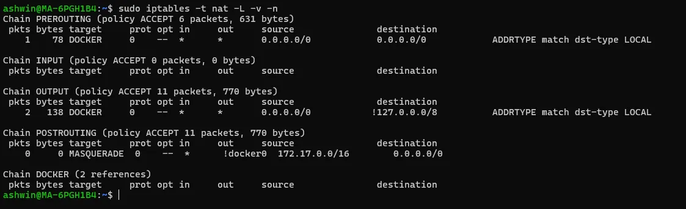
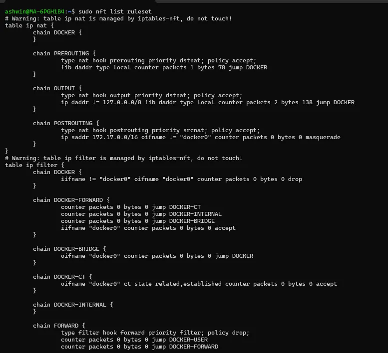

# დღე 12 — Netfilter, iptables & nftables: Linux-ის Firewall ტვინი

ღრმა ჩაძირვა იმაში, თუ როგორ ფილტრავს, ცვლის, გადასცემს, NAT-ს აკეთებს და წყვეტს ყოველი პაკეტის ბედს Linux-ი.



## რატომ არის ეს თემა უკიდურესად მნიშვნელოვანი

თუ მუშაობთ:
- Linux სერვერებთან
- Kubernetes კლასტერებთან
- Docker კონტეინერებთან
- Cloud VPC-ებთან
- Firewalls-თან
- NAT გეითვეიებთან
- Load Balancers-თან
- მიკროსერვისებთან

**მაშინ თქვენ უკვე იყენებთ Netfilter-ს — თუნდაც არ იცოდეთ.**

Netfilter არის kernel-ის დონის ტვინი, რომელიც წყვეტს:
- ნებადართულია თუ არა ეს პაკეტი?
- უნდა მოგდეს?
- უნდა გაიკეთოს NAT?
- უნდა გადაიგზავნოს?
- უნდა გადაიწეროს?

- **Netfilter** → ძირითადი firewall ძრავა
- **iptables/nftables** → მომხმარებლის API-ები მის კონფიგურაციისთვის

დღეს გავიგებთ ყველაფერს:
- როგორ მოძრაობს პაკეტები Linux-ის შიგნით
- iptables ცხრილები (filter, nat, mangle, raw)
- ჯაჭვები (PREROUTING, INPUT, FORWARD, OUTPUT, POSTROUTING)
- Connection tracking (conntrack)
- NAT: SNAT, DNAT, MASQUERADE
- დებაგი მოგდებული პაკეტებისა
- როგორ ცვლის Kubernetes-ი iptables-ს
- რატომ იყენებენ cloud VM-ები NAT-ს
- გადასვლა nftables-ზე

მოდით firewall-ინგი გავხადოთ სახალისო და მარტივი.

## ნაწილი 1 — რა არის Netfilter? (ახსნილია როგორც 10 წლის ბავშვისთვის)

წარმოიდგინეთ რომ Linux-ი არის აეროპორტი.

ყველა პაკეტი არის მგზავრი, რომელიც შედის აეროპორტში.

**Netfilter არის უსაფრთხოების checkpoint.**

ის ამოწმებს:
- ვინ ხარ?
- სად მიდიხარ?
- ნებადართულია შენი შესვლა?
- ნებადართულია შენი გასვლა?
- უნდა გადამისამართდე?

**iptables/nftables არის გუშაგები და წესები, რომლებიც წყვეტენ რა უნდა მოხდეს.**

### ანალოგია

- **Netfilter** = აეროპორტის უსაფრთხოების სისტემა
- **iptables** = ძველი წესების წიგნი
- **nftables** = ახალი წესების წიგნი
- **Connection tracking** = წარსული მგზავრების დამახსოვრება
- **NAT** = მგზავრების სხვა გეითზე გადამისამართება

## ნაწილი 2 — პაკეტის მოგზაურობა Linux-ში (ძალიან მნიშვნელოვანი)

ყველა პაკეტი, რომელიც შედის ან ტოვებს Linux-ს, უნდა გაიაროს 5 საკვანძო checkpoint:

1. **PREROUTING**  
2. **INPUT**  
3. **FORWARD**  
4. **OUTPUT**  
5. **POSTROUTING**

მოდით გავიგოთ ისინი ისტორიით.

### ისტორია: პაკეტი სტუმრობს სასტუმროს (Linux)

პაკეტი ჩამოდის სასტუმროში (ქსელის ბარათი):

#### 1. PREROUTING

სასტუმრო ეკითხება:
"უნდა გადავამისამართო ეს ადამიანი? თუ გააგრძელოს თავისი მიმდინარე გზით?"

**აქ ხდება DNAT.**

#### 2. INPUT

სასტუმრო ეკითხება:
"ეს სტუმარი მოდის ვინმესთან სასტუმროში?"

თუ დიახ → გააგზავნეთ ლოკალურ პროცესზე.

#### 3. FORWARD

სასტუმრო ეკითხება:
"ეს სტუმარი გადის ჩემს სასტუმროში სხვა შენობაში. უნდა დავუშვა?"

**გამოიყენება მარშრუტიზაციაში, ფაირვოლებში, გეითვეიებში.**

#### 4. OUTPUT

სასტუმრო ეკითხება:
"ვინმე სასტუმროს შიგნიდან სურს გასვლა. უნდა დავუშვა?"

გამოიყენება ლოკალურად შექმნილი პაკეტებისთვის.

#### 5. POSTROUTING

სწორედ სასტუმროდან გასვლამდე.

"უნდა გადავწეროთ მათი გამავალი მისამართი?"

**აქ ხდება SNAT და MASQUERADE.**

## ნაწილი 3 — iptables ცხრილები (სუპერ მნიშვნელოვანი)

iptables არ არის ერთი ცხრილი — მას აქვს მრავალი ცხრილი, თითოეული სხვადასხვა მიზნისთვის.

### 1. filter (ნაგულისხმევი)

აკონტროლებს allow/deny.

**გამოიყენება:**
- ფაირვოლებში
- INPUT წესებში
- FORWARD ფილტრაციაში

### 2. nat (Network Address Translation)

გამოიყენება მისამართის გადაწერისთვის:
- DNAT
- SNAT
- MASQUERADE

### 3. mangle

გამოიყენება პაკეტის ველების შესაცვლელად:
- QoS
- TTL
- TOS
- პაკეტების მარკირება

### 4. raw

გვერდს უვლის connection tracking-ს.

**გამოიყენება:**
- გაფართოებული წარმადობის tuning-ისთვის
- conntrack overhead-ის თავიდან აცილებისთვის

### 5. security

გამოიყენება SELinux labelling-ისთვის.

## ნაწილი 4 — iptables ჯაჭვები (დამწყებთათვის მეგობრული განმარტებები)

### PREROUTING

პაკეტი ახლახან ჩამოვიდა. შეუძლია დანიშნულების IP-ის გადაწერა (DNAT).

### INPUT

პაკეტი გამიზნულია ამ მანქანისთვის.

### FORWARD

პაკეტი გადის ამ მანქანაზე.

### OUTPUT

პაკეტი შექმნილია ამ მანქანის მიერ.

### POSTROUTING

პაკეტი აპირებს გასვლას. შეუძლია წყაროს IP-ის შეცვლა (SNAT, MASQUERADE).

## ნაწილი 5 — NAT: SNAT, DNAT, MASQUERADE (მარტივად ახსნილი)




### 1. SNAT (Source NAT)

გადაწერე წყაროს IP.

**მაგალითი:**
```
სერვერის შიდა IP: 10.0.1.22
ინტერნეტი მოითხოვს: 54.10.33.1
```

SNAT გადაწერს:
```
from: 10.0.1.22
to:   54.10.33.1
```

**გამოიყენება როცა:**
- სერვერები პირად subnet-ში აღწევენ ინტერნეტს
- NAT გეითვეიები
- Kubernetes egress

**ხდება:**
POSTROUTING ჯაჭვში

### 2. DNAT (Destination NAT)

გადაწერე დანიშნულების IP.

**მაგალითი:**

თქვენ აჰიტებთ:
```
http://mycompany.com → 80.80.80.10
```

მაგრამ სერვერი რეალურად ცხოვრობს:
```
10.0.1.50
```

DNAT გადაწერს:
```
to 10.0.1.50
```

**ხდება:**
PREROUTING ჯაჭვში

**ასე მუშაობს:**
- load balancers
- reverse proxies
- Kubernetes Services
- port-forwarding

### 3. MASQUERADE

სპეციალური დინამიური SNAT. გამოიყენება როცა გამავალ ინტერფეისს აქვს დინამიური IP (DHCP, PPPoE, cloud VM-ები).

**Kubernetes იყენებს MASQUERADE-ს როცა Pod-ები საუბრობენ ინტერნეტთან.**

## ნაწილი 6 — Connection Tracking (conntrack)

Netfilter იხსენებს პაკეტებს რათა დაუშვას:
- stateful firewall-ინგი
- NAT თარგმანები
- საპირისპირო პაკეტები
- მრავალ-პაკეტიანი TCP ნაკადები

**კავშირის მდგომარეობები:**
- NEW
- ESTABLISHED
- RELATED
- INVALID

**მაგალითი:**

როცა პაკეტი 1 დაშვებულია:
```
ESTABLISHED
```
მაშინ პაკეტი 2 ავტომატურად დაშვებულია.

### conntrack ცხრილის ნახვა:
```bash
sudo conntrack -L
```

### გაჭედილი ჩანაწერების წაშლა:
```bash
sudo conntrack -D -p tcp --dport 443
```

## ნაწილი 7 — iptables წესები (მარტივი მაგალითები)

### SSH-ის ნებართვა:
```bash
iptables -A INPUT -p tcp --dport 22 -j ACCEPT
```

### IP-ის დაბლოკვა:
```bash
iptables -A INPUT -s 10.1.2.3 -j DROP
```

### გამავალი ტრაფიკის NAT:
```bash
iptables -t nat -A POSTROUTING -o eth0 -j MASQUERADE
```

### პორტის გადამისამართება:
```bash
iptables -t nat -A PREROUTING -p tcp --dport 80 -j DNAT --to 10.0.1.5:8080
```

## ნაწილი 8 — iptables პაკეტის ნაკადი (ვიზუალიზირებული)

```
                         +-------------+
შემომავალი პაკეტი --->    | PREROUTING  |
                         +------+------+
                                |
                        ჩემთვისაა?
                        /          \
                       /            \
               +-------+             +--------+
               | INPUT |             | FORWARD|
               +-------+             +--------+
                       \            /
                        \          /
                         +--------+
                         |პროცესი |
                         +--------+
                                |
                         +-------------+
                         |  OUTPUT     |
                         +------+------+
                                |
                         +-------------+
                         |POSTROUTING  |
                         +-------------+
                                |
                       პაკეტი ტოვებს სისტემას
```

## ნაწილი 9 — nftables (თანამედროვე ჩანაცვლება)

iptables ძველია.
nftables თანამედროვე, უფრო სწრაფი, უფრო სუფთაა.

**უპირატესობები:**
- ნაკლები syscall-ები
- ერთი ერთიანი სინტაქსი
- უფრო სწრაფი წესების დამუშავება
- უფრო მასშტაბირებადი
- ცვლის iptables, ip6tables, arptables, ebtables-ს

**nft წესის მაგალითი:**
```bash
nft add rule inet filter input tcp dport 22 accept
```

**წესების სია:**
```bash
nft list ruleset
```

## ნაწილი 10 — როგორ იყენებს Kubernetes iptables-ს & nftables-ს

Kubernetes ძალიან ეყრდნობა iptables-ს:
- Service VIP მარშრუტიზაცია (ClusterIP → kube-proxy)
- NodePort მარშრუტიზაცია
- Pod-to-Pod მარშრუტიზაცია
- SNAT pod-ებიდან ინტერნეტამდე
- DNS გადაწერა
- NetworkPolicy enforcement

**მაგალითად:**

ClusterIP სერვისი იყენებს DNAT-ს:
```
PREROUTING → DNAT → Pod IP
```

**CNI პლაგინები (Calico, Flannel, Cilium) აშენებენ უზარმაზარ iptables წესების ნაკრებებს.**

nftables ნელა ცვლის iptables-ს თანამედროვე Kubernetes დისტრიბუციებში.

## ნაწილი 11 — რეალური SRE დებაგის სცენარები

### სცენარი 1 — "Pod-ს არ შეუძლია ინტერნეტის მიღწევა"

**შეამოწმეთ NAT:**
```bash
iptables -t nat -L POSTROUTING -n
```

მოძებნეთ MASQUERADE წესები.



### სცენარი 2 — "Service ClusterIP მიუწვდომელია"

**შეამოწმეთ kube-proxy წესები:**
```bash
iptables -t nat -L KUBE-SERVICES -n
```

### სცენარი 3 — "გარე ტრაფიკი არ აღწევს ნოუდს"

**შეამოწმეთ PREROUTING:**
```bash
iptables -t nat -L PREROUTING -n
```


### სცენარი 4 — "რაღაც აგდებს პაკეტებს"

**იპოვეთ DROP წესები:**
```bash
iptables -S | grep DROP
```

**ან:**
```bash
iptables -L -v
```


### სცენარი 5 — "Firewall ბლოკავს აპლიკაციას მიუხედავად იმისა რომ გავხსენი პორტი"

შესაძლოა გამავალი დაბლოკილია:
```bash
iptables -L OUTPUT
```

შესაძლოა FORWARD წესი ბლოკავს:
```bash
iptables -L FORWARD
```

### სცენარი 6 — "დებაგი სად მოგდა პაკეტი"

**გამოიყენეთ TRACE:**
```bash
iptables -t raw -A PREROUTING -j TRACE
dmesg -w
```

## ნაწილი 12 — სასარგებლო ბრძანებები (დღე 12)

### iptables წესების სია (ყველა ცხრილი)
```bash
iptables -L -v -n
iptables -t nat -L -v -n
```

### პაკეტის გზის თვალყურის დევნება
```bash
iptables -t raw -A PREROUTING -j TRACE
```


### nftables წესების სია:
```bash
nft list ruleset
```


### iptables-ის გასუფთავება:
```bash
iptables -F
iptables -t nat -F
```

### iptables-ის შენახვა:
```bash
iptables-save > backup.txt
```

### iptables-ის აღდგენა:
```bash
iptables-restore < backup.txt
```

### conntrack სტატისტიკის ნახვა:
```bash
conntrack -S
```

### დაბლოკეთ კონკრეტული წყარო IP:
```bash
iptables -A INPUT -s 192.168.1.100 -j DROP
```

### პორტის გახსნა:
```bash
iptables -A INPUT -p tcp --dport 8080 -j ACCEPT
```

### ყველა წესის წაშლა:
```bash
iptables -F
iptables -X
iptables -t nat -F
iptables -t nat -X
iptables -t mangle -F
iptables -t mangle -X
```

## შეჯამება (დღე 12)

დღეს ისწავლეთ:
- ✅ Netfilter არის Linux-ის firewall ძრავა
- ✅ iptables/nftables არის კონფიგურაციის API-ები
- ✅ 5 ჯაჭვი: PREROUTING, INPUT, FORWARD, OUTPUT, POSTROUTING
- ✅ 5 ცხრილი: filter, nat, mangle, raw, security
- ✅ NAT: SNAT, DNAT, MASQUERADE
- ✅ Connection tracking (conntrack)
- ✅ როგორ იყენებს Kubernetes iptables-ს
- ✅ როგორ დებაგდება მოგდებული პაკეტები
- ✅ nftables არის თანამედროვე ჩანაცვლება
- ✅ რეალური SRE დებაგის სცენარები

**Netfilter/iptables არის Linux ქსელის საფუძველი.**

**ამის გაგება გეხმარებათ:**
- დებაგი Kubernetes ქსელის პრობლემები
- კონფიგურაცია firewalls
- გაგება cloud NAT
- გადაწყვეტა connectivity პრობლემები
- აშენება უსაფრთხო ინფრასტრუქტურა

## შემდეგი თავები

**კურსის გაგრძელება შემდეგ თემებზე:**
- eBPF და XDP (თანამედროვე პაკეტების დამუშავება)
- Linux Bridge & VLAN-ები
- Network Namespaces
- Container ქსელები
- და მეტი...

**მადლობა დაკითხვისთვის!** 🎉