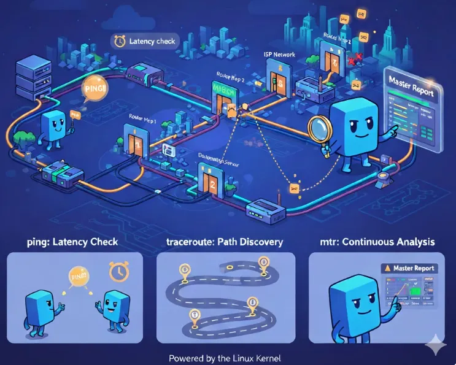
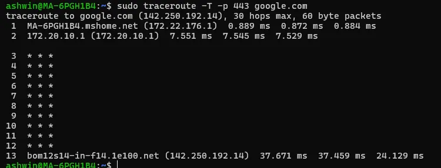
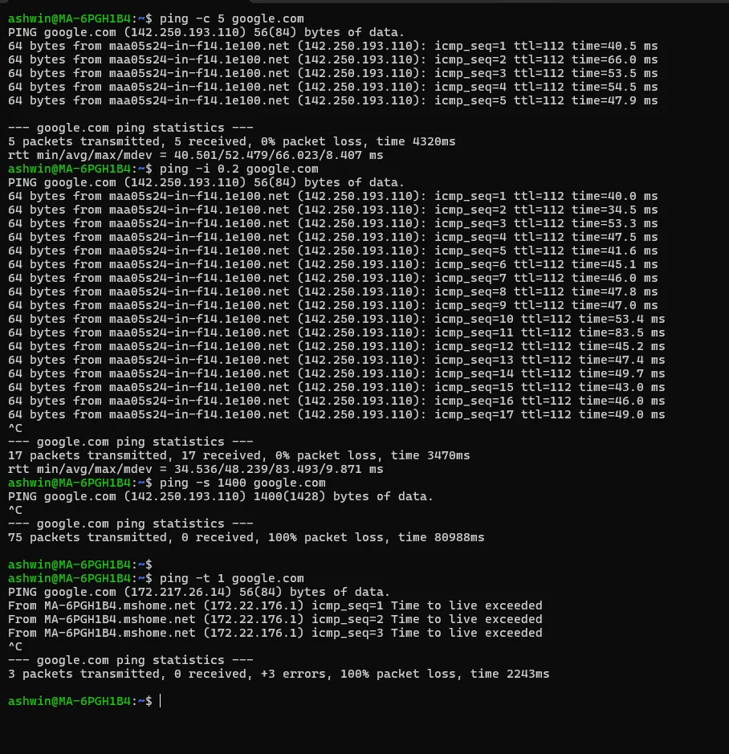
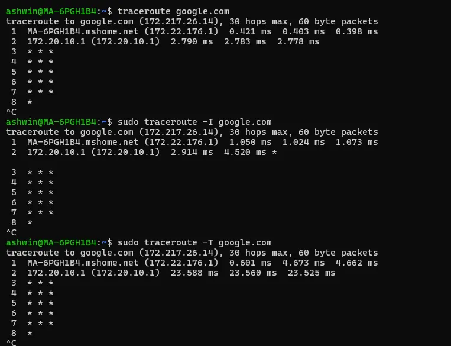
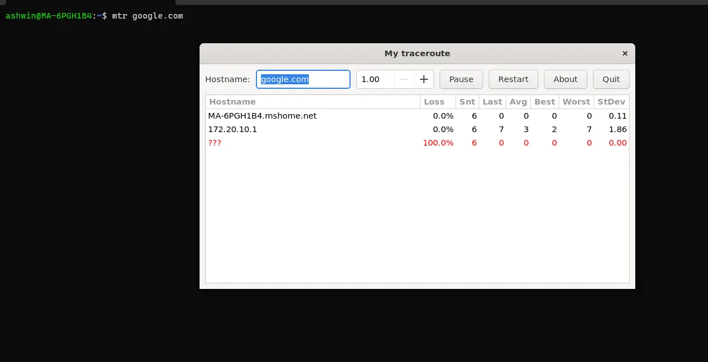
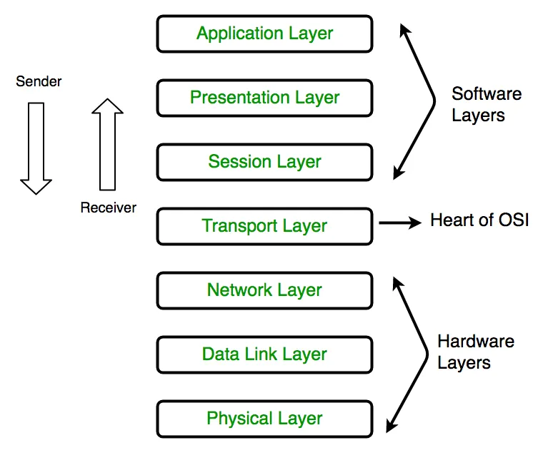

# დღე 13 — ping, traceroute & mtr: მარშრუტის აღმოჩენა, შეყოვნება და ქსელის დიაგნოსტიკის ოსტატური კლასი

ქსელური დიაგნოსტიკის ყველაზე მნიშვნელოვანი ინსტრუმენტების ღრმა ანალიზი.

---

---

## რატომ არის დღე 13 ძალიან მნიშვნელოვანი

ყველა DevOps ინჟინერმა...
ყველა SRE-მ...
ყველა cloud/network ინჟინერმა...
ყველა backend ინჟინერმა...
უნდა იცოდეს ეს სამი ინსტრუმენტი ძალიან კარგად:

- **ping** → მიღწევადობისა და შეყოვნების შემოწმება
- **traceroute** → მარშრუტის და ჰოპების აღმოჩენა
- **mtr** → რეალურ დროში ჰოპ-ჰოპის ანალიზი (შეყოვნება + პაკეტების დაკარგვა + jitter)

ისინი პირველი ინსტრუმენტებია, რომლებსაც იყენებენ როცა:

- Kubernetes pod-ები ვერ აღწევენ service-ს
- მონაცემთა ბაზის კავშირი ნელია
- ინტერნეტ წვდომა არ მუშაობს
- VPN აყოვნებს
- მიკროსერვისები აჩვენებენ ინტერმიტენტულ შეცდომებს
- cloud routing პრობლემა ჩნდება
- load balancer არასწორად მუშაობს
- პაკეტები იკარგება
- DNS გარჩევა მუშაობს, მაგრამ კავშირი ვერ მყარდება

დღეს განვიხილავთ:

- როგორ მუშაობენ ეს ინსტრუმენტები შიგნიდან
- როგორ იქცევიან ბაზისი პროტოკოლები
- როგორ პასუხობენ როუტერები
- როგორ წავიკითხოთ ჰოპ-ჰოპის შედეგები
- როგორ ვიდენტიფიციროთ ბოთლნეკები, გადატვირთვა და blackhole-ები
- როგორ გავაკეთოთ cloud routing-ის დიაგნოსტიკა

ყველაფერი ახსნილია მარტივი, ლამაზი ანალოგიებით.

## ნაწილი 1 — დაწყებამდე: რა არის ქსელური მარშრუტი?

წარმოიდგინეთ, რომ აგზავნით ამანათს თქვენი სახლიდან მეგობართან სხვა ქალაქში.
ის პირდაპირ არ მიდის.
ის გადის:

- ადგილობრივ ოფისში
- რეგიონულ ოფისში
- დისტრიბუციის ცენტრში
- ქალაქის ჰაბში
- დანიშნულების ოფისში

ანალოგიურად, პაკეტი გადის როუტერებში.

თითოეული როუტერი = საკონტროლო პუნქტი.
თითოეული საკონტროლო პუნქტი = ჰოპი.

ping, traceroute, mtr გეხმარებათ ამ ჰოპების რუკის შედგენაში.

## ნაწილი 2 — ping: ყველაზე მარტივი და სასარგებლო ქსელის დიაგნოსტიკის ინსტრუმენტი

ping იყენებს ICMP Echo შეტყობინებებს.

### რა არის ICMP რეალურად

ICMP არ არის TCP
ICMP არ არის UDP
ICMP არ არის აპლიკაციის მონაცემები

ის არის:

**ქსელის კონტროლისა და შეცდომების შეტყობინების პროტოკოლი.**

როუტერები იყენებენ მას რათა თქვან:

- "ეს მარშრუტი არ მუშაობს"
- "TTL ამოიწურა"
- "ჰოსტი მიუწვდომელია"
- "ქსელი მიუწვდომელია"
- "პაკეტი ძალიან დიდია"

ping ძირითადად ეკითხება:

```
გამარჯობა, ცოცხალი ხარ?  
გესმის?  
რამდენად სწრაფად გესმის?
```

### როგორ მუშაობს ping (შიგნიდან ახსნილი)

როცა აკეთებთ:

```bash
ping google.com
```

ხდება შემდეგი:

1. DNS გარჩევს google.com → IP
2. Linux აგზავნის ICMP Echo Request-ს
3. Google პასუხობს ICMP Echo Reply-ით
4. ping ზომავს round-trip დროს (RTT)
5. ping იმეორებს ამას და იძლევა:
   - პაკეტების დაკარგვის %
   - min/avg/max/stddev შეყოვნებებს

### ანალოგია: ping არის როგორც "ჰეი, იქ ხარ?"

თქვენ ამბობთ:
"ჰეი Google!"

Google პასუხობს:
"დიახ?"

თქვენ ზომავთ რამდენი დრო დასჭირდა.

### ping შედეგების ინტერპრეტაცია

მაგალითი:

```
64 bytes from 142.250.67.206: icmp_seq=1 ttl=116 time=38.2 ms
```

განმარტება:

- `64 bytes` → პასუხის ზომა
- `icmp_seq=1` → პაკეტი #1
- `ttl=116` → დაახლოებით 139−116 = 23 ჰოპი
- `time=38.2ms` → შეყოვნება

გასაღები:

- `<1ms` → იგივე მანქანა (lo)
- `<5ms` → იგივე მონაცემთა ცენტრი
- `<20ms` → იგივე ქალაქი/რეგიონი
- `<60ms` → იგივე ქვეყანა
- `100–200ms` → კონტინენტთაშორისი

### როცა ping ვერ მუშაობს, რას ნიშნავს:

**1. DNS მუშაობს**
მიიღეთ IP.

**2. ICMP მიუწვდომელია**
Firewall შეიძლება ბლოკავს ICMP-ს.

**3. არ არის დამადასტურებელი, რომ სერვერი არ მუშაობს**
ზოგიერთი კომპანია სრულად ბლოკავს ping-ს:

- AWS EC2 security groups
- firewall-ები
- Cloudflare-ით დაცული ვებსაიტები

ასე რომ "ping: Destination unreachable" ≠ სერვერი არ მუშაობს.

## ნაწილი 3 — traceroute: როგორ მუშაობს რეალურად

ping პასუხობს:

```
შემიძლია მივაღწიო დანიშნულებას?
```

traceroute პასუხობს:

```
რა მარშრუტს გადის ჩემი ტრაფიკი იქამდე?
```

### ძირითადი იდეა: traceroute იყენებს TTL-ს ჰოპების აღმოსაჩენად

TTL = Time To Live
ყოველ ჯერზე როცა პაკეტი გადის როუტერში, TTL = -1

თუ TTL მიაღწევს 0-ს → როუტერი ანადგურებს პაკეტს და აგზავნის უკან:

```
ICMP Time Exceeded
```

Traceroute იყენებს ამ ქცევას.

### როგორ მუშაობს traceroute ნაბიჯ-ნაბიჯ

დავუშვათ დანიშნულებაა 8.8.8.8.

**1️⃣ traceroute აგზავნის პაკეტს TTL=1-ით**
- როუტერი #1 იღებს მას
- TTL ხდება 0
- როუტერი #1 პასუხობს
  ```
  ICMP Time exceeded
  ```
- traceroute იდენტიფიცირებს ჰოპ #1-ს

**2️⃣ traceroute აგზავნის პაკეტს TTL=2-ით**
- როუტერი #1 გადასცემს
- როუტერი #2 ანადგურებს TTL=0-ით
- როუტერი #2 პასუხობს
- traceroute სწავლობს ჰოპ #2-ს

**3️⃣ იმეორებს:**

- TTL 3
- TTL 4
- TTL 5
- ...

სანამ საბოლოო ჰოპი არ პასუხობს.

### ASCII დიაგრამა

```
Your PC → R1 → R2 → R3 → Google
TTL=1 --> R1 ანადგურებს → აბრუნებს "time exceeded"
TTL=2 --> R2 ანადგურებს → აბრუნებს "time exceeded"
TTL=3 --> R3 ანადგურებს → აბრუნებს "time exceeded"
TTL=4 --> Google აბრუნებს "port unreachable" ან "echo reply"
```

### როგორ იძლევა traceroute რეალურ შედეგებს

მაგალითი:

```bash
traceroute to google.com
1   192.168.1.1      1.2 ms
2   10.10.0.1        5.1 ms
3   203.100.10.1    15.6 ms
4   72.14.232.10    32.8 ms
5   142.250.67.206  38.3 ms
```

ინტერპრეტაცია:

- ჰოპი 1 = სახლის როუტერი
- ჰოპი 2 = ISP-ის პირი
- ჰოპი 3 = ISP-ის backbone
- ჰოპი 4 = Google-ის შესასვლელი წერტილი
- ჰოპი 5 = საბოლოო სერვერი

### როცა traceroute აჩვენებს "* * *"

ეს ჩვეულებრივ ნიშნავს:

- როუტერი არ აგზავნის ICMP Time Exceeded-ს
- firewall ბლოკავს TTL-expired შეტყობინებებს
- როუტერი კონფიგურირებულია ჩუმად იყოს

ეს არ ნიშნავს:

- პაკეტი დაბლოკილია
- კავშირი ვერ მყარდება
- routing გატეხილია

ბევრი როუტერი გამორთავს ICMP-ს დატვირთვის შესამცირებლად.



## ნაწილი 4 — mtr: ping + traceroute გაერთიანებული (უწყვეტი სტატისტიკით)

mtr = My Traceroute.

იფიქრეთ mtr-ზე როგორც:

```
traceroute = ერთი სტატიკური ფოტო
mtr = ცოცხალი ვიდეო ნაკადი
```

mtr უწყვეტად ზომავს:

- შეყოვნებას თითო ჰოპზე
- პაკეტების დაკარგვას თითო ჰოპზე
- jitter-ს
- მიღწევადობას

### რატომ არის mtr უკეთესი დიაგნოსტიკისთვის

რადგან traceroute არ გეუბნებათ:

- ინტერმიტენტულ პაკეტების დაკარგვას
- დაკარგვის მიმართულებას
- jitter ვარიაციებს
- შუალედური როუტერების გადატვირთვას
- Carrier ან ISP-ის throttling-ს

mtr იძლევა დინამიურ, მოძრავ გაზომვას ყველა ჰოპზე.

### mtr შედეგის მაგალითი (ახსნილი)

```
                               Loss%   Snt   Last   Avg  Best  Wrst StDev
1. 192.168.1.1                 0.0%   100   1.1    1.5   1.0   4.0   0.4
2. 10.10.0.1                   1.0%   100   5.3    5.8   5.1  12.1   1.2
3. 203.100.10.1                0.0%   100  15.4   15.9  15.0  22.3   1.0
4. 72.14.232.10                0.0%   100  32.1   32.7  31.0  38.9   0.9
5. 142.250.67.206              0.0%   100  38.2   38.5  38.1  40.1   0.3
```

ინტერპრეტაცია ჰოპ-ჰოპის:

**ჰოპი 1**
თქვენი როუტერი.
ჯანმრთელი.

**ჰოპი 2**
ISP ადგილობრივი კვანძი.
1% დაკარგვა = მსუბუქი გადატვირთვა.

**ჰოპი 3**
ISP backbone.
სტაბილური.

**ჰოპი 4**
Google-ის შესასვლელი ქსელი.

**ჰოპი 5**
საბოლოო სერვერი.
დაკარგვის გარეშე.

**დასკვნა:**

- პატარა დაკარგვები ჰოპ 2-ის მახლობლად
- საერთო მარშრუტი ჯანმრთელია

### ძირითადი დასკვნა: შუალედურ ჰოპებზე პაკეტების დაკარგვა ≠ პრობლემა

როუტერები ხშირად აკეთებენ rate-limit-ს ICMP-ზე.

ასე რომ "ჰოპი 3: 20% დაკარგვა" არ ნიშნავს პრობლემას თუ:

- საბოლოო ჰოპს აქვს 0% დაკარგვა
- აპლიკაცია მუშაობს

## ნაწილი 5 — რეალური DevOps & SRE დიაგნოსტიკა

### სცენარი 1 — "სერვისი ზოგჯერ ნელია"

გამოიყენეთ mtr ინტერმიტენტული დაკარგვის დასადგენად:

```bash
mtr -rw google.com
```

ეძებეთ:

- მაღალი jitter
- შეყოვნების სპაიკები
- შემთხვევითი დაკარგვა ბოლო ჰოპზე

### სცენარი 2 — "Pod Kubernetes კლასტერში ვერ აღწევს ინტერნეტს"

**1. Ping gateway:**
```bash
ping $(ip route | grep default | awk '{print $3}')
```

**2. traceroute 8.8.8.8-ზე:**

```bash
traceroute 8.8.8.8
```

**3. გაუშვით mtr end-to-end მარშრუტისთვის:**

```bash
mtr -rw 8.8.8.8
```

ყველაზე ხშირი მიზეზი:

- iptables MASQUERADE პრობლემები
- CNI routing პრობლემა
- Node route table არასწორია
- VPC route table არასწორია

### სცენარი 3 — "ტრაფიკი ნელია AWS/GCP/Azure-ში"

გაუშვით mtr შიდა node IP-ებზე.
თუ დაკარგვა იწყება ჰოპ 1-ის შემდეგ → cloud შიდა გადატვირთვა.

### სცენარი 4 — "VPN აყოვნებს"

Ping tunnel-ის შიგნით:

```bash
ping 10.8.0.1
```

mtr:

```bash
mtr -rw 10.8.0.1
```

ხშირად დაინახავთ:

- MTU პრობლემებს
- პაკეტების ფრაგმენტაციას
- jitter VPN concentrator-ზე

### სცენარი 5 — "მხოლოდ პირველი ჰოპი აჩვენებს დაკარგვას"

თუ შემდეგი ჰოპები კარგია → ეს არის ICMP rate limiting → უსაფრთხოა იგნორირება.

### სცენარი 6 — "აპლიკაცია მუშაობს მაგრამ traceroute ვერ მუშაობს"

როუტერები ბლოკავენ ICMP TTL exceeded-ს.
ნორმალურია.

## ნაწილი 6 — სასარგებლო ბრძანებების cheat sheet

### Ping:
```bash
ping -c 5 google.com
ping -i 0.2 google.com        # უფრო სწრაფი
ping -s 1400 google.com       # MTU ტესტი
ping -t 1 google.com          # TTL-ის დაყენება
```



### traceroute:
```bash
traceroute google.com
traceroute -I google.com      # ICMP-ის გამოყენება
traceroute -T google.com      # TCP SYN probe-ის გამოყენება
```



### mtr:
```bash
mtr google.com
mtr -rw google.com
mtr -ezbw google.com
```



## ნაწილი 7 — ბონუსი: TCP traceroute

TCP traceroute იყენებს SYN პაკეტებს ჰოპების აღმოსაჩენად:

```bash
traceroute -T -p 443 google.com
```

სასარგებლოა როცა:

- ICMP დაბლოკილია
- UDP დაბლოკილია
- firewall-ები მალავენ ჰოპებს



## შეჯამება (დღე 13)

დღეს ისწავლეთ:

- როგორ იყენებს ping ICMP Echo-ს
- რას აკეთებს traceroute TTL მანიპულაციით
- როგორ აგზავნიან როუტერები "time exceeded" შეტყობინებებს
- რატომ აჩვენებენ ზოგიერთი ჰოპები * * *
- რატომ არის mtr უკეთესი ვიდრე traceroute
- როგორ ვინტერპრეტიროთ დაკარგვა თითოეულ ჰოპზე
- განსხვავება როუტერის ICMP throttling-სა და რეალურ პაკეტების დაკარგვას შორის
- როგორ გავაკეთოთ routing-ის დიაგნოსტიკა რეალურ სისტემებში
- Cloud-ზე დაფუძნებული მარშრუტის ანალიზი
- VPN და Kubernetes routing ანალიზი

ეს ინსტრუმენტები ზუსტად გიჩვენებთ როგორ მოძრაობენ პაკეტები, რაც საშუალებას გაძლევთ უფრო სწრაფად დიაგნოსტირება გაუკეთოთ პრობლემებს ვიდრე ინჟინერების 95%-ს.

## მომდევნო (დღე 14)
tcpdump & Wireshark — პაკეტების მიმაღრების ოსტატური კლასი

ისწავლით:

- როგორ იჭერს tcpdump პაკეტებს
- BPF ფილტრაციას
- როგორ დეკოდირებს Wireshark ფრეიმებს
- Ethernet ფრეიმების, IP პაკეტების, TCP სეგმენტების გაგებას
- ნელი კავშირების ანალიზს
- retransmission-ების იდენტიფიცირებას
- TLS დიაგნოსტიკას
- MTU პრობლემების პოვნას
- SYN flood-ების აღმოჩენას
- handshake ჩავარდნების წაკითხვას
- Kubernetes პაკეტების მიმაღრებას pod-ების შიგნით

ეს იქნება ერთ-ერთი ყველაზე ღრმა და პრაქტიკული თავი მთელ სერიაში.