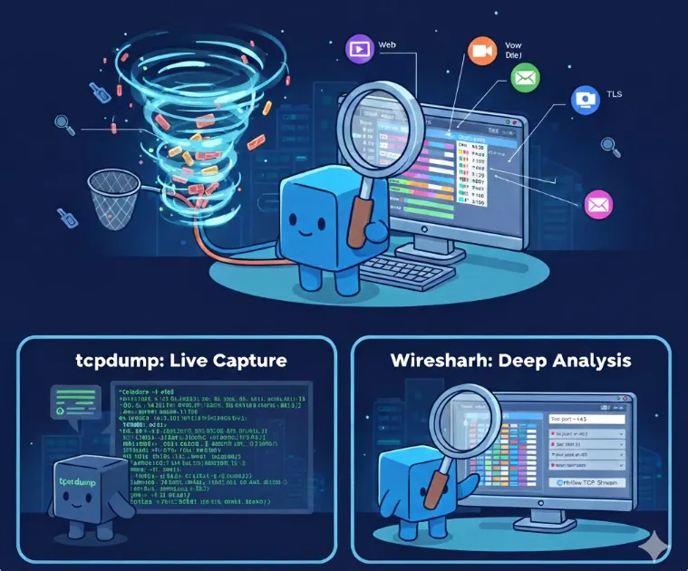
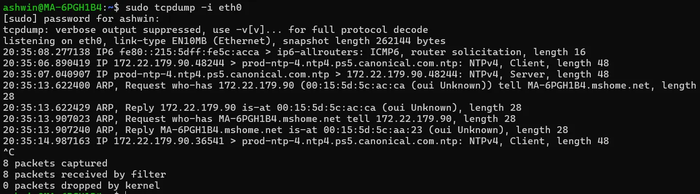
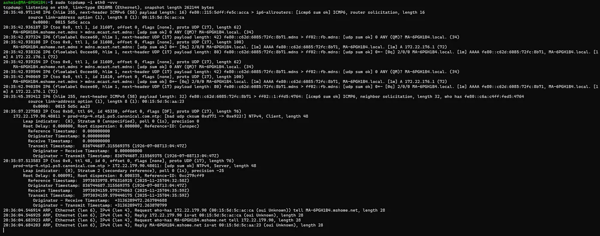
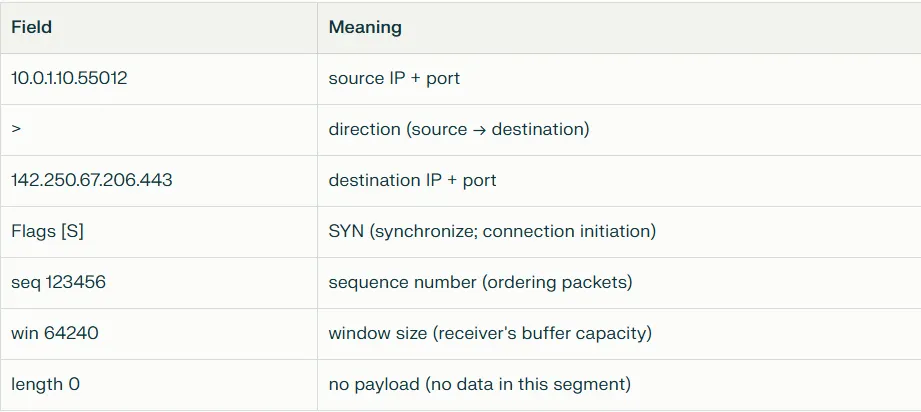

# დღე 14 — tcpdump & Wireshark: პაკეტების მიმაღრების ოსტატური კლასი

ღრმა ანალიზი პაკეტების მიმაღრებაზე, მათი დეკოდირებაზე, performance პრობლემების ანალიზზე, მიკროსერვისების დიაგნოსტიკაზე, TCP ჩავარდნების გარკვევაზე და ქსელის ნაკადების გაგებაზე ბაიტების დონეზე.



## რატომ არის ეს თავი მნიშვნელოვანი

ყველა DevOps/SRE-მ უნდა იცოდეს სამი რამ კარგად:

1. როგორ გამოიყურებიან პაკეტები სინამდვილეში
2. როგორ მოვიმაღროთ პაკეტები უსაფრთხოდ
3. როგორ წავიკითხოთ ქსელის პრობლემები პაკეტების კვალიდან

tcpdump + Wireshark არის ქსელის მიკროსკოპი და რენტგენის სკანერი.

მათი საშუალებით დაინახავთ:

- TCP handshake-ებს
- retransmission-ებს
- გადატვირთვას
- MTU/ფრაგმენტაციას
- დაკარგვებს
- reset პაკეტებს
- TLS მოლაპარაკებას
- DNS ჩავარდნებს
- Kubernetes Service პაკეტების გადაწერას
- NAT ქცევას
- Load balancer რემარშრუტიზაციას
- Firewall ბლოკებს
- SYN flood-ებს
- ნელ REST API ზარებს
- გატეხილ მიკროსერვისების ტრაფიკს

## ნაწილი 1 — tcpdump: პაკეტების მიკროსკოპი

tcpdump არის command-line პაკეტების sniffer.
ის იჭერს პაკეტებს პირდაპირ ქსელის ინტერფეისიდან.

იფიქრეთ tcpdump-ზე როგორც:

```
უსაფრთხოების კამერაზე, რომელიც დამონტაჟებულია თქვენს ქსელურ პორტზე.
```

ის ყველაფერს ხედავს.
მაგრამ ის იჭერს მხოლოდ raw ბაიტებს — არ ინტერპრეტირებს მათ.

დეკოდირებისთვის → ვიყენებთ Wireshark-ს.

## ნაწილი 2 — როგორ მუშაობს tcpdump (შიგნიდან)

tcpdump იყენებს:

- **libpcap** (პაკეტების მიმაღრების ბიბლიოთეკა)
- Linux kernel-ის **BPF** (Berkeley Packet Filter)

როცა აკეთებთ tcpdump-ს:

1. ის ამაგრებს BPF ფილტრს NIC-ზე
2. Kernel ფილტრავს პაკეტებს userspace-მდე
3. მხოლოდ შესაბამისი პაკეტები მიეწოდება tcpdump-ს
4. tcpdump ბეჭდავს ან ინახავს მათ

ეს tcpdump-ს სუპერ სწრაფს და ეფექტურს ხდის.

### ანალოგია: BPF = უსაფრთხოების დაცვა კართან

წარმოიდგინეთ სასტუმროს ლობი:

- გსურთ ნახოთ მხოლოდ სტუმრები წითელ მაისურებში
- იმის ნაცვლად რომ თვითონ აკონტროლოთ ყველას
- ეკითხებით უსაფრთხოების დაცვას მოიყვანოს მხოლოდ წითელ მაისურებში სტუმრები

ეს არის BPF.

ის ფილტრავს პაკეტებს სანამ tcpdump დაინახავს მათ.

## ნაწილი 3 — tcpdump საფუძვლები

### ინტერფეისზე მიმაღრება:
```bash
tcpdump -i eth0
```



### დეტალებით მიმაღრება:
```bash
tcpdump -i eth0 -vvv
```



### პაკეტის პირველი N ბაიტის მიმაღრება:
```bash
tcpdump -s 96 -i eth0
```

### ფაილში შენახვა:
```bash
tcpdump -i eth0 -w capture.pcap
```

### ფაილიდან წაკითხვა:
```bash
tcpdump -r capture.pcap
```

## ნაწილი 4 — პაკეტების ფილტრაცია (ყველაზე სასარგებლო tcpdump უნარი)

tcpdump ფილტრები იყენებენ BPF სინტაქსს.

### მხოლოდ ტრაფიკი IP-დან/IP-ზე:
```bash
tcpdump host 10.0.1.10
```

### ტრაფიკი კონკრეტულ პორტზე:
```bash
tcpdump port 443
```

### მხოლოდ TCP SYN პაკეტები:
```bash
tcpdump 'tcp[13] & 2 != 0'
```

### მხოლოდ DNS:
```bash
tcpdump port 53
```

### მხოლოდ HTTP:
```bash
tcpdump port 80
```

### მხოლოდ პაკეტები gateway-დან/gateway-ზე:
```bash
tcpdump net 192.168.1.0/24
```

## ნაწილი 5 — Raw პაკეტების შედეგის წაკითხვა (საინტერესო ნაწილი)

მაგალითი:

```
14:10:51.123456 IP 10.0.1.10.55012 > 142.250.67.206.443: Flags [S], seq 123456, win 64240, length 0
```

განმარტება:



- **14:10:51.123456** → timestamp
- **10.0.1.10.55012** → source IP:port
- **142.250.67.206.443** → destination IP:port
- **Flags [S]** → SYN ფლაგი
- **seq 123456** → sequence number
- **win 64240** → window size
- **length 0** → data length

ეს არის TCP SYN პაკეტი — handshake-ის დასაწყისი.

tcpdump აჩვენებს სიმართლეს აპლიკაციური ფენის ქვეშ.

## ნაწილი 6 — კონკრეტული ქსელის პრობლემების მიმაღრება

აქ არის ყველაზე მნიშვნელოვანი tcpdump გამოყენების შემთხვევები.

### 1. ნელი კავშირების დიაგნოსტიკა

ბრძანება:

```bash
tcpdump -i eth0 -nn -vvv -s0 -w slow-conn.pcap host <server>
```

Wireshark-ში:

- ეძებეთ retransmission-ებს
- ეძებეთ პაკეტების reordering-ს
- შეამოწმეთ window size-ის შემცირება
- ეძებეთ "TCP DUP ACK"
- ეძებეთ RTO მოვლენებს

### 2. DNS დიაგნოსტიკა

```bash
tcpdump -i eth0 -nn udp port 53
```

ეძებეთ:

- ნელ DNS პასუხებს
- პასუხებს შეცდომებით
- DNS timeout-ებს
- DNS სერვერი არ პასუხობს
- მხოლოდ UDP და არა TCP fallback

### 3. TLS პრობლემების დიაგნოსტიკა

მიმაღრება:

```bash
tcpdump -i eth0 -w tls.pcap tcp port 443
```

Wireshark-ში:

- ეძებეთ TLS "Client Hello"
- ეძებეთ "Handshake Failure"
- შეამოწმეთ cipher negotiation
- შეამოწმეთ certificate გაცვლა
- შეამოწმეთ MTU პრობლემები რომლებიც იწვევს "hello" ფრაგმენტაციას

### 4. MTU პრობლემების დეტექტირება (Path MTU Discovery)

ICMP frag-needed-ის მიმაღრება:

```bash
tcpdump -i eth0 icmp and ip[20] == 4
```

თუ დაინახავთ:

```
ICMP fragmentation needed
```

→ MTU შეუსაბამობა
→ VPN პრობლემები
→ jumbo frames პრობლემა
→ გაასწორეთ MTU

### 5. SYN Flood თავდასხმის დეტექტირება

```bash
tcpdump 'tcp[tcpflags] & tcp-syn != 0'
```

თუ ხედავთ ათასობით SYN-ს ACK-ის გარეშე → თავდასხმა.

### 6. Kubernetes ქსელის დიაგნოსტიკა

პაკეტების მიმაღრება pod-ის შიგნით:

```bash
kubectl exec -it <pod> -- tcpdump -i eth0 -nn
```

service load-balancing-ის დიაგნოსტიკისთვის:

```bash
tcpdump -i any -nn 'host <clusterIP>'
```

CNI პრობლემების დიაგნოსტიკისთვის:

```bash
tcpdump -i cni0
tcpdump -i flannel.1
tcpdump -i cali+   # Calico
```

## ნაწილი 7 — Wireshark-ის გაგება (GUI მაგია)

Wireshark დეკოდირებს პაკეტებს ადამიანისთვის წაკითხვად ფორმატში.

ის გამოიცნობს:

- TCP
- UDP
- HTTP
- DNS
- TLS
- gRPC
- QUIC
- ARP
- SMB
- ასობით პროტოკოლს

tcpdump გაძლევთ ბაიტებს.
Wireshark გაძლევთ მნიშვნელობას.

## ნაწილი 8 — Wireshark ინტერფეისის განმარტება

**ზედა ნაწილი: პაკეტების სია**
აჩვენებს ყველა მიმაღრებულ პაკეტს.

**შუა ნაწილი: პაკეტის დეტალები**
აჩვენებს პროტოკოლის ფენებს:

- Ethernet
- IP
- TCP
- HTTP
- DNS

დაწკაპუნება ავრცელებს ველებს.

**ქვედა ნაწილი: Raw Hex/ASCII**
აჩვენებს ბაიტებს.

## ნაწილი 9 — TCP Handshake-ის წაკითხვა Wireshark-ში

ფილტრი:

```
tcp.flags.syn==1 && tcp.flags.ack==0
```

დაინახავთ:

- SYN
- SYN-ACK
- ACK

თუ აკლია:

- firewall-ები
- ქსელის მარშრუტის პრობლემები
- ასიმეტრიული routing
- არასწორი security group

## ნაწილი 10 — ნელი API-ების დიაგნოსტიკა Wireshark-ით

ნაბიჯები:

**1. ფილტრაცია TCP stream-ით:**
```
tcp.stream eq 4
```

**2. შეამოწმეთ:**

- SYN შეყოვნება
- Retransmission-ები
- RTT
- Window size
- Zero window სცენარები

**3. შეამოწმეთ სერვერის პასუხის დრო:**
Wireshark აჩვენებს "Time since previous frame".

თუ სერვერს სჭირდება 2 წამი → აპლიკაციის პრობლემა
თუ პაკეტები იკარგება → ქსელის პრობლემა

## ნაწილი 11 — პაკეტების დაკარგვის პოვნა

ფილტრი:

```
tcp.analysis.retransmission
tcp.analysis.duplicate_ack
```

თუ ხედავთ წითელ ხაზებს → ქსელის გადატვირთვა ან ფიზიკური ბმულის პრობლემები.

## ნაწილი 12 — TLS დიაგნოსტიკა (მარტივი ხედვა)

ფილტრი:

```
tls.handshake
```

ხშირი შეცდომები:

- TLS ვერსიის შეუსაბამობა
- აკლია SNI
- cipher შეუსაბამობა
- არასწორი სერტიფიკატი
- firewall ანადგურებს დიდ პაკეტებს

## ნაწილი 13 — tcpdump + Wireshark ერთად გამოყენება

საუკეთესო პრაქტიკა:

**1. მოიმაღრეთ tcpdump-ით:**
```bash
tcpdump -i eth0 -s0 -w capture.pcap
```

**2. გახსენით Wireshark-ში:**

```bash
wireshark capture.pcap
```

ეს უზრუნველყოფს:

- ნულოვან პაკეტების დაკარგვას მიმაღრებისას
- ეფექტურ ფილტრაციას
- სუფთა GUI ანალიზს მოგვიანებით

## ნაწილი 14 — რეალური DevOps/SRE დიაგნოსტიკის ამბები

### ამბავი 1 — Kubernetes Pod ინტერმიტენტული DB ჩავარდნები

tcpdump-ის გამოყენებით:

- ნახეს SYN გაგზავნილი მაგრამ SYN-ACK აკლია → firewall შემთხვევით ანადგურებს პაკეტებს

ძირითადი მიზეზი:

- ძალიან მკაცრი NetworkPolicy
- pod-ის IP არ არის whitelist-ში

### ამბავი 2 — API ნელია მხოლოდ production-ში

tcpdump აჩვენა:

- ბევრი TCP retransmission → პრობლემა არ არის აპში, არამედ ქსელში

ძირითადი მიზეზი:

- გადატვირთული firewall
- გადატვირთვა cloud provider-ის edge router-ში

### ამბავი 3 — VPN downtime ყოველ ღამე

tcpdump:

- ICMP fragmentation needed

მიზეზი:

- MTU შეუსაბამობა
- დიდი პაკეტები იკარგება
- გამოსწორდა MTU=1350-ით

### ამბავი 4 — TLS handshake ჩავარდნები NodeJS აპთან

Wireshark გამოავლინა:

- ClientHello ძალიან დიდი
- ფრაგმენტაცია → firewall ანადგურებდა მეორე ფრაგმენტს

გადაწყვეტა:

- გამორთეთ დიდი client hello გაფართოებები
- ან გაზარდეთ MTU

## ნაწილი 15 — სასარგებლო tcpdump ფილტრები (სწრაფი Cheatsheet)

### საერთო:
```bash
host <ip>
net <CIDR>
port <number>
tcp
udp
icmp
```

### TCP ფლაგები:
```bash
tcp[tcpflags] & tcp-syn != 0
tcp[tcpflags] & tcp-fin != 0
tcp[tcpflags] & tcp-ack != 0
```

### DNS:
```bash
udp port 53
```

### HTTP:
```bash
port 80
```

### მხოლოდ headers-ის მიმაღრება:
```bash
tcpdump -s 96
```

## შეჯამება (დღე 14)

დღეს ისწავლეთ:

- როგორ მუშაობს tcpdump შიგნიდან
- BPF ფილტრაცია
- პაკეტების უსაფრთხო მიმაღრება
- raw tcpdump შედეგის წაკითხვა
- retransmission-ების დეტექტირება
- MTU პრობლემების დიაგნოსტიკა
- SYN flood-ების იდენტიფიცირება
- DNS/TLS/HTTP-ის მიმაღრება
- როგორ დეკოდირებს Wireshark პროტოკოლებს
- TCP handshake-ების წაკითხვა
- Kubernetes ქსელის დიაგნოსტიკა
- რეალური SRE გამოყენების შემთხვევები

ეს თავი თავისთავად შეიძლება გადაგარჩინოთ კვირები დიაგნოსტიკის თქვენს კარიერაში.

## მომდევნო (დღე 15)
ss, netstat, lsof — Linux-ის სოკეტების ინსპექციის სრული ინსტრუმენტები

ისწავლით:

- როგორ გამოვიტანოთ გახსნილი სოკეტების სია
- როგორ ვიპოვოთ რომელი პროცესი იყენებს პორტს
- ცოცხალი TCP მდგომარეობების მონიტორინგი
- ephemeral პორტების ამოწურვის დეტექტირება
- CLOSE_WAIT & TIME_WAIT დიაგნოსტიკა
- პორტების პროცესებზე მიბმა
- გარე კავშირების იდენტიფიცირება
- netstat-ის ჩანაცვლება ss-ით (თანამედროვე ინსტრუმენტი)

ეს იქნება ძალიან პრაქტიკული.