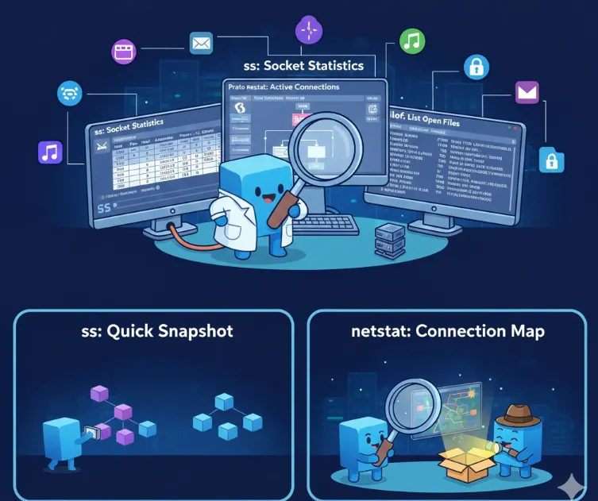
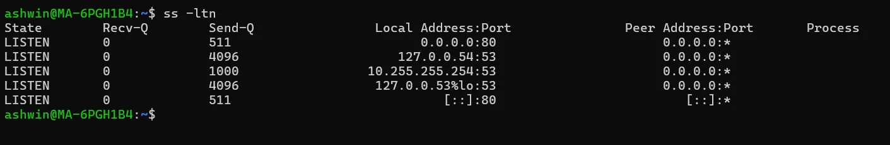
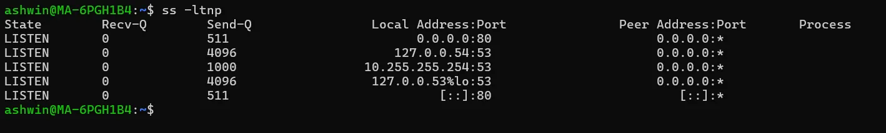
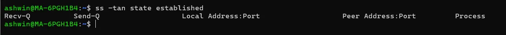
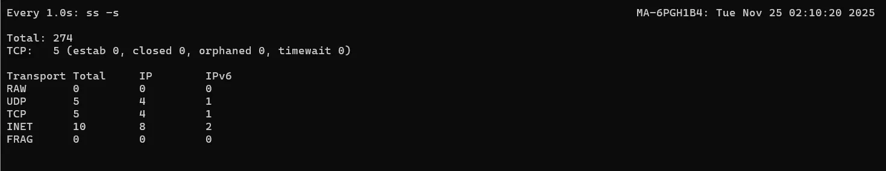
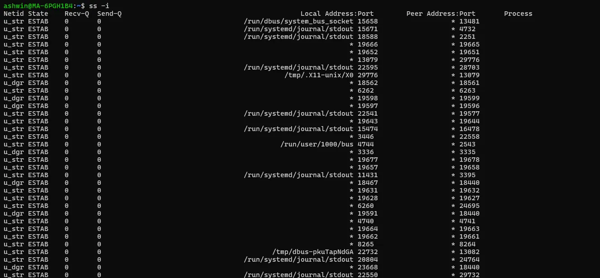
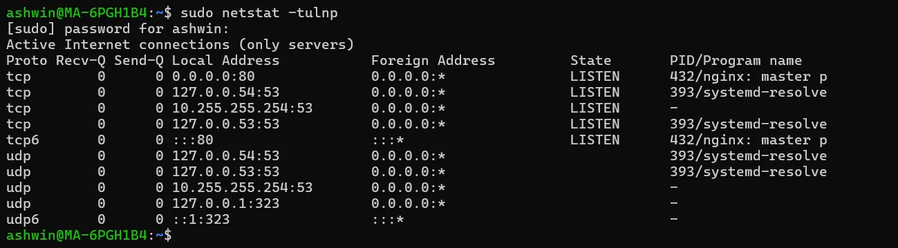
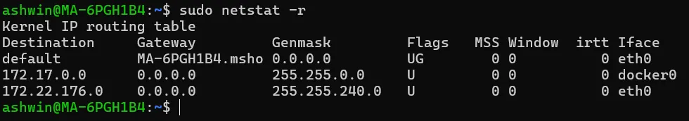
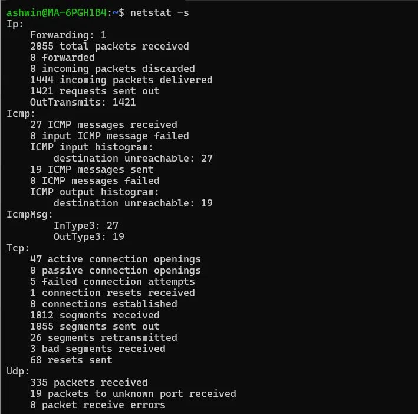
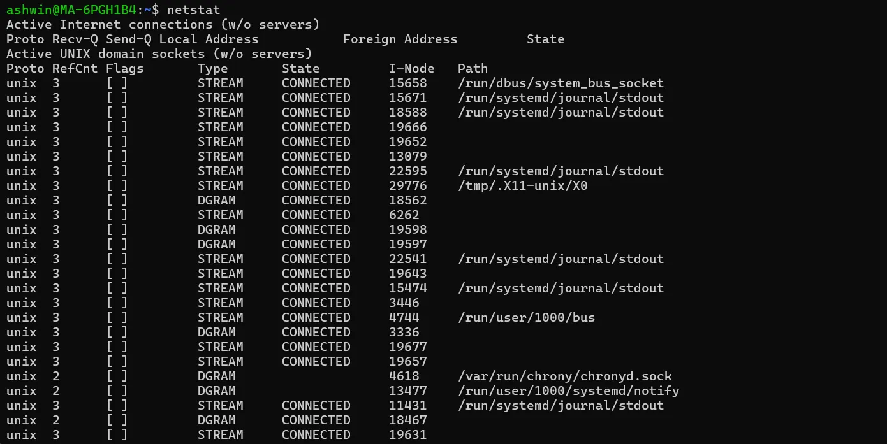

# დღე 15 — ss, netstat & lsof: Linux-ის სოკეტების ინსპექციის საბოლოო ინსტრუმენტები

ღრმა ანალიზი გახსნილი კავშირების აღმოჩენაზე, გაჭედილი მდგომარეობების დიაგნოსტიკაზე, პორტის კონფლიქტების იდენტიფიცირებაზე და რეალურ დროში ქსელის ქცევის გაგებაზე.



## რატომ არის დღე 15 მნიშვნელოვანი

თუ მუშაობთ:

- DevOps
- SRE
- Platform Engineering
- Cloud Infrastructure
- Microservices
- Kubernetes
- Networking

... მაშინ უნდა დაეუფლოთ როგორ გამოიკვლიოთ ქსელური კავშირები Linux მანქანაზე.

უნდა შეძლოთ პასუხის გაცემა კითხვებზე როგორიცაა:

- რა პორტები უსმენს?
- რომელი PID იყენებს პორტ 8080-ს?
- რამდენი კავშირია TIME_WAIT-ში?
- რატომ არის ჩემი სერვისი გაჭედილი CLOSE_WAIT-ში?
- რა გარე კავშირებს აკეთებს ჩემი pod?
- რომელი პროცესი საუბრობს მონაცემთა ბაზასთან?
- რომელი კავშირები ცდილობენ ხელახლა ან ვერ მუშაობენ?
- მანქანას ეხმარება ფაილის დესკრიპტორები?

დღევანდელი ინსტრუმენტები გაძლევთ რენტგენის ხედვას:

- **ss** — თანამედროვე, სწრაფი სოკეტების inspector
- **netstat** — ძველი ინსტრუმენტი, მაგრამ ჯერ კიდევ ყველგან გამოიყენება
- **lsof** — "ვინ-იყენებს-ამ-ფაილს-ან-პორტს" დეტექტივი

მოდით გავაცოცხლოთ ისინი ამბებით, დიაგრამებით და რეალური SRE დიაგნოსტიკის მაგალითებით.

## ნაწილი 1 — რა არის სოკეტი, რეალურად? (სწრაფი გამეორება)

სოკეტი არის:

```
IP + Port + Protocol (TCP/UDP)
```

კავშირები ამატებენ:

```
source IP + source port → dest IP + dest port
```

იფიქრეთ სოკეტებზე როგორც:

```
თქვენი სახლის კარებზე, რომლითაც საუბრები ხდება.
```

ინსტრუმენტები როგორიცაა ss / netstat / lsof გეუბნებათ:

- ვინ საუბრობს
- რომელი კარით
- რა მდგომარეობაში
- რომელი პროცესით
- რამდენი ხანი
- რამდენი საუბარი არსებობს
- არის თუ არა კარები დაბლოკილი, გაჭედილი ან გადატვირთული

მოდით ჩავუღრმავდეთ.

## ნაწილი 2 — ss (socket statistics): თანამედროვე ჩანაცვლება netstat-ისთვის

ss = super sonic netstat
სწრაფი, ეფექტური, თანამედროვე.

### რატომ არის ss უკეთესი:

- უფრო სწრაფი
- იყენებს /proc/net-ს პირდაპირ
- უკეთესი ფილტრები
- აჩვენებს მეტ TCP მონაცემებს
- მხარს უჭერს გაფართოებულ ფუნქციებს

ყველა თანამედროვე დისტრიბუცია რეკომენდაციას უწევს ss-ს netstat-ის ნაცვლად.

### ანალოგია: ss არის როგორც Google Maps ქსელური კავშირებისთვის

ის აჩვენებს ყველა კავშირს
რეალურ დროში სტატუსს
ვინ ვისთან საუბრობს
რომელი გზები გადატვირთულია
რომელი გზები დაბლოკილია
რომელი გზები (პორტები) გაჭედილია

## ნაწილი 3 — ss საფუძვლები (დაიწყეთ მარტივი, წადით ღრმად)

### 1. ყველა მოსმენილი პორტის სია:
```bash
ss -ltn
```

განმარტება:

- `l` = listening
- `t` = TCP
- `n` = numeric (არ გარჩიოს DNS)

შედეგის მაგალითი:



### 2. პროცესის სახელისა და PID-ის ჩათვლით:
```bash
ss -ltnp
```

მიიღებთ:



ახლა იცით:

- რომელი პროცესი
- რომელი PID
- რომელი ფაილის დესკრიპტორი

## ნაწილი 4 — დამყარებული კავშირების სია

```bash
ss -tan state established
```



აჩვენებს აქტიურ საუბრებს.

სასარგებლოა:

- DB კავშირების დიაგნოსტიკისთვის
- HTTP ტრაფიკის დიაგნოსტიკისთვის
- დატვირთვის გაზომვისთვის
- ტრაფიკის სპაიკების დასანახად

### მაგალითი: შეამოწმეთ რამდენი მომხმარებელია დაკავშირებული NGINX-თან

```bash
ss -tan | grep ':443' | wc -l
```

## ნაწილი 5 — TIME_WAIT & CLOSE_WAIT დიაგნოსტიკა

ეს ორი მდგომარეობა იწვევს რეალურ სამყაროში კავშირის პრობლემების 80%-ს.

### TIME_WAIT

**მნიშვნელობა:**

კავშირი დახურულია, მაგრამ Linux ელოდება რათა თავიდან აიცილოს დუბლიკატ პაკეტების დაბნევა.

**შემოწმება:**

```bash
ss -tan state time-wait
```

**მაღალი TIME_WAIT ნიშნავს:**

- მოკლე ვადიანი კავშირები
- მაღალი ტრაფიკი
- keep-alive-ის ნაკლებობა
- LB ან მიკროსერვის ცვლა

### CLOSE_WAIT

**მნიშვნელობა:**

დისტანციურმა მხარემ დახურა, მაგრამ თქვენმა აპლიკაციამ ვერ.

**შემოწმება:**

```bash
ss -tan state close-wait
```

**მაღალი CLOSE_WAIT ნიშნავს:**

- აპლიკაციის ბაგი
- კავშირის გაჟონვა
- close() არ ეძახება სწორად
- thread დაბლოკილია

ეს არის ერთ-ერთი უდიდესი production killer.

## ნაწილი 6 — მხოლოდ კონკრეტული პორტების ჩვენება

### პორტი 5432 (Postgres)
```bash
ss -tanp sport = :5432
```

### პორტი 8080:
```bash
ss -tanp 'sport = :8080'
```

### მხოლოდ გარე 443 ტრაფიკი:
```bash
ss -tan sport != :443 dport = :443
```

## ნაწილი 7 — დაინახეთ ვისთან ხართ დაკავშირებული

### გარე კავშირები ამ მანქანიდან:
```bash
ss -tan state established '( dport = :443 )'
```

ეს პასუხობს:

- რომელი მიკროსერვისები ეძახიან გარე API-ებს?
- რომელი pod უკავშირდება მონაცემთა ბაზას?
- რომელი node უგზავნის flood გარე მოთხოვნებს?

## ნაწილი 8 — რეალურ დროში სოკეტების მონიტორინგი (Live)

```bash
watch -n1 'ss -s'
```

აჩვენებს:

- TCP კავშირების რაოდენობას
- retransmission-ებს
- მეხსიერების გამოყენებას
- მდგომარეობების შეჯამებას

დიდი სისტემების დიაგნოსტიკისას → ეს არის ოქრო.



## ნაწილი 9 — გაფართოებული TCP ველები ss-ით

```bash
ss -i
```



აჩვენებს:

- congestion control
- retransmission-ებს
- rtt შეფასებებს
- cwnd (congestion window)
- unacked პაკეტებს

მაგალითი:

```
cubic wscale:7,7 rto:204 rtt:33.1/3.2 mss:1460 cwnd:10
```

დაინახავთ:

- თუ TCP ნელია
- თუ ქსელი გადატვირთულია
- თუ პაკეტების დაკარგვა არსებობს

ეს უგუნუმშია ნელი API ზარების დიაგნოსტიკაში.

## ნაწილი 10 — netstat: ძველი კლასიკა (ჯერ კიდევ რელევანტური)

netstat უფრო ძველია მაგრამ ფართოდ გამოიყენება.

### პორტების სია:
```bash
netstat -tulnp
```



ექვივალენტურია `ss -tulnp`-ს.

### routing ცხრილის ჩვენება:
```bash
netstat -r
```



### სტატისტიკის ჩვენება:
```bash
netstat -s
```



აჩვენებს:

- retransmission-ებს
- TCP ჩავარდნებს
- receive შეცდომებს
- send queue overflow-ებს

ეს შესანიშნავია low-level დიაგნოსტიკისთვის.

### netstat შედეგის ინტერპრეტაცია (მარტივი ხედვა)

```
Active Internet connections
Proto Recv-Q Send-Q Local Address   Foreign Address  State       PID/Program
tcp   0       0      0.0.0.0:22     0.0.0.0:*        LISTEN      568/sshd
```

მნიშვნელობა:

- **Recv-Q** → მონაცემები რომლებიც ელოდება აპს
- **Send-Q** → მონაცემები რომლებიც ელოდება kernel-ს
- **LISTEN** → სერვისი მზადაა
- **PID/Program** → მფლობელი

თუ Recv-Q იზრდება → აპი ვერ ამუშავებს მონაცემებს საკმარისად სწრაფად.
თუ Send-Q იზრდება → ქსელის პრობლემები ან receiver ნელი.



### ᲓᲘᲓᲘ SRE რჩევა: Recv-Q და Send-Q არის Performance ინდიკატორები

**Send-Q მაღალი**
= ქსელი გადატვირთული
= დისტანციური სერვერი ნელი
= როუტერი ანადგურებს პაკეტებს
= retransmission
= ძირითადი ბმული ცუდი

**Recv-Q მაღალი**
= აპლიკაცია ნელი
= აპის thread დაბლოკილი
= CPU სპაიკები
= GC პაუზა
= DB lock

ეს ველები ავლენს რა რეალურად ხდება.

## ნაწილი 11 — lsof: დეტექტივი რომელიც პოულობს "ვინ იყენებს ამ პორტს?"

lsof = List Open Files

Linux-ში:

```
ყველაფერი არის ფაილი: სოკეტები, pipes, მოწყობილობები, პორტები.
```

გამოიყენეთ lsof რათა იპოვოთ:

- რომელი პროცესი იყენებს პორტ 8080-ს
- რომელი PID ფლობს გახსნილ DB კავშირებს
- გაჟონვადი კავშირები
- zombie სოკეტები
- ფაილის დესკრიპტორის ამოწურვა

### ვინ იყენებს პორტ 8080-ს?
```bash
sudo lsof -i :8080
```

შედეგის მაგალითი:

```
java  2345 user  45u  IPv6  TCP *:8080 (LISTEN)
```

### ყველა ქსელთან დაკავშირებული ფაილის დესკრიპტორის სია:
```bash
lsof -i
```

### გახსნილი კავშირები პროცესის მიხედვით:
```bash
lsof -p 1234 -a -i
```

ეს პასუხობს:

- რა DB-ებს უკავშირდება სერვისი?
- რა მიკროსერვისებთან საუბრობს?
- გაჟონავს თუ არა სოკეტებს?

### მხოლოდ TCP კავშირების ჩვენება:
```bash
lsof -iTCP
```

### მხოლოდ LISTEN სოკეტების ჩვენება:
```bash
lsof -iTCP -sTCP:LISTEN
```

### მხოლოდ პროცესები რომლებიც იყენებენ კონკრეტულ IP-ს:
```bash
lsof -i @10.0.2.5
```

## ნაწილი 12 — რეალური DevOps/SRE დიაგნოსტიკის სცენარები

### სცენარი 1 — "პორტი უკვე გამოყენებულია"

```bash
sudo lsof -i :8080
```

იპოვეთ PID → kill ან გაასწორეთ აპი.

### სცენარი 2 — "აპი მუშაობს ლოკალურად, ვერ მუშაობს production-ში"

ss:

```bash
ss -tan state syn-sent
```

თუ SYN გაგზავნილია მაგრამ SYN-ACK არ არის → firewall პრობლემა.

### სცენარი 3 — "მონაცემთა ბაზის კავშირების გაჟონვა"

```bash
lsof -i :5432 | wc -l
```

თუ რაოდენობა განაგრძობს ზრდას → კავშირის გაჟონვა → გაასწორეთ pooling.

### სცენარი 4 — "მაღალი TIME_WAIT იწვევს პორტის ამოწურვას"

```bash
ss -tan state time-wait | wc -l
```

გასწორება:

- ჩართეთ keep-alive
- კავშირის ხელახლა გამოყენება

### სცენარი 5 — "Pod ვერ აღწევს ინტერნეტს"

ss შედეგი:

```
Recv-Q იზრდება
```

→ NAT mapping აკლია
→ CNI პრობლემა
→ iptables MASQUERADE პრობლემა

### სცენარი 6 — "ნელი API ზარი მიკროსერვისიდან"

ss -i:

```
retransmissions > 0
```

→ ქსელის გადატვირთვა
→ მარშრუტის პრობლემა
→ შეამოწმეთ mtr/traceroute

### სცენარი 7 — "მოჩვენების პროცესი ფლობს პორტს"

lsof:

```
defunct პროცესი
```

→ zombie
→ სჭირდება parent kill ან restart

## ნაწილი 13 — პრაქტიკული ბრძანებების Cheat Sheet

### ss — თანამედროვე სოკეტის ინსტრუმენტი
```bash
ss -tulnp            # მოსმენილი პორტები პროცესებით
ss -tan              # ყველა TCP კავშირი
ss -i                # შიდა TCP სტატისტიკა
ss -tan state time-wait
ss -tan state close-wait
ss -s                # შეჯამება
ss -p                # პროცესის ინფო
```

### netstat (ძველი მაგრამ სასარგებლო)
```bash
netstat -tulnp
netstat -s
netstat -r
netstat -anp
```

### lsof — ვინ ფლობს რომელ პორტს?
```bash
lsof -i :8080
lsof -i
lsof -iTCP -sTCP:LISTEN
lsof -p <pid> -a -i
```

## შეჯამება (დღე 15)

დღეს ისწავლეთ:

- განსხვავება ss, netstat და lsof-ს შორის
- როგორ გამოიკვლიოთ მოსმენილი პორტები
- როგორ იპოვოთ რომელი პროცესი ფლობს პორტს
- TIME_WAIT, CLOSE_WAIT დიაგნოსტიკა
- გარე vs შიდა კავშირები
- როგორ დადგინდეს ნელი TCP კავშირები
- როგორ იდენტიფიცირდეს გაჟონვები
- როგორ გაანალიზდეს Recv-Q / Send-Q
- როგორ ეხმარება ეს ინსტრუმენტები რეალურ SRE პრობლემებში

ერთად, ss + lsof არის ყველაზე აუცილებელი ყოველდღიური ინსტრუმენტები Linux ქსელის დიაგნოსტიკისთვის.

## მომდევნო (დღე 16)
ethtool, ifstat, nstat — ქსელის ინტერფეისის ხილვადობის ტრიო

ისწავლით:

- NIC სიჩქარე & duplex
- დრაივერის ინფორმაცია
- Link flapping
- პაკეტების დაკარგვა
- შეცდომები & კოლიზიები
- ინტერფეისის მთვლელები
- რეალურ დროში throughput
- Kernel ქსელის სტატისტიკა
- ფიზიკური NIC პრობლემების დიაგნოსტიკა
- Cloud VM ვირტუალური NIC დიაგნოსტიკა

ეს არის თავი სადაც გავიგებთ თავად ქსელურ ბარათს.