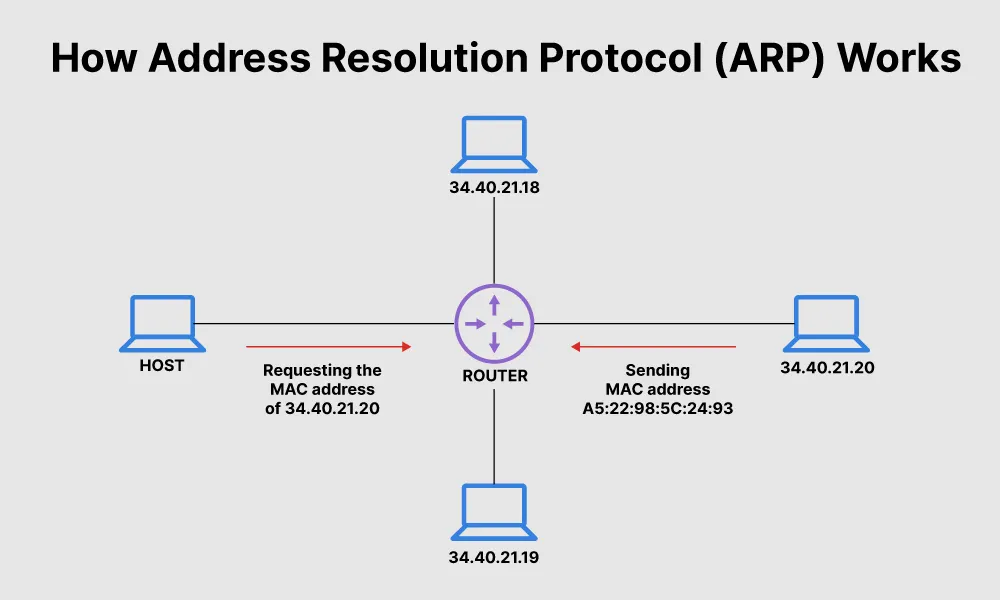
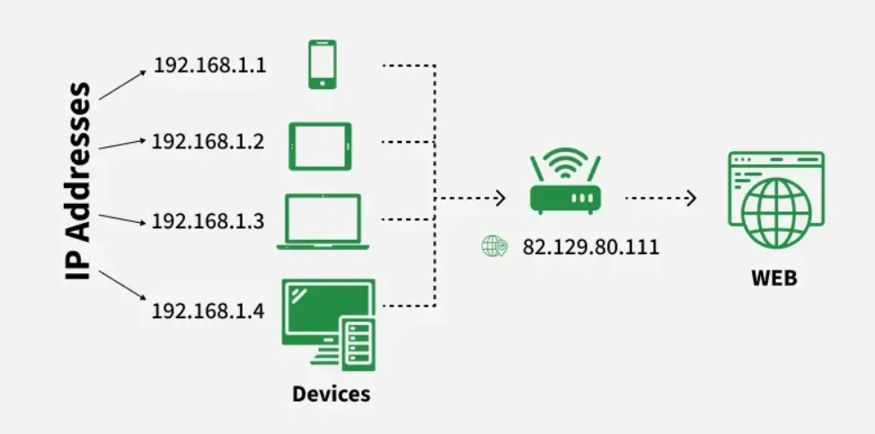
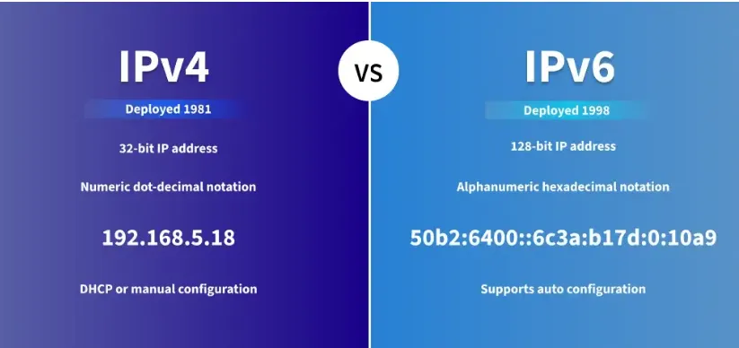
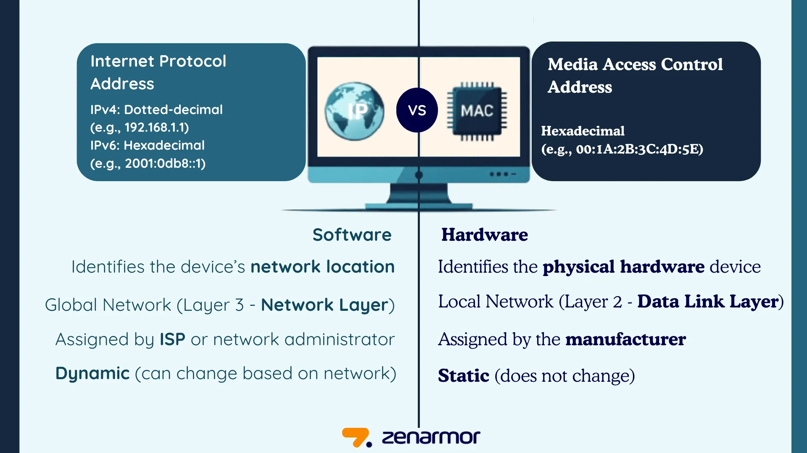
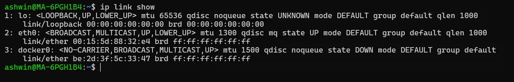
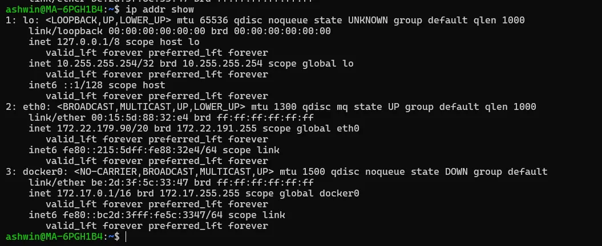
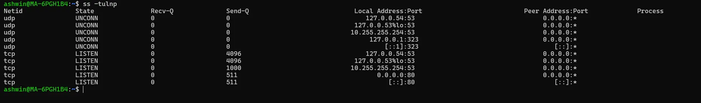
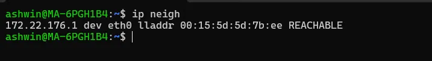
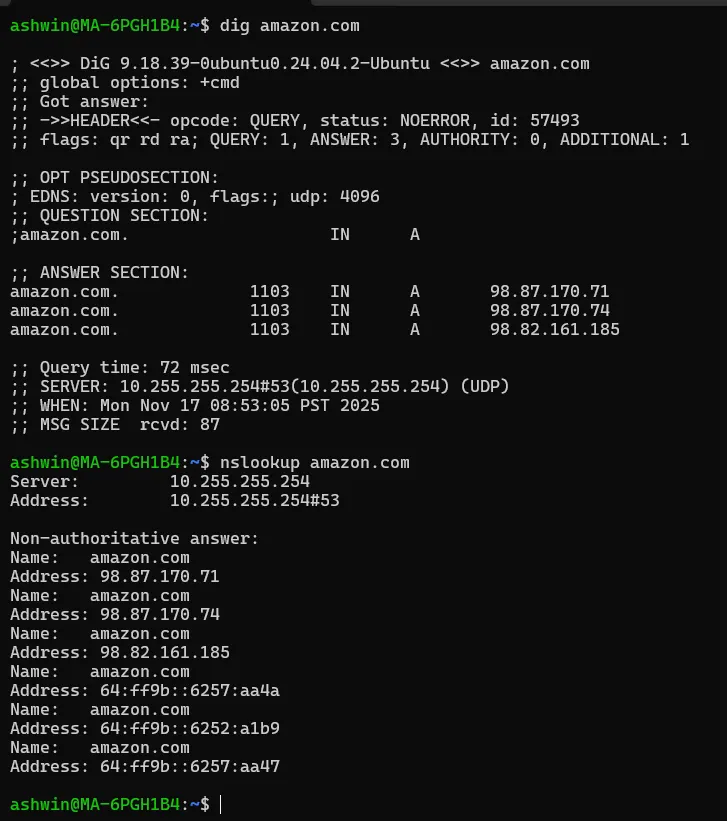
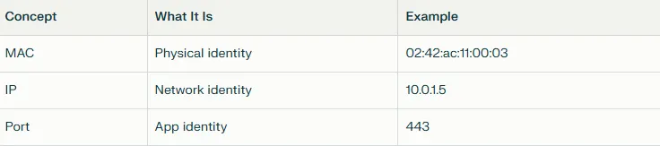

# დღე 2 — MAC, IP და პორტები: ინტერნეტის იდენტიფიკაციის სისტემა (მარტივად ახსნილი)

## რატომ არის ეს თემა მნიშვნელოვანი

ყოველ ჯერზე, როცა რაიმეს უკავშირდებით — იქნება ეს `curl google.com`, Kubernetes pod რომელიც სერვისს უძახებს, თუ VM რომელიც ლოგებს აგზავნის — სამი იდენტიფიკატორი ხდის კომუნიკაციას შესაძლებელს:

* MAC მისამართი (ლეიერი 2 იდენტიფიკატორი)
* IP მისამართი (ლეიერი 3 იდენტიფიკატორი)
* პორტის ნომერი (ლეიერი 4 იდენტიფიკატორი)

ერთად, ისინი პასუხობენ:

* **ვინ ხარ?** (MAC)
* **სად ხარ?** (IP)
* **რომელ აპლიკაციასთან ცდილობ საუბარს?** (პორტი)

თუ ამათგან რომელიმე არასწორია → ქსელი იშლება.

ეს არის ერთ-ერთი ყველაზე პრაქტიკული თემა DevOps/SRE troubleshooting-ისთვის.


## ლეიერი 2: MAC მისამართი — თქვენი ქსელური ბარათის სახელი

თქვენი MAC მისამართი არის ფიზიკური იდენტიფიკატორი, რომელიც ჩაწერილია თქვენს ქსელურ ინტერფეისში.

**მაგალითი:**
```
eth0 → 02:42:ac:11:00:03
```

### მარტივი ანალოგია

MAC არის როგორც თქვენი სახლის ფიზიკური მდებარეობა — ის არასოდეს იცვლება და იდენტიფიცირებს მოწყობილობას მხოლოდ ლოკალურ ქუჩაში.

### მთავარი ფაქტები:

* 48-ბიტიანი იდენტიფიკატორი
* უნიკალური (უმეტესწილად)
* ცხოვრობს ლეიერ 2-ში (Ethernet/WiFi)
* რელევანტურია მხოლოდ იმავე ლოკალურ ქსელში
* როუტერები არ გადაიტანენ MAC მისამართებს

### რეალური გამოყენება:

* Switching
* ARP (დაკავშირება IP → MAC)
* L2 იზოლაცია (VLAN, bridges)




## ლეიერი 3: IP მისამართი — თქვენი მისამართი ინტერნეტში

IP = მდებარეობა ქსელურ სამყაროში.

**მაგალითები:**
```
10.0.1.5
172.17.0.2
192.168.1.10
```

### ანალოგია

IP არის როგორც თქვენი საფოსტო მისამართი, რომელიც სხვებს საშუალებას აძლევს გამოგიგზავნონ შეტყობინებები თქვენს მდებარეობაზე — თუნდაც სხვადასხვა ქალაქებიდან.

### მთავარი ფაქტები:

* შეიძლება შეიცვალოს
* მიეწოდება DHCP-ის ან static კონფიგურაციის საშუალებით
* საჭიროა მარშრუტიზაციისთვის ქსელებს შორის

### IPv4 vs IPv6

* **IPv4:** 4 მილიარდი მისამართი
* **IPv6:** ძირითადად უსასრულო
* უმეტესი cloud ინფრასტრუქტურა ჯერ კიდევ იყენებს IPv4-ს შიდა გამოყენებისთვის







## ლეიერი 4: პორტები — სახლის რომელი კარი?

თქვენი IP იდენტიფიცირებს მანქანას.
პორტი იდენტიფიცირებს აპლიკაციას.

### მაგალითები:

```
22 = SSH
80 = HTTP
443 = HTTPS
5432 = PostgreSQL
```

### ანალოგია

თქვენს სახლს აქვს ერთი მისამართი (IP), მაგრამ მრავალი კარი (პორტები) — ერთი ფოსტისთვის, ერთი მიწოდებისთვის და ა.შ.

### მთავარი ფაქტები:

* **დიაპაზონი:** 0–65535
* პორტები < 1024 = პრივილეგირებული (საჭიროებენ root-ს, თუ არ იყენებთ capabilities-ს)
* მრავალი აპლიკაცია შეიძლება იმუშაოს იმავე IP-ზე სხვადასხვა პორტების გამოყენებით

## როგორ მუშაობენ ეს სამი ერთად

დავუშვათ, თქვენ გაუშვით:

```bash
curl google.com
```

ეს იწვევს:


პაკეტი, რომელიც ტოვებს თქვენს მანქანას, შეიძლება გამოიყურებოდეს ასე:

```
Source MAC: 02:42:ac:11:00:05
Source IP: 192.168.1.10
Source Port: 52234   (შემთხვევითი მაღალი პორტი)
→
Destination MAC: gateway-ის MAC
Destination IP: 142.250.182.110 (Google)
Destination Port: 443
```

## რეალური DevOps სცენარი

**"ჩემს კონტეინერს არ შეუძლია მონაცემთა ბაზის მიღწევა."**

შეამოწმეთ:

### 1. პორტები

```bash
nc -vz db.internal 5432
```

### 2. IP მისაწვდომობა

```bash
ping db.internal
```

### 3. MAC რეზოლუცია (ARP)

```bash
ip neigh
```

* თუ ARP უარყოფს → კონტეინერს არ შეუძლია gateway-ის ან DB ჰოსტის პოვნა L2-ზე.
* თუ პორტი უარყოფს → firewall ან listening პრობლემა.

## რატომ არის ეს თემა გადამწყვეტი DevOps/SRE-ში

რადგან უმეტესი საერთო პრობლემები ასახავს ამ იდენტიფიკატორებს:

* ❌ **არასწორი IP** → სერვისი მიუწვდომელია
* ❌ **არასწორი პორტი** → აპლიკაცია მიუწვდომელია
* ❌ **არასწორი MAC** → ARP უარყოფა, გაჭედილი პაკეტები
* ❌ **პორტი უკვე გამოყენებულია** → აპი არ ეშვება
* ❌ **IP კონფლიქტი** → არაპროგნოზირებადი ქცევა
* ❌ **NAT გადაწერა** → რთული დებაგი

ამის გაგება = ქსელური პრობლემების 70%-ის დებაგი.

## სასარგებლო Linux ბრძანებები (დღე 2)

### MAC მისამართების ნახვა

```bash
ip link show
```



### IP-ების ნახვა

```bash
ip addr show
```



### მსმენელი პორტების ნახვა

```bash
ss -tulnp
```



### შემომავალი/გამავალი კავშირების ნახვა

```bash
ss -pant
```

**picture_add**

### ARP ცხრილი (IP → MAC)

```bash
ip neigh
```



### DNS → IP lookup

```bash
dig amazon.com
nslookup amazon.com
```



## სწრაფი შეჯამება



ეს სამი ქმნის ყველა ქსელური კომუნიკაციის საფუძველს.

## მომავალი (დღე 3)

ხვალ ჩავუღრმავდებით:
**დღე 3 — ARP, ICMP და Ping: როგორ პოულობს თქვენი მანქანა თავის მეზობლებს**

თქვენ გაიგებთ:

* როგორ გარდაქმნის ARP IP → MAC-ს
* რატომ იყენებს ping ICMP-ს
* რატომ "მუშაობს ping მაგრამ curl არ მუშაობს"
* როგორ დავადებაგოთ ARP poisoning, stale neighbours და packet drops