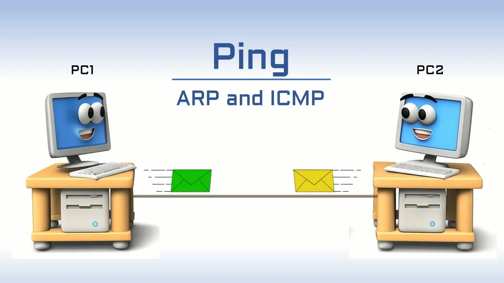
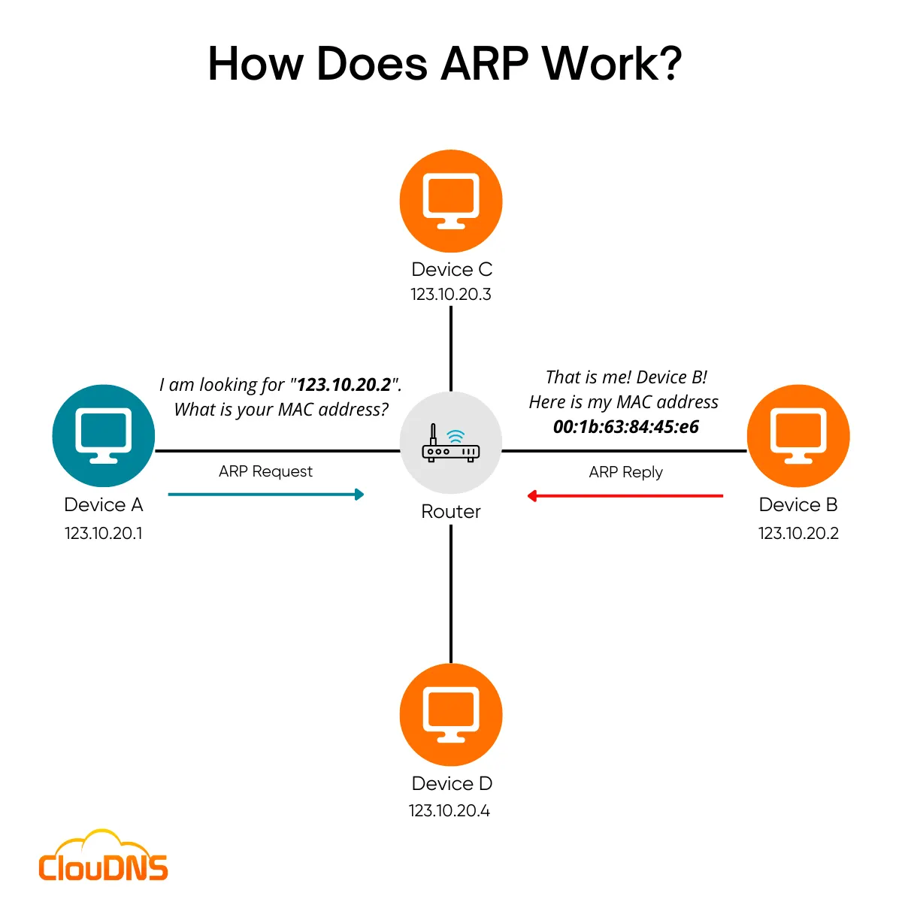
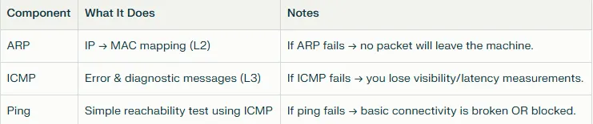

# დღე 3 — ARP, ICMP და Ping: როგორ პოულობს თქვენი მანქანა თავის მეზობლებს

## რატომ არის ეს მნიშვნელოვანი

ყველა ქსელური მოთხოვნა — რაც არ უნდა რთული იყოს — იწყება ერთი მარტივი კითხვით:
**"ვის აქვს ეს IP?"**

იქნება თქვენი სერვერი ping-ავს gateway-ს, თქვენი pod უძახებს cluster service-ს, თუ თქვენი VM აღწევს გარე API-ს… თქვენმა მანქანამ უნდა იცოდეს დანიშნულების MAC მისამართი (ან მისი gateway) სანამ ერთი პაკეტიც კი დატოვებს მას.

დღეს ჩვენ ავხსნით ამ აღმოჩენის მექანიზმის სამ ძირითად ნაწილს:

* **ARP** → აკავშირებს IP → MAC
* **ICMP** → შეტყობინებების პროტოკოლი შეცდომებისა და აღმოჩენისთვის
* **Ping** → ICMP Echo კავშირის შესამოწმებლად

ეს არის ერთ-ერთი ყველაზე მნიშვნელოვანი საფუძველი DevOps & SRE troubleshooting-ისთვის.



## ნაწილი 1 — ARP: Address Resolution Protocol

ARP პასუხობს კითხვაზე:
**"რომელ MAC მისამართს აქვს ეს IP?"**

თუ გსურთ პაკეტის გაგზავნა `192.168.1.20`-ზე, თქვენი მანქანა პირველ რიგში ამოწმებს ARP-ს.

### მარტივი ანალოგია

თქვენ გაქვთ ვიღაცის ქუჩის მისამართი (IP), მაგრამ გჭირდებათ მათი სახე (MAC) რათა წერილი პირადად გადასცეთ.

### როგორ მუშაობს:

**1. თქვენ ეკითხებით მთელ ქსელს:**
```
ვის აქვს 192.168.1.20? უთხარით 192.168.1.10-ს
```

**2. მოწყობილობა ამ IP-თი პასუხობს:**
```
192.168.1.20 არის 02:42:ac:11:00:03-ზე
```

**3. თქვენი მანქანა ინახავს ამას ARP cache-ში.**

### ARP cache-ის ნახვა:

```bash
ip neigh
```



## რეალური DevOps სიტუაციები სადაც ARP იშლება

* ❌ **Pod/node არ შეუძლია gateway-ს მიღწევა** → ARP incomplete
* ❌ **არასწორად კონფიგურირებული VLAN-ები** → ARP იშლება
* ❌ **დუბლირებული IP-ები** → ARP ცვლის ორ MAC-ს შორის
* ❌ **ხმელი ARP ჩანაწერები** → ინტერმიტენტული კავშირი
* ❌ **ARP poisoning** → თავდამსხმელი ხელს უშლის ტრაფიკს

### ARP უარყოფის მაგალითი:

```
192.168.1.1 dev eth0  INCOMPLETE
```

ნიშნავს, რომ თქვენმა სისტემამ იკითხა "ვის აქვს 192.168.1.1?" მაგრამ არავინ უპასუხა.

## ნაწილი 2 — ICMP: Internet Control Message Protocol

ICMP არ არის აპლიკაციის პროტოკოლი. ეს არის კონტროლისა და შეცდომის ანგარიშგების პროტოკოლი.

### გამოიყენება:

* **Ping** (echo request/reply)
* **TTL გადაჭარბებული** (traceroute)
* **დანიშნულება მიუწვდომელი**
* **გადამისამართების შეტყობინებები**
* **პაკეტი ძალიან დიდია** (MTU პრობლემები)

### ანალოგია

ICMP არის როგორც საფოსტო თანამშრომელი, რომელიც გაცნობებთ:
* "თქვენი ამანათი ვერ მიწოდებულა."
* "მისამართი არ არსებობს."
* "გზა ძალიან გრძელია."


## ნაწილი 3 — Ping: უმარტივესი ქსელური ტესტი (ICMP Echo)

Ping იყენებს ICMP Echo (ტიპი 8) და Echo Reply (ტიპი 0).

როცა გაუშვებთ:
```bash
ping 8.8.8.8
```

### ხდება შემდეგი:

1. DNS რეზოლუცია (ოფციონალური)
2. ARP რეზოლუცია (თუ იმავე subnet-შია)
3. ICMP Echo Request გაიგზავნება
4. ICMP Echo Reply მიიღება

### Ping გეუბნებათ:

* ✅ ხელმისაწვდომია ჰოსტი?
* ⏱️ რა არის latency?
* 📉 ხდება packet loss?
* 🛣️ სტაბილურია მარშრუტი?


## Troubleshooting როგორც SRE

### 1. შემთხვევა 1: "Ping მუშაობს მაგრამ curl არა."

**ნიშნავს:**
* ✅ L3 რიგზეა
* ❌ DNS შეიძლება არასწორი იყოს
* ❌ Firewall შეიძლება ბლოკავს პორტს 80/443
* ❌ აპი რემოუთზე შეიძლება გამორთული იყოს
* ❌ SSL პრობლემები

### 2. შემთხვევა 2: "Curl მუშაობს მაგრამ ping არა."

Cloud გარემოები ხშირად ბლოკავენ ICMP-ს. AWS security groups ბლოკავს ICMP-ს ნაგულისხმევად. არ არის პრობლემა, თუ არ გჭირდებათ დიაგნოსტიკური მონაცემები (latency/packet loss).

## სასარგებლო Linux ბრძანებები (დღე 3)

### ARP ცხრილის ნახვა

```bash
ip neigh
```

### ხმელი ARP ჩანაწერის წაშლა

```bash
ip neigh del 192.168.1.20 dev eth0
```

### Ping დეტალური სტატისტიკით

```bash
ping -c 10 google.com
```


### TTL და path ინფორმაციის გამოტანა

რომელიც კარგია routing პრობლემებისთვის:

```bash
ping -t 3 8.8.8.8
```

### ICMP შეცდომები (troubleshooting)

```bash
dmesg | grep ICMP
```

## სწრაფი შეჯამება



## მომავალი (დღე 4)

ხვალ უფრო ღრმად შევალთ:
**დღე 4 — IP Routing საფუძვლები: როგორ მოძრაობენ პაკეტები ქსელებში**

თქვენ გაიგებთ:

* რა არის routing table
* როგორ ირჩევს Linux შემდეგ hop-ს
* როგორ მუშაობს default gateway
* რას რეალურად ნიშნავს CIDR routes-ისთვის
* რატომ იღებენ პაკეტები ზოგჯერ უცნაურ გზებს
* როგორ დავადებაგოთ routing პრობლემები `ip route`, `mtr` და `traceroute` გამოყენებით

ეს იქნება ერთ-ერთი ყველაზე მნიშვნელოვანი პოსტი მთელ სერიაში.