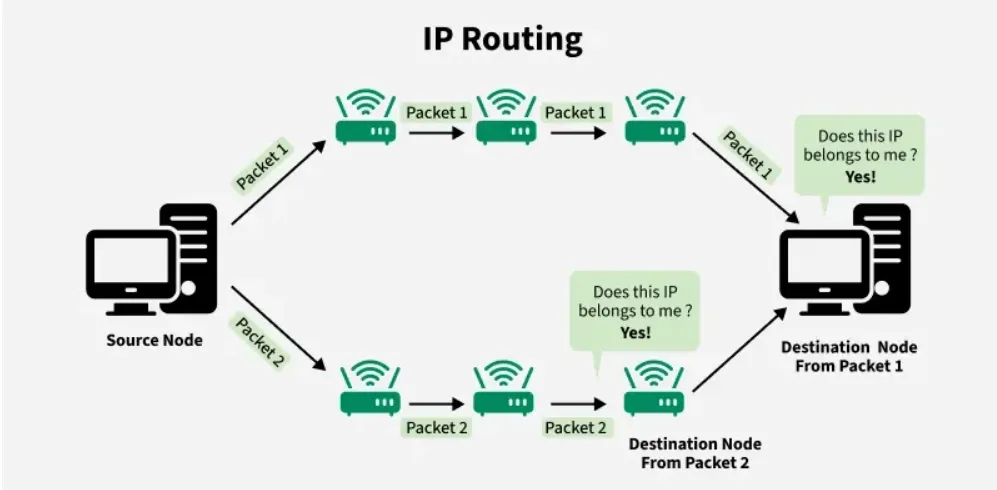
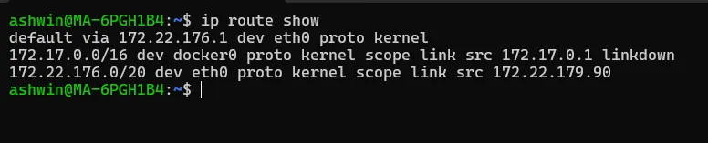
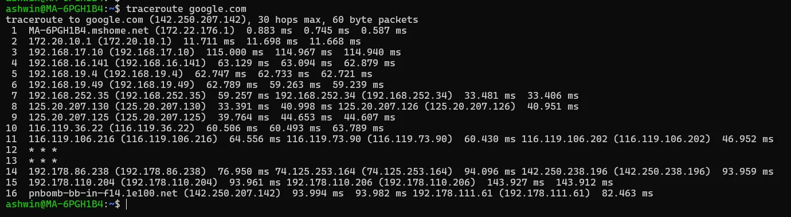
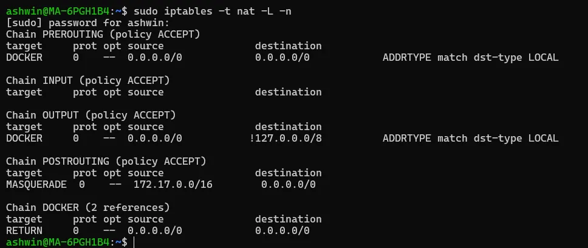
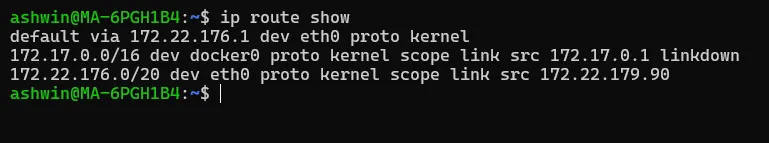
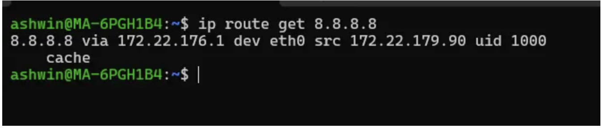

# დღე 4 — IP Routing საფუძვლები: როგორ მოძრაობენ პაკეტები ქსელებში

## რატომ არის Routing ერთ-ერთი ყველაზე მნიშვნელოვანი ქსელური კონცეფცია

როცა გაუშვებთ:
```bash
curl google.com
curl internal-service.cluster.local
ping 8.8.8.8
kubectl exec pod -- curl service
```

თქვენ ჩართავთ routing მექანიზმს Linux-ში.

### Routing წყვეტს სად წავიდეს პაკეტები:

* სხვა ჰოსტთან იმავე subnet-ში?
* Gateway-ზე?
* სხვა ქსელში?
* ინტერნეტში?
* VPN-ის გავლით?
* Kubernetes node-ებში?
* NAT-ის ან firewall-ის გავლით?

### არაფერი არ მუშაობს routing-ის გარეშე.

თუ routing გაფუჭებულია →
* ❌ სერვისები არ უკავშირდებიან
* ❌ Cloud VM-ებს არ შეუძლიათ API-ების მიღწევა
* ❌ Pod-ები იღებენ "Connection timed out"
* ❌ Load balancer-ები უხმოდ უარყოფენ


ასე რომ, დღეს ჩავუღრმავდებით:

* რა არის routing
* როგორ იღებს Linux routing გადაწყვეტილებებს
* Routing tables
* Default gateway
* Longest-prefix match
* Multi-path routing
* Policy-based routing
* როგორ მოძრაობენ პაკეტები hop-by-hop
* რეალური DevOps/SRE troubleshooting
* სასარგებლო Linux ბრძანებები

დავიწყოთ.

## რა არის IP Routing სწორედ?

Routing არის პაკეტების გადაგზავნის პროცესი ერთი ქსელიდან მეორეში.

### წარმოიდგინეთ, რომ აგზავნით ამანათს:

* თუ დანიშნულება თქვენს საცხოვრებელ კორპუსშია → გადასცემთ ლოკალურ მიმტანს
* თუ დანიშნულება სხვა ქალაქშია → აძლევთ მთავარ საკურიერო ოფისს (gateway)
* თუ დანიშნულება სხვა ქვეყანაშია → კურიერი გადააქვს მას ჰაბებსა და მარშრუტებზე

ქსელი მუშაობს იგივე გზით.



## ლეიერული ახსნა

### 1. თუ destination IP იმავე subnet-შია → მიაწოდეთ პირდაპირ

**მაგალითი:**
```
თქვენი ჰოსტი: 192.168.1.10/24
დანიშნულება: 192.168.1.20

იმავე ქსელში = როუტერი არ სჭირდება
ARP პოულობს MAC-ს → პაკეტი გაიგზავნება
```

### 2. თუ destination IP subnet-ის გარეთაა → გაგზავნეთ default gateway-ზე

**მაგალითი:**
```
დანიშნულება: 8.8.8.8

თქვენი მანქანა ამბობს:
"არ ვიცი სად არის 8.8.8.8. მაგრამ ვიცი რომ gateway იცის."

ასე რომ პაკეტები მიდიან:
default gateway → router → internet
```

## Routing Table — პაკეტის მიმართულების ტვინი

ნახეთ ამით:
```bash
ip route show
```

### მაგალითი გამოსავალი:

```
default via 192.168.1.1 dev eth0
192.168.1.0/24 dev eth0 proto kernel scope link src 192.168.1.10
10.0.0.0/16 via 10.0.1.1 dev eth0
```

ეს ნიშნავს:

* ყველაფერი რაც სხვა route-ებს არ ემთხვევა → გაგზავნეთ 192.168.1.1-ზე
* ყველაფერი 192.168.1.0/24-ში → გაგზავნეთ პირდაპირ eth0-ს გავლით
* ყველაფერი 10.0.0.0/16-ში → გაგზავნეთ 10.0.1.1-ის გავლით



## Routing-ის ოქროს წესი: Longest Prefix Match (LPM)

Linux ყოველთვის ირჩევს ყველაზე სპეციფიკურ route-ს.

### მაგალითი:

```
10.0.0.0/8 → მოიცავს უზარმაზარ დიაპაზონს
10.0.0.0/16 → უფრო მცირე დიაპაზონი
10.0.1.0/24 → უფრო მცირე
10.0.1.50/32 → ზუსტი ჰოსტი
```

თუ ping-ავთ 10.0.1.50-ს, Linux ირჩევს:
```
10.0.1.50/32  → ყველაზე სპეციფიკური
```

### ეს გადამწყვეტია:

* Kubernetes networking-ში
* VPN-ებში
* კორპორატიულ split-tunnelling-ში
* Cloud VPC routing-ში
* Multi-homed სერვერებში

## როგორ მოძრაობენ პაკეტები (Hop-by-Hop ნაკადი)

მოდით, გავაკვალიოთ:
```bash
curl google.com
```

### ნაკადი:

1. **DNS** → პოულობს Google IP-ს
2. **ARP** → პოულობს gateway MAC-ს
3. **პაკეტი შექმნილია:** Source IP: თქვენი მანქანა, Destination IP: Google
4. პაკეტი გაიგზავნება gateway-ის MAC-ზე
5. Gateway გადააქვს შემდეგ router-ზე
6. Router გადააქვს შემდეგ router-ზე
7. საბოლოოდ აღწევს Google-ის უახლოეს data center-ს
8. პასუხი მიჰყვება საპირისპირო route-ს
9. თქვენი აპი იღებს პასუხს

### გამოიყენეთ ეს ბრძანება გზის დასათვალიერებლად:

```bash
traceroute google.com
```



ან უფრო ზუსტი:
```bash
mtr google.com
```

## Routing გადაწყვეტილების მაგალითი

### Routing table:

```
default via 192.168.1.1 dev eth0
10.0.0.0/8 dev eth1
10.1.2.0/24 via 10.0.0.1 dev eth1
```

### დანიშნულება: 10.1.2.5

რომელი წესი შეესაბამება?

* `/8` (მოიცავს უზარმაზარ დიაპაზონს)
* `/24` (უფრო სპეციფიკური) ✅

ასე რომ Linux ირჩევს:
```
10.1.2.0/24 via 10.0.0.1
```

## Policy-Based Routing (გაუმჯობესებული)

### რა მოხდება თუ:

* eth0 არის ინტერნეტისთვის
* eth1 არის პირად VPN-ისთვის
* გსურთ მხოლოდ გარკვეული ტრაფიკი გაიაროს eth1-ზე?

ჩვეულებრივი routing ვერ გამოხატავს:
*"გამოიყენე eth1 მხოლოდ ტრაფიკისთვის ამ კონკრეტული აპიდან ან network namespace-დან."*

### შემოდის policy routing:

```bash
ip rule add from 10.20.30.0/24 table 100
ip route add default via 10.20.30.1 table 100
```

ეს გამოიყენება:
* Kubernetes-ში
* Docker-ში
* WireGuard-ში
* Cloud VPC-ებში
* Multi-NIC სერვერებში

## რეალური DevOps/SRE Debugging სცენარები

### სცენარი 1 — "Ping მუშაობს მაგრამ curl არა"

* Ping იყენებს ICMP-ს
* Curl იყენებს TCP-ს

➡️ Routing რიგზეა → firewall/ports/SSL იწვევს უარყოფას

### სცენარი 2 — "ჩემს pod-ს არ შეუძლია გარე URL-ების მიღწევა"

შეამოწმეთ არსებობს თუ არა default route:
```bash
ip route show
```

**ხშირი K8s პრობლემა:**
* Pod-ს აკლია SNAT → პასუხი არასოდეს უბრუნდება
* არასწორი routing table CNI plugin-ში
* პაკეტი ტოვებს არასწორ interface-ს

### სცენარი 3 — "ორი NIC, ტრაფიკი მოდის არასწორი interface-დან"

შეამოწმეთ source-based routing:
```bash
ip rule
```

### სცენარი 4 — "სერვერს შეუძლია ინტერნეტის მიღწევა მაგრამ ვერ აღწევს კონკრეტულ subnet-ს"

ხშირად აკლია სპეციფიკური route:
```bash
ip route add 10.50.0.0/16 via 10.0.0.1
```

### სცენარი 5 — "Ping gateway მაგრამ ვერ ping 8.8.8.8"

შეამოწმეთ NAT:
```bash
iptables -t nat -L -n
```



ან cloud route table.

## სასარგებლო Linux ბრძანებები (დღე 4)

### Routing table-ის ნახვა

```bash
ip route show
```



### ნახეთ როგორ გაავლებს Linux კონკრეტულ IP-ს

```bash
ip route get 8.8.8.8
```

### გზის კვალი hop-by-hop

```bash
traceroute google.com
mtr google.com
```

### Routing წესების ნახვა (გაუმჯობესებული)

```bash
ip rule show
```

### Static route-ის დამატება

```bash
ip route add 10.0.0.0/16 via 192.168.1.1
```

### Route-ის წაშლა

```bash
ip route del 10.0.0.0/16
```

## სწრაფი შეჯამება

Routing არის ქსელის ხერხემალი.

### თქვენ ისწავლეთ:

* Direct vs gateway მიწოდება
* Routing table საფუძვლები
* Longest prefix match
* Policy routing
* Multi-hop გზები
* DevOps troubleshooting
* აუცილებელი Linux routing ბრძანებები

ეს ქმნის საფუძველს ხვალინდელი თემისთვის.

## მომავალი (დღე 5)

**დღე 5 — Subnetting და CIDR: რეალური მნიშვნელობა /24, /16, /8-ის უკან**

თქვენ გაიგებთ:

* რა არის subnet სინამდვილეში
* რატომ ნიშნავს /32 ერთ ჰოსტს
* რატომ იყენებს cloud VPC /16-ს და subnet-ები /24-ს
* როგორ გამოვთვალოთ ქსელები ხელით (მარტივი გზა)
* Subnetting შეცდომები რომლებიც routing-ს შლიან
* რატომ ქმნის Kubernetes pod CIDR-ს თითო node-ზე
* რატომ იყენებს VPN-ები /32 route-ებს
* როგორ დავადებაგოთ subnet კონფლიქტები

ეს არის ერთ-ერთი ყველაზე მნიშვნელოვანი უნარი DevOps & SRE-ში.