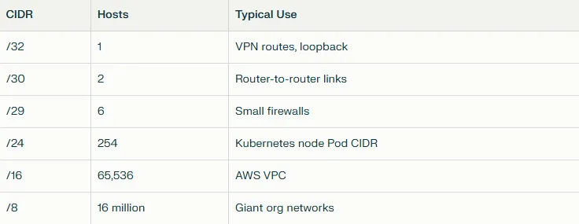
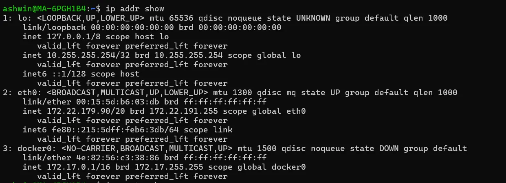
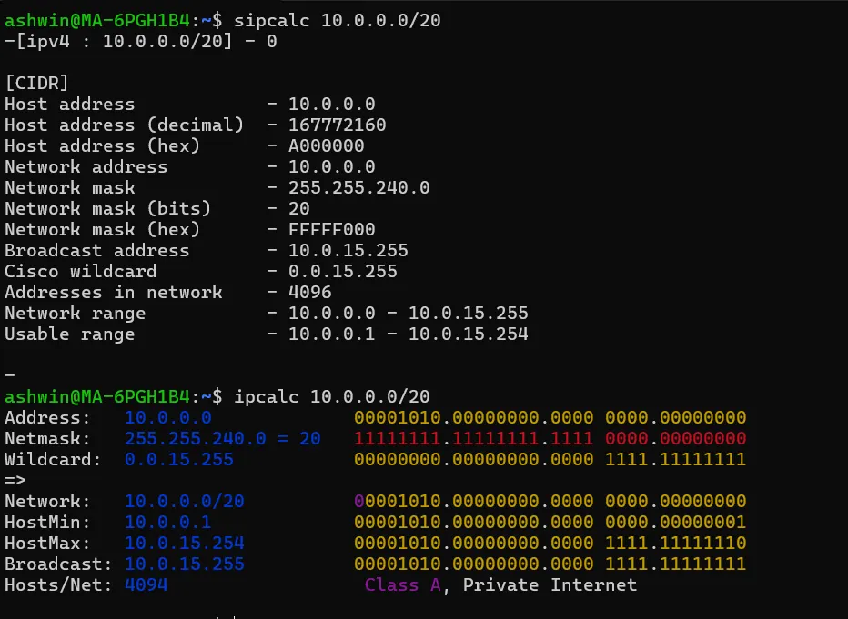
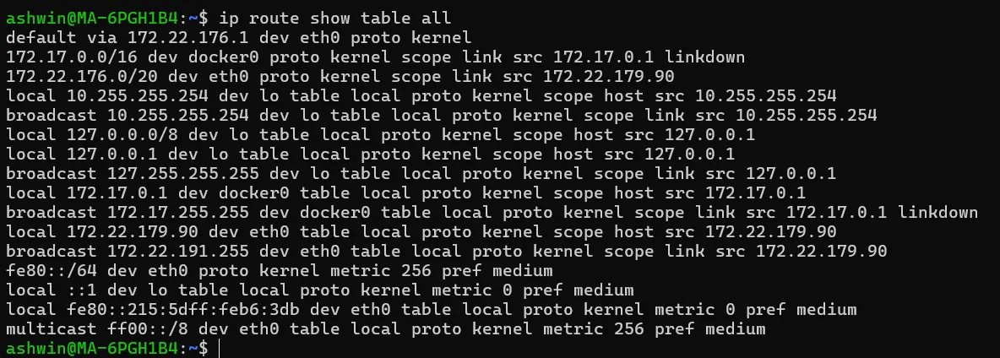

# დღე 5 — Subnetting და CIDR: ქსელების საიდუმლო ენა (ახსნილი ადამიანებისთვის)

## რატომ არის Subnetting მნიშვნელოვანი (განსაკუთრებით DevOps/SRE-ებისთვის)

თუ მუშაობთ:

* AWS VPC / Azure VNET / Google VPC-თან
* Kubernetes კლასტერებთან
* Docker ქსელებთან
* VPN-ებთან
* Load balancer-ებთან
* Linux სერვერებთან
* Firewall-ებთან
* NAT-თან
* Cloud routing table-ებთან

თქვენ უკვე იყენებთ subnetting-ს. მაგრამ უმეტეს ინჟინერს ჯერ კიდევ არ ესმის:

* რა არის /24 რეალურად?
* რატომ აძლევს Kubernetes თითოეულ node-ს /24-ს?
* რატომ არის cloud VPC-ები /16 ნაგულისხმევად?
* რა განსხვავებაა network IP-სა და broadcast IP-ს შორის?
* რა ხდება როცა subnet-ები გადაფარავენ ერთმანეთს?
* რატომ ჩნდება /32 route-ები VPN-ში?
* როგორ ინტერპრეტირებს Linux CIDR-ს?

დღეს გაიგებთ ყველა ამას ყველაზე მარტივი და შემოქმედებითი გზით, რაც ოდესმე ნახეთ.

დავიწყოთ.

## ნაწილი 1 — რა არის Subnet (მარტივი სიტყვებით)?

Subnet არის უბრალოდ:

**IP მისამართების ჯგუფი, რომლებიც ერთ უბანს ეკუთვნიან.**

### მაგალითი:

```
192.168.1.0 დან 192.168.1.255 მდე
არის subnet.
```

### იფიქრეთ subnet-ზე როგორც ლოკალურ დასახლებაზე ქალაქში:

* **სახლები** (hosts)
* **ერთი ქუჩა** (network)
* **ერთი ბოლო სახლი დარეზერვებული განცხადებებისთვის** (broadcast)

### ანალოგია: Subnet-ები როგორც საცხოვრებელი კომპლექსები

წარმოიდგინეთ დიდი ქალაქი (ინტერნეტი).
მასში არიან უბნები (subnets).
თითოეულ უბანში არიან სახლები (IP მისამართები).

* თუ ორი ადამიანი **იმავე უბანში** ცხოვრობს → ისინი ლაპარაკობენ პირდაპირ (router არ სჭირდება)
* თუ ისინი **სხვადასხვა უბანში** ცხოვრობენ → მიდიან საფოსტო ოფისის გავლით (router)

ეს ზუსტად ასეა routing-ში.

## ნაწილი 2 — CIDR ნოტაცია: რას ნიშნავს /24?

**CIDR = Classless Inter-Domain Routing**

ის გვიჩვენებს რამდენი ბიტია IP მისამართში ფიქსირებული.

### მაგალითი:

```
192.168.1.0/24
```

ნიშნავს:

* **პირველი 24 ბიტი:** network
* **ბოლო 8 ბიტი:** hosts

### გამოთვლა:

```
32 სულ ბიტი – 24 network ბიტი = 8 host ბიტი
2^8 = 256 მისამართი
```

ასე რომ:
```
192.168.1.0 → network
192.168.1.1 → პირველი host
...
192.168.1.254 → ბოლო host
192.168.1.255 → broadcast
```

## ვიზუალური: როგორ ყოფს CIDR IP სივრცეს

```
IP მისამართი:   192.168.1.  00110101
CIDR /24 →      11111111.11111111.11111111.00000000
                                   ↑ host ნაწილი (8 ბიტი)
```

## ხშირი CIDR-ების Cheat Sheet



## ნაწილი 3 — Subnet საზღვრები (სუპერ მარტივი)

### დავუშვათ /24:

```
192.168.1.0/24  
→ დიაპაზონი = .0 დან .255 მდე
→ შემდეგი subnet = 192.168.2.0/24
```

### აიღეთ /23:

```
192.168.1.0/23  
→ დიაპაზონი = 192.168.1.0 დან 192.168.2.255 მდე
→ შემდეგი subnet = 192.168.3.0/23
```

### აიღეთ /26:

```
/26 = 64 IP თითო subnet-ზე

Subnet-ები იქნება:
192.168.1.0/26     (0 – 63)
192.168.1.64/26    (64 – 127)
192.168.1.128/26   (128 – 191)
192.168.1.192/26   (192 – 255)
```

## რეალური DevOps მაგალითები (სუპერ ღირებული)

### მაგალითი 1: AWS VPC (რატომ ყოველთვის /16?)

AWS რეკომენდაციას უწევს:
```
10.0.0.0/16
```

**რატომ?**

რადგან თითოეული subnet იღებს /24-ს:
```
10.0.1.0/24  (AZ1)
10.0.2.0/24  (AZ1)
10.0.3.0/24  (AZ2)
10.0.4.0/24  (AZ2)
```

**ნიშნავს:**
* ✅ მარტივი მასშტაბირება
* ✅ მარტივი NAT gateway-ები
* ✅ subnet გადაფარვის გარეშე
* ✅ თავიდან აცილებს AWS route table კონფლიქტებს

### მაგალითი 2: Docker Bridge Subnets

Docker ქმნის:
```
172.17.0.0/16
```

თითოეული კონტეინერი იღებს:
```
172.17.0.x
```

მასიური დიაპაზონი → მარტივი განაწილება.

### მაგალითი 3: Kubernetes Pod CIDR

თითოეული node იღებს:
```
/24
```

**მაგალითი:**
```
Node 1 → 10.244.1.0/24  
Node 2 → 10.244.2.0/24
Node 3 → 10.244.3.0/24
```

**მიზეზი:**
Pod-ებს სჭირდებათ მრავალი IP და არასოდეს უნდა გადაფაროს node-ებზე.

### მაგალითი 4: VPN იყენებს /32-ს

VPN აძლევს:
```
10.8.0.5/32
```

**ნიშნავს:**
* ეს IP წარმოადგენს მხოლოდ თქვენ
* /32 ქმნის host route-ს
* Routing table-ები აგზავნიან პაკეტებს მხოლოდ ამ მომხმარებელზე

### მაგალითი 5: გადაფარვადი Subnet-ები → სრული ქაოსი

წარმოიდგინეთ ეს შეცდომა:
```
Server A: 10.0.1.10/24  
Server B: 10.0.1.10/16
```

* ❌ იგივე IP
* ❌ სხვადასხვა subnet mask-ები
* ❌ სხვადასხვა ინტერპრეტაციები
* ❌ უცნაური routing პრობლემები

**ეს იწვევს:**
* მიუწვდომელ hosts-ებს
* დუბლირებული IP დაბნეულობას
* არასწორ default gateway გადაწყვეტილებებს

⚠️ **Subnet გადაფარვა არის ერთ-ერთი ყველაზე ხშირი რეალური მიზეზი outage-ებისთვის.**

## ნაწილი 4 — Subnet მათემატიკა (მარტივი გზა)

მოდით გავაკეთოთ subnetting ზარმაცი გზით.

### ხრიკი 1: კონვერტაცია CIDR-დან ზომაში ამ ცხრილის დამახსოვრებით

დაიმახსოვრეთ ეს 8 რიცხვი და არასოდეს გექნებათ პრობლემა.

### ხრიკი 2: შემდეგი subnet-ის პოვნა

უბრალოდ გადახტით ბლოკის ზომით.

**მაგალითი:**
```
10.5.16.0/20
/20 = 4096 IP-ები
ბლოკის ზომა = 4096
კონვერტირება ბოლო ოქტეტის მოძრაობაში:
4096 = 16 მესამე ოქტეტში

ასე რომ შემდეგი subnet:
10.5.32.0/20
```

სულ ეს.

### ხრიკი 3: "არის IP subnet-ში?" (2-წამიანი მეთოდი)

შეამოწმეთ ემთხვევა თუ არა network ნაწილი.

**მაგალითი 1:**

არის `10.244.3.12` ში `10.244.3.0/24`?
```
/24 ნიშნავს: 10.244.3.*
✅ დიახ.
```

**მაგალითი 2:**

არის `10.244.3.20` ში `10.244.0.0/16`?
```
/16 ნიშნავს: 10.244.*.*
✅ დიახ.
```

სუპერ მარტივი.

## Linux ბრძანებები Subnet-ებისთვის (დღე 5)

### IP + subnet-ის ნახვა:

```bash
ip addr show
```



### Routing table-ის ნახვა (subnet-ზე დაფუძნებული გადაწყვეტილებები):

```bash
ip route show
```


### იპოვეთ რომელ route-ს იყენებს მოცემული IP:

```bash
ip route get 10.200.32.10
```

### CIDR კალკულატორი (Linux):

```bash
sipcalc 10.0.0.0/20
ipcalc 10.0.0.0/20
```



### გადაფარვადი subnet-ების ნახვა routing-ში:

```bash
ip route show table all
```



## ASCII დიაგრამა — Subnet-ები /24-ში

```
192.168.1.0/24
┌───────────────────────────────────────────────────┐
│ Network:    192.168.1.0                           │
│ Host დიაპაზონი: 192.168.1.1 → 192.168.1.254      │
│ Broadcast:  192.168.1.255                         │
└───────────────────────────────────────────────────┘
```

## ASCII დიაგრამა — /24-ის გაყოფა /26 ბლოკებად

```
192.168.1.0/24  
გაყავით 4 subnet-ად:
192.168.1.0/26      (0–63)
192.168.1.64/26     (64–127)
192.168.1.128/26    (128–191)
192.168.1.192/26    (192–255)
```

## სწრაფი შეჯამება (სუპერ სასარგებლო)

* ✅ Subnet-ები არის IP მისამართების უბნები
* ✅ CIDR განსაზღვრავს რამდენი ბიტი ეკუთვნის network-ს
* ✅ /24 = 256 IP, /16 = 65k IP, /32 = 1 IP
* ⚠️ გადაფარვადი subnet-ები ანგრევს ყველაფერს
* ✅ Kubernetes, Docker, AWS cloud — ყველა ძალიან დამოკიდებულია სწორ subnetting-ზე
* ✅ Subnetting-ის ცოდნა = routing-ის რეალური მუშაობის ცოდნა

**ეს გაკვეთილი გახსნის ქსელის ნახევარს თავისთავად.**

## მომავალი (დღე 6)

**დღე 6 — DNS ღრმა ჩაძირვა: როგორ ხდებიან სახელები IP-ებად**

თქვენ გაიგებთ:

* როგორ მუშაობს DNS hierarchy
* Recursive vs Authoritative სერვერები
* DNS record ტიპები (A, AAAA, CNAME, MX, NS, SOA)
* TTL და caching
* რატომ იწვევს DNS ასეთ მრავალ outage-ს
* როგორ ხსნის Linux სახელებს
* როგორ დავადებაგოთ DNS პრობლემები