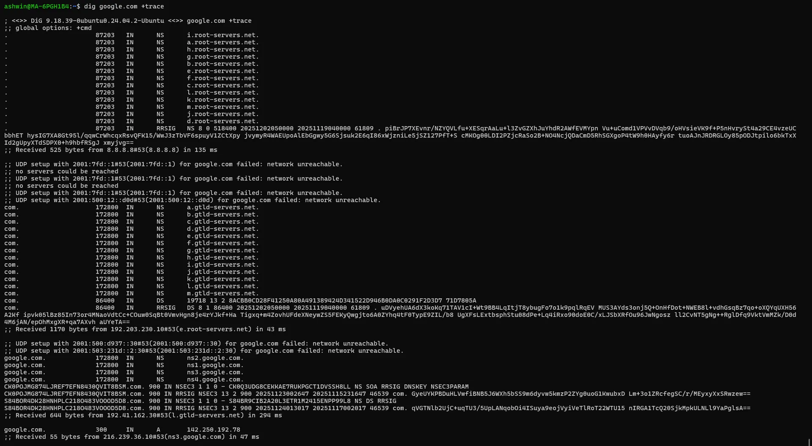

# დღე 6 — DNS ღრმა ჩაძირვა: როგორ ხდებიან სახელები IP-ებად (ინტერნეტის ტელეფონის წიგნი, მარტივად ახსნილი)

გრძელი, უაღრესად დეტალური, დამწყებთათვის მეგობრული + SRE დონის ახსნა DNS-ის შესახებ.

## რატომ არის DNS ერთ-ერთი ყველაზე მნიშვნელოვანი თემა ქსელში

წარმოიდგინეთ სამყარო, სადაც უნდა აკრიფოთ `172.217.167.238` Google-ზე წვდომისთვის. ან დაიმახსოვროთ `142.250.183.14` YouTube-ისთვის.

ეს სამყარო არსებობდა 1980 წელს.

**DNS (Domain Name System)** შეცვალა ყველაფერი, როდესაც გახდა ინტერნეტის ტელეფონის წიგნი, რომელიც აკავშირებს სახელებს → IP მისამართებს.

### ყოველ ჯერზე როცა თქვენ:

* ეწვიეთ ვებსაიტს
* curl-ით API-ს
* გაუშვით თქვენი Kubernetes service
* უკავშირდებით მიკროსერვისებს
* ssh-ით შედიხართ სერვერზე

… DNS ჩუმად მუშაობს ფონზე.

### როცა DNS იშლება → ყველაფერი იშლება.

* Google outage-ები
* Cloudflare outage-ები
* GitHub outage-ები

**თითქმის ყოველთვის DNS.**

დღეს ღრმად შევალთ იმაში, თუ როგორ მუშაობს DNS რეალურად, ვიზუალებით, ანალოგიებით, რეალური lookup ნაკადებით, recursive vs authoritative სერვერებით, TTL, caching, Linux ხელსაწყოებით და debugging-ით.

დავიწყოთ.


## ნაწილი 1 — რა არის DNS (ახსნილი როგორც ადამიანისთვის)

DNS არის უბრალოდ:

**გლობალური, განაწილებული მონაცემთა ბაზა, რომელიც აკავშირებს ადამიანისთვის გასაგებ სახელებს (google.com) → IP მისამართებს (142.250.183.14)**

### იფიქრეთ DNS-ზე როგორც:

* ინტერნეტის ტელეფონის წიგნზე
* გლობალურ მისამართების დირექტორიაზე
* Google Maps სერვერებისთვის

ნომრების დამახსოვრების ნაცვლად, DNS ინახავს მათ ჩვენთვის.

## ნაწილი 2 — DNS იერარქია (ძალიან მნიშვნელოვანი)

DNS სტრუქტურირებულია როგორც ხე:

```
          Root (.)
               |
          TLD (.com .net .org .in)
               |
         Authoritative Servers
               |
            Domain Records
```

მოდით დავშალოთ.

### 1. Root DNS სერვერები (.)

ეს არის DNS ხის ზედა ნაწილი. არის 13 ლოგიკური root სერვერი, რომლებსაც მართავენ გლობალური ორგანიზაციები.

**ისინი იციან:**

* რომელი DNS სერვერი პასუხისმგებელია .com, .net, .org და ა.შ.-ზე
* ✖️ ისინი არ იციან google.com-ის IP

### 2. TLD სერვერები (.com, .net, .org)

**მაგალითი:**

* `.com` სერვერები იციან რომელი სერვერი მუშავებს google.com-ს
* `.in` სერვერები იციან amazon.in-ს

ისინი არ ინახავენ A ჩანაწერებს. ისინი მხოლოდ მიუთითებენ authoritative სერვერებზე.

### 3. Authoritative Name Servers

ესენი არიან დომენის ჭეშმარიტების საბოლოო წყარო.

**google.com-ისთვის:**
```
ns1.google.com
ns2.google.com
ns3.google.com
```

**ისინი ინახავენ:**
* A record
* AAAA record
* CNAME
* MX
* TXT
* SOA
* NS

## ნაწილი 3 — მთელი DNS Lookup პროცესი (ნაბიჯ-ნაბიჯ)

დავუშვათ გაუშვით:
```bash
curl google.com
```

თქვენი მანქანა ასრულებს ამ ნაბიჯებს:

### 1. შეამოწმეთ ლოკალური DNS cache

Linux cache-ავს გამოყენებით:
* systemd-resolved
* nscd (ოფციონალური)
* აპლიკაციები (Chrome, Firefox cache DNS-ს ცალკე)

თუ მოიძებნა → ⚡ დაუყოვნებელი პასუხი (ამიტომ განმეორებითი ping-ები უფრო სწრაფია)

### 2. შეამოწმეთ /etc/hosts ფაილი

```bash
cat /etc/hosts
```

თუ google.com აქ არის → უბრალოდ დაბრუნება.

დეველოპერები ხშირად ამატებენ ჩანაწერებს აქ ტესტირების დროს.

### 3. ჰკითხეთ კონფიგურირებულ DNS resolver-ს

კონფიგურირებულია:
```
/etc/resolv.conf
```

ტიპური:
```
nameserver 8.8.8.8
nameserver 1.1.1.1
```

თუ სისტემა იყენებს systemd-resolved-ს:
```
nameserver 127.0.0.53
```
(და systemd აკეთებს რეალურ resolving-ს)

### 4. Recursive Resolver იწყებს (მნიშვნელოვანი)

თქვენი resolver (როგორიცაა 8.8.8.8) ასრულებს მძიმე მუშაობას:

**ნაბიჯი A: ჰკითხეთ Root სერვერებს**
```
"სად არის .com?"
```

Root პასუხობს:
```
ჰკითხეთ ამ TLD სერვერებს .com-ისთვის
```

**ნაბიჯი B: ჰკითხეთ .com TLD სერვერებს**
```
"სად არის google.com?"
```

TLD პასუხობს:
```
google.com-ის authoritative სერვერი არის ns1.google.com
```

**ნაბიჯი C: ჰკითხეთ Authoritative სერვერს**
```
"რა არის A record google.com-ისთვის?"
```

NS პასუხობს:
```
142.250.183.14
```

**ნაბიჯი D: Resolver აბრუნებს IP-ს თქვენ**

და თქვენი curl იწყებს.

## ვიზუალური — სრული DNS Lookup ნაკადი

```
თქვენი მანქანა
   |
   |---> ლოკალური Cache?
   |
   |---> /etc/hosts?
   |
   |---> DNS Resolver (მაგ., 8.8.8.8)
              |
              |---> Root Server (.)
              |         "სად არის .com?"
              |
              |---> TLD (.com)
              |         "სად არის google.com?"
              |
              |---> Authoritative NS
                        "რა არის google.com-ის IP?"
              |
            Resolver აბრუნებს IP-ს თქვენ
```

## ნაწილი 4 — DNS Record ტიპები (მარტივად ახსნილი)

### 1. A Record

აკავშირებს domain → IPv4

**მაგალითი:**
```
google.com → 142.250.183.14
```

### 2. AAAA Record

აკავშირებს domain → IPv6
(4 A = IPv6)

**მაგალითი:**
```
google.com → 2404:6800:4009:80e::200e
```

### 3. CNAME Record

Alias. მიუთითებს ერთ დომენს მეორეზე.

**მაგალითი:**
```
www.example.com → example.com
```

www არ არის ცალკე საიტი — უბრალოდ alias.

### 4. MX Record (Mail Exchange)

ელ.ფოსტის სერვერი დომენისთვის.

### 5. NS Record

აჩვენებს authoritative სერვერებს დომენისთვის.

### 6. SOA Record (Start of Authority)

**შეიცავს:**
* admin email
* serial number
* zone პარამეტრები
* refresh დრო
* retry დრო
* TTL ნაგულისხმევი

ეს ჩანაწერი გვიჩვენებს თუ როგორ არის სტრუქტურირებული დომენის მფლობელობა.

## ნაწილი 5 — TTL და DNS Caching

**TTL = Time To Live**

განსაზღვრავს რამდენ ხანს შეიძლება DNS პასუხების cache-ირება.

### მაგალითი:

```
google.com TTL = 300
```

ნიშნავს:

თქვენმა მანქანამ უნდა გამოიყენოს ხელახლა ეს პასუხი 300 წამის განმავლობაში.

## რატომ არის TTL გადამწყვეტი

### მოკლე TTL:
* ✅ კარგია სწრაფი განახლებებისთვის
* ❌ ცუდია მასშტაბირებისთვის (მეტი query)

### გრძელი TTL:
* ✅ კარგია სტაბილურობისთვის
* ❌ ცუდია failover-ისთვის

⚠️ **უმეტესი DNS outage-ები = ცუდი TTL არჩევანი**

## ნაწილი 6 — რატომ იწვევს DNS იმდენ outage-ს

DNS არის:
* 🌍 გლობალური
* 💾 Cache-ირებული
* 🌐 განაწილებული
* 🏗️ მრავალფენოვანი
* 🐌 ნელი გავრცელებისთვის
* 🔙 რთული დასაბრუნებლად

### ხშირი outage მიზეზები:

* ❌ **არასწორი DNS ჩანაწერი** - არასწორად კონფიგურირებული A ან CNAME
* ❌ **ხმელი cache-ირებული ჩანაწერები** - ძველი IP ჯერ კიდევ cache-ირებულია 24 საათის განმავლობაში
* ❌ **TTL ძალიან გრძელი** - ვერ მოგვარდება outage სწრაფად
* ❌ **Cloudflare ან Route53 outage** - გავლენას ახდენს მილიონობით
* ❌ **Authoritative სერვერი გამორთულია** - დომენი მიუწვდომელი გლობალურად
* ❌ **DNSSEC არასწორი კონფიგურაცია** - მყისიერად კლავს დომენს
* ❌ **გამოტოვებული NS glue ჩანაწერები** - დომენი ხდება უხილავი

### DNS უარყოფებმა გამოიწვია:

* GitHub გამორთვა
* WhatsApp გამორთვა
* Facebook outage
* Microsoft Azure outage
* DigitalOcean outage

**DNS მყიფეა.**

## ნაწილი 7 — როგორ ხსნის Linux სახელებს

### Linux თანმიმდევრობა:

**/etc/nsswitch.conf**

ეს განსაზღვრავს lookup თანმიმდევრობას:
```
hosts: files dns
```

### ნაბიჯების თანმიმდევრობა:

1. /etc/hosts
2. DNS
3. mDNS (ოფციონალური)

რეალური DNS სერვერი განსაზღვრულია:
```
/etc/resolv.conf
```

**მაგალითი:**
```
nameserver 8.8.8.8
nameserver 1.1.1.1
```

თუ systemd-resolved ჩართულია:
```
nameserver 127.0.0.53
```

და რეალური სერვერები შიგნით:
```bash
systemd-resolve --status
```

## ხელსაწყოები: dig, nslookup, host

### dig — საუკეთესო DNS debugging-ისთვის

```bash
dig google.com
```


დეტალებით:
```bash
dig a google.com
```

ეს აჩვენებს:
* root lookup
* TLD lookup
* NS lookup
* საბოლოო A record

უაღრესად სასარგებლო.

### nslookup — ძველი ხელსაწყო

```bash
nslookup google.com
```

### host — სწრაფი შემოწმება

```bash
host google.com
```

## DNS Debugging DevOps/SRE-ისთვის

### 1. შეამოწმეთ DNS სერვერის პასუხები:

```bash
dig @8.8.8.8 google.com
```


### 2. შეამოწმეთ სრული resolution გზა:

```bash
dig google.com +trace
```



### 3. შეამოწმეთ TTL:

```bash
dig +nocmd +noall +answer +ttlid a amazon.com
host -a -t a amazon.com
```


### 4. შეამოწმეთ რომელ DNS სერვერს იყენებთ:

```bash
resolvectl status
```

### 5. გაასუფთავეთ DNS cache:

```bash
sudo systemd-resolve --flush-caches
sudo resolvectl flush-caches
```

## რეალური SRE Debug სცენარები

### სცენარი 1 — აპი ხსნის არასწორ IP-ს

DNS ჩანაწერი განახლდა, მაგრამ TTL = 1 დღე.
ძველი მნიშვნელობა cache-ირებული.

**გამოსწორება:**
```bash
dig authoritative_nameserver
```
ნახეთ რეალური მნიშვნელობა.

### სცენარი 2 — Kubernetes CoreDNS გაფუჭებული

Pod-ებს არ შეუძლიათ cluster.local-ის resolution.

**დებაგი:**
```bash
kubectl exec pod -- sh nslookup kubernetes.default
kubectl logs -n kube-system coredns-xyz
```

### სცენარი 3 — DNS VPN-ზე უარყოფს

Split tunnelling არასწორად კონფიგურირებული.

**შემოწმება:**
```bash
ip route
resolvectl status
```

### სცენარი 4 — DNS მუშაობს მაგრამ curl უარყოფს

ალბათ firewall / პორტის პრობლემა.
Ping + DNS ≠ გარანტია რომ TCP მუშაობს.

## სწრაფი შეჯამება (დღე 6)

DNS არის:
* 🏗️ იერარქიული
* 💾 cache-ირებული
* 🌐 განაწილებული
* ⚠️ მყიფე
* 🎯 უაღრესად მნიშვნელოვანი

### თქვენ ისწავლეთ:

* ✅ სრული DNS lookup თანმიმდევრობა
* ✅ Recursive vs authoritative სერვერები
* ✅ A, CNAME, NS, SOA
* ✅ TTL, caching, გავრცელება
* ✅ რატომ ხდება DNS outage-ები
* ✅ როგორ ხსნის Linux სახელებს
* ✅ როგორ დავადებაგოთ dig/nslookup-ით

**ეს არის ერთ-ერთი ყველაზე ღირებული უნარი DevOps/SRE-ში.**

## მომავალი (დღე 7)

**დღე 7 — ქსელური ინტერფეისები და ip-link: როგორ ხედავს Linux თქვენს NIC-ებს**

თქვენ გაიგებთ:

* რა არის ქსელური ინტერფეისი
* ფიზიკური vs ვირტუალური ინტერფეისები
* როგორ მუშაობს loopback
* veth წყვილები და bridges
* MTU და მისი გავლენა
* როგორ დავადებაგოთ ინტერფეისის პრობლემები