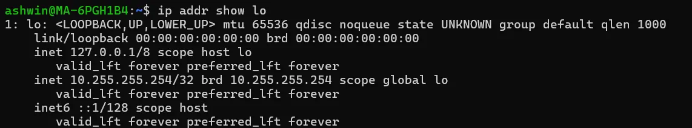

# დღე 7 — ქსელური ინტერფეისები და ip-link: როგორ ხედავს Linux თქვენს NIC-ებს

ღრმა ჩაძირვა დაწერილი უმარტივესი შესაძლო გზით, მაგრამ სავსე DevOps/SRE ძალით.


## რატომ არის ქსელური ინტერფეისები მნიშვნელოვანი

ქსელური ინტერფეისი არის შესასვლელი და გამოსასვლელი კარი ყველა ქსელური ტრაფიკისთვის თქვენს მანქანაზე.

### ყოველ ჯერზე როცა თქვენ:

* ხსნით ვებსაიტს
* curl-ით API-ს
* უკავშირდებით მონაცემთა ბაზას
* ssh-ით შედიხართ სერვერზე
* თქვენი Kubernetes pod საუბრობს სხვა service-თან

**ყველა პაკეტი უნდა გაიაროს რომელიმე ქსელური ინტერფეისის გავლით.**

### თუ ინტერფეისი DOWN არის → თქვენი სერვერი offline-ზეა

### თუ ინტერფეისი არასწორად არის კონფიგურირებული → routing იშლება

### თუ ვირტუალური ინტერფეისები იშლება → Docker/Kubernetes ქსელი იშლება

ასე რომ დღეს ვსწავლობთ:

* რა არის ქსელური ინტერფეისი რეალურად
* ფიზიკური vs ვირტუალური ინტერფეისები
* როგორ ხედავს Linux მათ
* რატომ ქმნიან კონტეინერები veth წყვილებს
* რას ნიშნავს MTU
* რას ნიშნავს flags როგორიცაა UP, BROADCAST, MULTICAST, LOWER_UP
* რა არის bridges და bonds
* როგორ გამოვიყენოთ ip link, ip addr, ethtool
* რეალური SRE debugging სცენარები

დავიწყოთ.

## ნაწილი 1 — რა არის ქსელური ინტერფეისი? (ახსნილი როგორც 10 წლის ბავშვისთვის)

წარმოიდგინეთ თქვენი კომპიუტერი როგორც სახლი.
და ინტერნეტი არის გიგანტური ქალაქი სავსე სახლებით.

### ქსელური ინტერფეისი არის:

**კარი, რომელსაც იყენებთ ქალაქში შესასვლელად და გამოსასვლელად.**

თქვენ ვერ წახვალთ სკოლაში ან მეგობართან, თუ არ გამოხვალთ კარიდან.

იგივე კომპიუტერისთვის:
ის ვერ გააგზავნის ან მიიღებს პაკეტებს, თუ არ გაივლის ქსელურ ინტერფეისს.


## ანალოგია: თითოეული ინტერფეისი არის სხვადასხვა კარი

### მაგალითები:

* **eth0** → თქვენი მთავარი წინა კარი
* **wlan0** → თქვენი WiFi კარი
* **lo (loopback)** → საიდუმლო კარი თქვენი სახლის შიგნით
* **docker0** → კარი რომელიც Docker-მა შექმნა
* **cni0** → კარი რომელიც Kubernetes-მა შექმნა
* **tun0** → კარი რომელიც VPN-მა შექმნა
* **bond0** → ორი კარი ერთად შებმული მეტი სიჩქარისთვის
* **br0** → სასტუმროს ლობის კარი (bridge) სადაც მრავალი ოთახი იზიარებს იმავე გასასვლელს

თითოეული კარი მიდის სხვადასხვა ადგილას.

## ნაწილი 2 — ფიზიკური vs ვირტუალური ინტერფეისები

### ფიზიკური ინტერფეისები

ესენი არის რეალური აპარატურა:

* **eth0** → Ethernet პორტი
* **wlan0** → WiFi ბარათი
* **enp0s3, ens3, eno1** → ახალი Linux სახელების სქემა (პროგნოზირებადი სახელები)

**მათ აქვთ:**
* ფიზიკური ჩიპები
* MAC მისამართები
* რეალური კაბელები ან ანტენები

### ვირტუალური ინტერფეისები

ესენი ფიზიკური არ არის. Linux თითქოს მათი არსებობას წარმოიდგენს.

**მაგალითები:**

* **lo** (loopback)
* **docker0** (Docker bridge)
* **cni0 / flannel0 / weave** (Kubernetes CNI)
* **vethXXX** (კონტეინერის NIC-ები)
* **tun0** (VPN)
* **tap0** (ვირტუალური მანქანის NIC)
* **br0** (bridge)
* **bond0** (bonded NIC-ები)

### ვირტუალური ინტერფეისები სუპერ მნიშვნელოვანია DevOps/SRE-ისთვის:

* ✅ Docker/Kubernetes ძალიან იყენებს მათ
* ✅ VPN, tunnel-ები, load balancer-ები ყველა ეყრდნობა მათ
* ✅ Cloud VM-ები იყენებენ ვირტუალურ NIC-ებს, არა ფიზიკურ ბარათებს

## ნაწილი 3 — Loopback ინტერფეისი (lo)

ეს არის ყველაზე მნიშვნელოვანი NIC, რომელსაც ყველა იგნორირებს.

```bash
ip addr show lo
127.0.0.1
```



### Loopback არის:

**პირადი კარი საკუთარ თავთან საუბრისთვის.**

* თუ `curl localhost` → ის მიდის lo-ს გავლით
* ყველა პროცესი საუბრობს საკუთარ თავთან loopback-ის გავლით

⚠️ **lo-ს გარეშე, Linux-ის ნახევარი იშლება.**

## ნაწილი 4 — ip link: ბრძანება რომელიც აჩვენებს ყველა ინტერფეისს

გაუშვით:
```bash
ip link
```

### მაგალითი გამოსავალი:

```
1: lo: <LOOPBACK,UP,LOWER_UP> ...
2: eth0: <BROADCAST,MULTICAST,UP,LOWER_UP> ...
3: docker0: <NO-CARRIER,BROADCAST,MULTICAST,UP> ...
4: veth0ab123: <BROADCAST,MULTICAST,UP,LOWER_UP> ...
```

მოდით დავშალოთ ეს.

## ნაწილი 5 — ინტერფეისის Flags (მარტივად ახსნილი)

### <UP>

კარი ღიაა. ინტერფეისი ჩართულია.

თუ DOWN → არანაირი ტრაფიკი.

```bash
ip link set eth0 down
ip link set eth0 up
```

### <LOWER_UP>

კაბელი ჩართულია / WiFi დაკავშირებულია / ვირტუალური ინტერფეისი დაკავშირებულია.

თუ UP მაგრამ არა LOWER_UP, ინტერფეისი ღიაა მაგრამ გათიშულია.

**ანალოგია:**
* `UP` = კარი ღიაა
* `LOWER_UP` = კარი რეალურად გარეთ მიდის

### <BROADCAST>

შეუძლია broadcast პაკეტების გაგზავნა (მაგ., ARP). უმეტეს NIC-ებს აქვს ეს.

### <MULTICAST>

ინტერფეისი უჭერს მხარს multicast ტრაფიკს.

**საჭიროა:**
* Kubernetes flannel-ისთვის
* Routing პროტოკოლებისთვის
* mDNS-ისთვის

### <NO-CARRIER>

კაბელი არ არის ჩართული.

### <LOOPBACK>

სპეციალური შიდა ინტერფეისი.

## ნაწილი 6 — MTU (Maximum Transmission Unit)

MTU = მაქსიმალური პაკეტის ზომა, რომელიც დაშვებულია ამ ინტერფეისზე.

### ნაგულისხმევი:

```
1500 ბაიტი
```

თუ MTU mismatch-ები ხდება → პაკეტების fragmentation → ნელი მუშაობა.

### VPN-ისთვის:

```
tun0 MTU = 1400
```

### Cloud VPC-ისთვის → ზოგჯერ:

```
9001 (Jumbo frames)
```

### ანალოგია:

MTU არის როგორც თქვენი კარის სიმაღლე.
თუ პაკეტი ძალიან მაღალია → მან უნდა დაიხაროს (fragmentation) → ნელდება.

## ნაწილი 7 — MAC მისამართები (ინტერფეისის იდენტიფიკატორი)

თითოეულ ინტერფეისს აქვს MAC:
```
02:42:ac:11:00:03
```

MAC იდენტიფიცირებს თქვენს NIC-ს ლოკალურ ქსელში.

⚠️ **როუტერები არასოდეს გადაიტანენ MAC-ებს.**

### MAC აუცილებელია:

* ARP-ისთვის
* switching-ისთვის
* VLAN-ებისთვის
* კონტეინერებისთვის (თითოეული კონტეინერი იღებს საკუთარ MAC-ს)

## ნაწილი 8 — ვირტუალური NIC-ები კონტეინერების შიგნით (სუპერ მნიშვნელოვანი)

როცა გაუშვებთ Docker კონტეინერს:
```bash
docker run -it ubuntu bash
```

Docker ქმნის veth წყვილს:
```
veth1234 <----> veth5678
```

* ერთი ბოლო მიდის კონტეინერის შიგნით
* მეორე რჩება host-ზე და უკავშირდება docker0 bridge-ს

### ანალოგია:

წარმოიდგინეთ ორი კონსერვი დაკავშირებული თოკით — ერთის მხრიდან ლაპარაკობთ, მეორე მხრიდან გამოდის შეტყობინება.

## ნაწილი 9 — Bridges (docker0, br0, cni0)

**Bridge = ვირტუალური switch**

როგორც სასტუმროს ლობი რომელიც აკავშირებს მრავალ ოთახს.

```
br0
 ├─ eth0
 ├─ vethA
 ├─ vethB
 ├─ vethC
```

### იყენებს Docker და Kubernetes:

* კონტეინერები უკავშირდებიან bridge-ს
* Bridge აკავშირებს მათ ქსელთან

## ნაწილი 10 — Bonds (bond0)

**Bonding = NIC-ების გაერთიანება ერთ უფრო სწრაფ/სანდო NIC-ად.**

### რეჟიმები:

* round robin
* active-backup
* balance-xor
* 802.3ad (LACP)

### გამოიყენება როცა:

* სერვერებს სჭირდებათ redundancy
* მაღალი throughput სისტემები

**ანალოგია:**
ორი კარი ერთად შებმული რათა მეტი ტრაფიკი გაატაროს.

## ნაწილი 11 — Tunnel-ები (tun0, tap0)

### გამოიყენება:

* VPN-ებით
* Kubernetes overlay-ებით
* WireGuard-ით
* OpenVPN-ით

* **tun0** = Layer 3 ვირტუალური ინტერფეისი
* **tap0** = Layer 2 ვირტუალური ინტერფეისი

**ანალოგია:**
საიდუმლო მიწისქვეშა tunnel ორ შენობას შორის.

## ნაწილი 12 — სასარგებლო Linux ბრძანებები (დღე 7)

### ინტერფეისების ნახვა

```bash
ip link show
```

### IP-ების + ინტერფეისების ნახვა

```bash
ip addr show
```

### ინტერფეისის ჩართვა/გამორთვა

```bash
ip link set eth0 up
ip link set eth0 down
```

### MTU-ის შეცვლა

```bash
ip link set eth0 mtu 9000
```

### NIC სიჩქარის/კაბელის სტატუსის ნახვა

```bash
ethtool eth0
```

### Routing table-ის ნახვა

```bash
ip route
```

## რეალური SRE Troubleshooting სცენარები

### სცენარი 1 — "სერვერი ჩართულია მაგრამ არავინ ping-ავს მას"

შეამოწმეთ ჩართულია თუ არა ინტერფეისი UP:
```bash
ip link show eth0
```

თუ DOWN:
```bash
ip link set eth0 up
```

### სცენარი 2 — "Docker კონტეინერს არ შეუძლია ინტერნეტის მიღწევა"

შეამოწმეთ bridge:
```bash
ip link show docker0
```

შეამოწმეთ veth:
```bash
ip link | grep veth
```

### სცენარი 3 — "VPN დაკავშირებული მაგრამ ინტერნეტი გაფუჭდა"

MTU mismatch → პაკეტები იკარგება.

შეამოწმეთ:
```bash
ip link show tun0
```

გამოასწორეთ:
```bash
ip link set tun0 mtu 1400
```

### სცენარი 4 — "Kubernetes Pod ვერ უკავშირდება სხვა Pod-ს"

შეამოწმეთ CNI ინტერფეისები:
```bash
ip link | grep cni
```

შეამოწმეთ veth წყვილები:
```bash
ip link | grep veth
```

## შეჯამება (დღე 7)

### დღეს ისწავლეთ:

* ✅ რა არის ინტერფეისები რეალურად
* ✅ ფიზიკური vs ვირტუალური NIC-ები
* ✅ Loopback = შიდა კომუნიკაცია
* ✅ Flags-ის მნიშვნელობა (UP, LOWER_UP, MULTICAST…)
* ✅ MTU და fragmentation
* ✅ MAC მისამართები
* ✅ Bridges (docker0)
* ✅ Bonds (bond0)
* ✅ Tunnel-ები (tun0/tap0)
* ✅ კონტეინერის ქსელი (veth წყვილები)
* ✅ მთავარი Linux ბრძანებები
* ✅ ხშირი troubleshooting სცენარები

**ქსელური ინტერფეისები არის Linux-ში ყველა ქსელის საფუძველი.**

ეს ქმნის სცენას შემდეგისთვის — სადაც ისწავლით თუ როგორ იღებენ IP მისამართები და routing table-ები გადაწყვეტილებებს როგორ გამოიყენონ ეს ინტერფეისები.

---

## 🎉 სერიის დასრულება

თქვენ გაიარეთ **7 დღის ქსელური საფუძვლები DevOps/SRE-ისთვის!**

### რა ისწავლეთ:

1. **OSI/TCP-IP მოდელები** - ქსელური დაშლის საფუძვლები
2. **MAC, IP, პორტები** - იდენტიფიკაციის სისტემა
3. **ARP, ICMP, Ping** - როგორ პოულობენ მანქანები ერთმანეთს
4. **IP Routing** - როგორ მოძრაობენ პაკეტები
5. **Subnetting & CIDR** - ქსელების საიდუმლო ენა
6. **DNS** - სახელებიდან IP-ებამდე
7. **ქსელური ინტერფეისები** - Linux-ის NIC-ები

### შემდეგი ნაბიჯები:

* 🔥 პრაქტიკა - გამოიყენეთ ეს ცოდნა რეალურ პროექტებში
* 🛠️ დებაგი - გამოიყენეთ ეს ხელსაწყოები პრობლემების მოსაგვარებლად
* 📚 გაღრმავება - გააგრძელეთ სწავლა iptables, ebpf, kubernetes networking-ზე

**წარმატებები თქვენი DevOps/SRE მოგზაურობაში! 🚀**