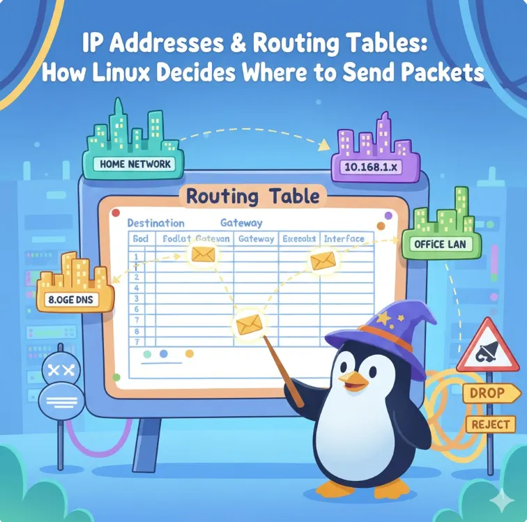
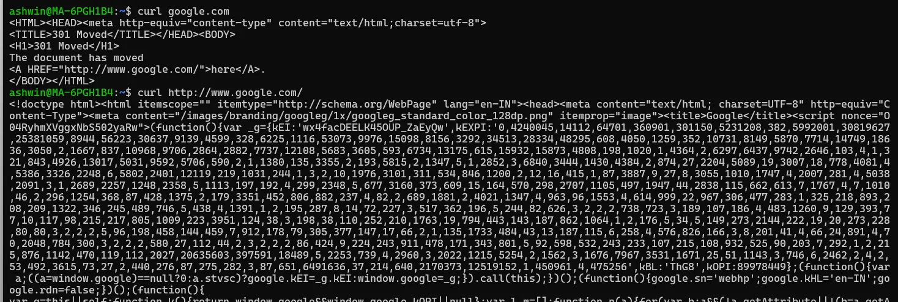
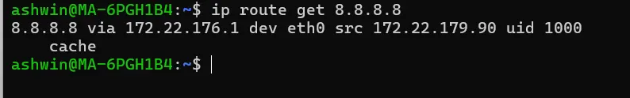
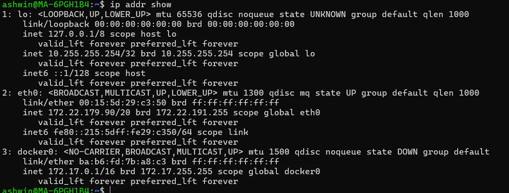

# დღე 8 — IP მისამართები და მარშრუტიზაციის ცხრილები: როგორ წყვეტს Linux-ი პაკეტების გაგზავნის მიმართულებას

გრძელი, გასუფთავებული, ისტორიის სტილის, ანალოგიებით მდიდარი ღრმა ჩაძირვა — იდეალურია DevOps & SRE მკითხველებისთვის.

## რატომ არის ეს თემა ასე მნიშვნელოვანი

შეიძლება იფიქროთ, რომ IP მისამართები უბრალოდ რიცხვებია. ან მარშრუტიზაციის ცხრილები მოსაწყენი ტექსტია `ip route`-ში.

მაგრამ სიმართლე ისაა:

**IP მისამართები + მარშრუტიზაციის ცხრილები = ყველა ქსელის ტვინი + ლოგიკა.**

ყოველ ჯერზე როცა თქვენ:
- `curl` API-ს
- SSH-ით უკავშირდებით მანქანას
- თქვენი pod-ი სხვა სერვისს უძახებს
- თქვენი VM-ი ინტერნეტს აღწევს
- DNS ასრულებს მოთხოვნას
- მონაცემთა ბაზები საუბრობენ მიკროსერვისების არქიტექტურაში

Linux-ი ორ კრიტიკულ ქმედებას ასრულებს:
1. ირჩევს გამოსაყენებელ IP მისამართს
2. ირჩევს ინტერფეისს + მარშრუტს პაკეტების გასაგზავნად

თუ ერთ-ერთი ნაბიჯი ვერ სრულდება → მოთხოვნა ვერ სრულდება.

დღეს ვახსნით ზუსტად თუ როგორ იღებს Linux-ი ამ გადაწყვეტილებებს — მარტივი სიტყვებით, ანალოგიებით, დიაგრამებით, რეალური მაგალითებით და SRE დებაგინგის ტექნიკებით.

დავიწყოთ.



## ნაწილი 1 — რა არის IP მისამართი? (ახსნილია როგორც 10 წლის ბავშვისთვის)

წარმოიდგინეთ, რომ მსოფლიოში ყველა კომპიუტერი სახლია. ინტერნეტი არის გიგანტური ქალაქი მილიარდობით სახლით.

ყველა სახლს სჭირდება მისამართი, რათა საფოსტო სამსახურმა იპოვოს იგი.

**IP მისამართი სწორედ ეს არის:**

თქვენი კომპიუტერის უნიკალური მისამართი ქსელში.

მაგალითები:
- `192.168.1.10`
- `10.244.2.15`
- `172.17.0.5`

ეს გეუბნება "სად" ცხოვრობს თქვენი მანქანა.

### ანალოგია: თქვენი ინტერფეისი არის კარი, თქვენი IP არის მისამართი ამ კარზე

გუშინდელმა ბლოგმა ახსნა:
- `eth0` = კარი
- `wlan0` = WiFi კარი
- `lo` = შიდა კარი

დღეს:
- **IP არის მისამართი, რომელიც დახატულია კარზე.**

ერთ კარს შეიძლება ჰქონდეს:
- ნული IP
- ერთი IP
- მრავალი IP (დიახ, ეს ხშირია!)

## ნაწილი 2 — IP-ებს აქვთ ორი ნაწილი: ქსელი + ჰოსტი

მაგალითი:
```
192.168.1.10/24
```

იყოფა:
- **ქსელის ნაწილი:** `192.168.1.0`
- **ჰოსტის ნაწილი:** `10`

### ანალოგია

წარმოიდგინეთ დიდი საცხოვრებელი შენობა:
- **შენობა თავად არის ქსელი**
- **ბინის ნომერი არის ჰოსტი**

## ნაწილი 3 — რატომ აქვს მნიშვნელობა /24, /16, /32-ს

გავიხსენოთ დღე 5-დან:


მარშრუტიზაციის პრობლემების უმეტესობა წარმოიქმნება აქ არსებული გაუგებრობებიდან.

## ნაწილი 4 — პირველადი vs მეორადი IP-ები

Linux-ი მხარს უჭერს მრავალ IP-ს ერთ ინტერფეისზე:

```bash
ip addr add 10.0.1.10/24 dev eth0
ip addr add 10.0.1.11/24 dev eth0
```

**რატომ?**

რადგან:
- ტვირთის გამანაწილებლები
- ვირტუალური IP-ები (VIPs)
- HAProxy / Keepalived
- Kubernetes სერვისის IP-ები ნოუდებზე
- Docker ქსელები
- ... ყველა ეყრდნობა მრავალ IP-ს.

## ნაწილი 5 — როგორ ირჩევს Linux-ი წყაროს IP-ს (ძალიან მნიშვნელოვანი)

ვთქვათ, თქვენ ცდილობთ:
```bash
curl 8.8.8.8
```

Linux-მა უნდა აირჩიოს:
1. რომელი ინტერფეისი გამოიყენოს
2. რომელი IP როგორც "წყაროს IP"

იგი მიჰყვება ამ ლოგიკას:

### ნაბიჯი 1 — შეამოწმე მარშრუტიზაციის ცხრილი

რომელი ინტერფეისიდან უნდა გავიდეს პაკეტი?

მაგალითი:
```
default via 192.168.1.1 dev eth0
```
ნიშნავს: → გამოიყენე `eth0`

### ნაბიჯი 2 — აირჩიე IP, რომელიც ეკუთვნის ამ ინტერფეისს

თუ არსებობს რამდენიმე IP → Linux-ი ნაგულისხმევად ირჩევს პირველად IP-ს.

### ნაბიჯი 3 — თუ არცერთი IP არ ემთხვევა → მარშრუტიზაცია ვერ ხორციელდება

შეცდომა:
```
RTNETLINK answers: Cannot assign requested address
```

## ნაწილი 6 — მარშრუტიზაციის ცხრილის მარტივი ახსნა

გაუშვით:
```bash
ip route
```

მაგალითი გამომავალი:
```
default via 192.168.1.1 dev eth0
10.244.0.0/16 dev cni0 proto kernel scope link src 10.244.1.1
192.168.1.0/24 dev eth0 proto kernel scope link src 192.168.1.10
```

მოდით გავშიფროთ:

### 1. ნაგულისხმევი მარშრუტი

```
default via 192.168.1.1 dev eth0
```

**მნიშვნელობა:**

"თუ არ ვიცნობ დანიშნულების IP-ს, გავაგზავნი პაკეტს `192.168.1.1`-ზე."

ეს არის თქვენი gateway.

**ანალოგია:** თუ არ იცით ვინმეს მისამართი, წერილს აძლევთ მთავარ საფოსტო ოფისს.

### 2. პირდაპირ დაკავშირებული ქსელი

```
192.168.1.0/24 dev eth0
```

**მნიშვნელობა:**

"ნებისმიერი IP `192.168.1.x`-ში არის ჩემს ქუჩაზე. მიაწოდე პირდაპირ."

- როუტერი არ არის საჭირო.
- უბრალოდ ARP და გაგზავნა.

### 3. Kubernetes Pod ქსელი

```
10.244.0.0/16 dev cni0
```

**მნიშვნელობა:**

პაკეტები pod-ებისთვის გადის CNI ვირტუალური ინტერფეისის მეშვეობით.

ასე საუბრობენ pod-ები სხვადასხვა ნოუდებზე.

## ნაწილი 7 — ყველაზე მნიშვნელოვანი წესი: Longest Prefix Match

**Linux-ი ᲧᲝᲕᲔᲚᲗᲕᲘᲡ ირჩევს მარშრუტს ყველაზე კონკრეტული დამთხვევით.**

მაგალითი:

მარშრუტები:
```
10.0.0.0/8
10.1.0.0/16
10.1.2.0/24
10.1.2.15/32
```

თქვენ აკეთებთ ping `10.1.2.15`-ზე.

რომელი მარშრუტია არჩეული?

**`10.1.2.15/32`** → რადგან ეს არის ყველაზე კონკრეტული.

ეს წესი არის გასაღები:
- VPN მარშრუტიზაციისთვის
- AWS VPC მარშრუტიზაციისთვის
- Kubernetes CNI-სთვის
- Docker ქსელებისთვის
- SD-WAN-სთვის
- ტრაფიკის პოლიტიკებისთვის

## ნაწილი 8 — როგორ წყვეტს Linux-ი გზას (Hop-by-Hop)

მოდით თვალყური ვადევნოთ:
```bash
curl google.com
```


### ნაკადი:

1️⃣ DNS → იღებს IP-ს
2️⃣ მარშრუტიზაციის ცხრილი → პოულობს საუკეთესო მარშრუტს
3️⃣ ირჩევს ინტერფეისს
4️⃣ ARP → პოულობს gateway-ის MAC-ს
5️⃣ პაკეტი გადაეგზავნება როუტერს
6️⃣ როუტერი გადასცემს შემდეგ როუტერს
7️⃣ საბოლოოდ აღწევს Google-ს
8️⃣ პასუხი მიჰყვება საპირისპირო გზას

**ინსტრუმენტები:**
```bash
traceroute google.com
mtr google.com
ip route get 8.8.8.8
```



## ნაწილი 9 — Policy-Based Routing (გაფართოებული მაგრამ მარტივი)

მარშრუტიზაცია ჩვეულებრივ დამოკიდებულია მხოლოდ დანიშნულების IP-ზე.

მაგრამ ზოგჯერ გსურთ:
- ტრაფიკი აპლიკაცია A-დან გამოიყენოს VPN
- ტრაფიკი აპლიკაცია B-დან გამოიყენოს ჩვეულებრივი ინტერნეტი
- ტრაფიკი eth1-დან მიჰყვეს განსხვავებულ მარშრუტიზაციის ცხრილს

მაშინ გამოიყენებთ:
```bash
ip rule
```

მაგალითი:
```bash
ip rule add from 10.20.0.0/16 table 100
ip route add default via 10.20.0.1 table 100
```

გამოიყენება:
- Kubernetes-ში
- Multi-NIC სერვერებში
- VPN split-tunneling-ში
- მაღალი ხელმისაწვდომობის კონფიგურაციებში

## ნაწილი 10 — ASCII ვიზუალი: როგორ მუშაობს მარშრუტიზაცია

```
                   +-----------------+
Internet <---------|   Router/GW     |
                   +-----------------+
                         ^ 
                         | უგზავნის პაკეტს gateway-ს
+------------------------|-----------------------------+
|                      eth0                            |
|                192.168.1.10                          |
|                     (თქვენი ჰოსტი)                   |
+------------------------------------------------------+
```

მარშრუტიზაციის ცხრილი წყვეტს:
- დანიშნულება?
- იგივე subnet? → პირდაპირ
- სხვა? → gateway

## ნაწილი 11 — რეალური DevOps/SRE დებაგინგის სცენარები

### სცენარი 1 — "სერვერს აქვს ინტერნეტი, მაგრამ აპლიკაცია ვერ აღწევს API-ს"

შეამოწმეთ მარშრუტიზაცია:
```bash
ip route get <api-ip>
```

**ხშირი პრობლემები:**
- არასწორი წყაროს IP
- დაკარგული default route
- Firewall აგდებს გამავალ პაკეტებს

### სცენარი 2 — "Pod ვერ აღწევს კლასტერის სხვა subnet-ს"

შეამოწმეთ pod-ის მარშრუტი:
```bash
ip route show | grep 10.
```

**ყველაზე ხშირი:**
- Flannel/Cilium არ აპროგრამებს pod მარშრუტებს
- ნოუდის CIDR-ები გადაფარავს ერთმანეთს
- დაკარგული CNI bridge მარშრუტები

### სცენარი 3 — "EC2 ინსტანსი ვერ აღწევს S3-ს"

შეამოწმეთ AWS route table:
- NAT gateway დაკარგული
- არასწორი მარშრუტი `0.0.0.0/0`-სთვის
- პირადი subnet გამოიყენება NAT-ის გარეშე

### სცენარი 4 — "სერვერი იყენებს არასწორ NIC-ს ტრაფიკის გასაგზავნად"

შეამოწმეთ:
```bash
ip route get 8.8.8.8
```

გამოასწორეთ წყაროს მარშრუტიზაციის ან ინტერფეისის metrics-ის შეცვლით.

## ნაწილი 12 — სასარგებლო Linux ბრძანებები (დღე 8)

### IP მისამართების ჩვენება
```bash
ip addr show
```


### IP-ის დამატება
```bash
ip addr add 192.168.1.50/24 dev eth0
```

### IP-ის წაშლა
```bash
ip addr del 192.168.1.50/24 dev eth0
```

### მარშრუტიზაციის ცხრილის ჩვენება
```bash
ip route
```

### მარშრუტიზაციის გადაწყვეტილების ჩვენება
```bash
ip route get 8.8.8.8
```

### Default gateway
```bash
ip route | grep default
```

### მარშრუტის დამატება
```bash
ip route add 10.0.0.0/16 via 192.168.1.1
```

## სწრაფი შეჯამება (დღე 8)

დღეს ისწავლეთ:
- ✅ IP არის თქვენი ქსელის კარის მისამართი
- ✅ ინტერფეისს შეიძლება ჰქონდეს მრავალი IP
- ✅ მარშრუტიზაციის ცხრილი წყვეტს სად წავიდეს პაკეტები
- ✅ Default route არის ალტერნატიული გზა
- ✅ პირდაპირ მარშრუტებს სჭირდებათ მხოლოდ ARP
- ✅ Longest Prefix Match არის #1 მარშრუტიზაციის წესი
- ✅ Policy routing ამუშავებს გაფართოებულ შემთხვევებს
- ✅ ინსტრუმენტები როგორიცაა `ip route get` და `mtr` არის ცხოვრების მხსნელები

**მარშრუტიზაცია არის ქსელის გული. ეს საფუძველი დაგეხმარებათ გამოავლინოთ ქსელის პრობლემების 70%.**