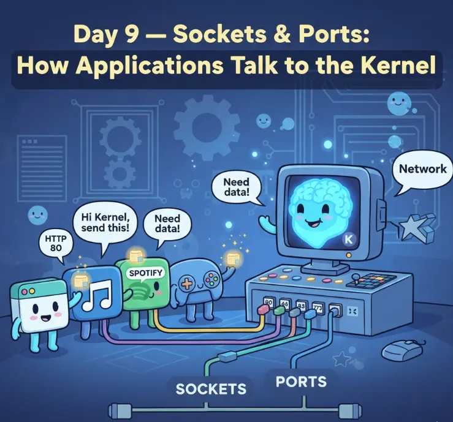
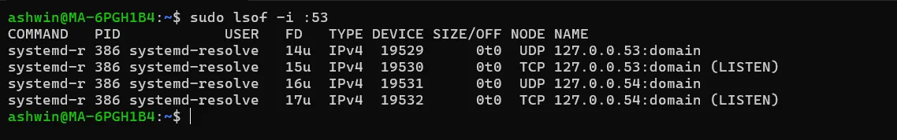
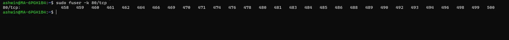
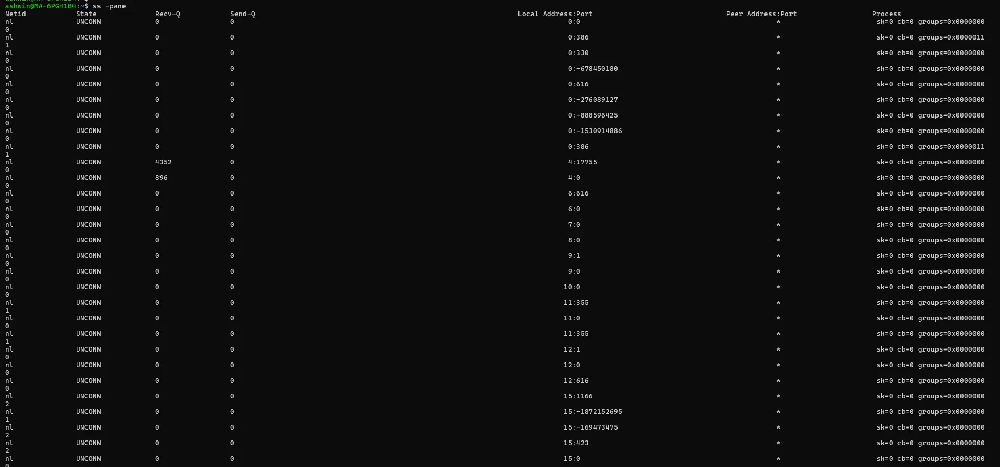
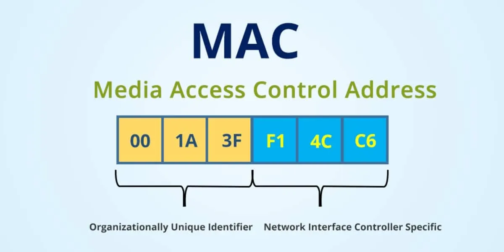
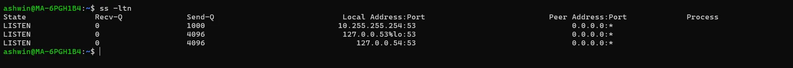
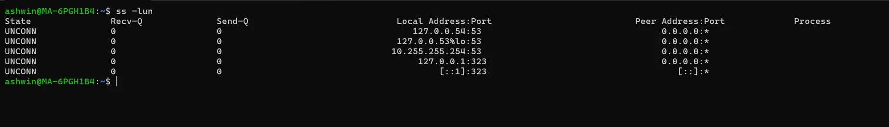

# დღე 9 — სოკეტები და პორტები: როგორ საუბრობენ აპლიკაციები Kernel-თან

გრძელი, ძალიან დამწყებთათვის მისაწვდომი, მაგრამ ღრმად ტექნიკური ახსნა ქსელების ერთ-ერთი ყველაზე მნიშვნელოვანი კონცეფციის შესახებ.

## რატომ აქვს მნიშვნელობა სოკეტებს (მეტი ვიდრე რეალურად ფიქრობთ)

შეიძლება იფიქროთ, რომ პორტები უბრალოდ რიცხვებია როგორიცაა 80, 22, ან 443.
შეიძლება იფიქროთ, რომ სოკეტები მხოლოდ რაღაცაა, რასაც პროგრამისტები ქმნიან.

მაგრამ სიმართლე ისაა:

**ყველა ქსელის კავშირი, რომელსაც თქვენი მანქანა ქმნის, არის სოკეტი.**
**ყველა სერვისი, რომელსაც ამჟღავნებთ, იყენებს პორტებს.**
**ყველა აპლიკაცია, რომელიც საუბრობს ქსელით, იყენებს სოკეტებს.**

როცა თქვენ:
- ხსნით ვებსაიტს
- აშვებთ მიკროსერვისს
- ssh-ით შედიხართ სერვერზე
- curl-ით უძახებთ API-ს
- უკავშირდებით მონაცემთა ბაზას
- აშლით აპლიკაციებს Kubernetes-ში
- ამჟღავნებთ პორტებს Docker-ში
- იყენებთ ტვირთის გამანაწილებლებს

... თქვენ იყენებთ სოკეტებს + პორტებს.

დღეს, ავხსნი ყველაფერს:
- ანალოგიებით
- დიაგრამებით
- მარტივი დაშლებით
- რეალური DevOps/SRE მაგალითებით
- ინსტრუმენტებით (`ss`, `lsof`, `netstat`)

ეს არის ერთ-ერთი ყველაზე მნიშვნელოვანი თავი ქსელებში.



## ნაწილი 1 — რა არის პორტი? (ახსნილია როგორც 10 წლის ბავშვისთვის)

წარმოიდგინეთ, რომ თქვენი კომპიუტერი არის დიდი საცხოვრებელი შენობა.
შენობის შიგნით ცხოვრობს ბევრი ადამიანი (აპლიკაციები).

**თქვენს შენობას აქვს 65,536 კარი (პორტები).**

ყველა აპლიკაცია ცხოვრობს კონკრეტული კარის უკან.

მაგალითები:
- **პორტი 22** → SSH
- **პორტი 80** → HTTP ვებსაიტი
- **პორტი 443** → HTTPS ვებსაიტი
- **პორტი 3306** → MySQL
- **პორტი 6379** → Redis
- **პორტი 5432** → Postgres

თუ გსურთ ეწვიოთ ადამიანს, რომელიც ცხოვრობს ბინა #22-ში → მიდიხართ კარი 22-ზე.

იგივე გზით:
თუ კლიენტს სურს ესაუბროს თქვენს SSH სერვერს → ის მიდის პორტ 22-ზე.

**მარტივი წესი:**
IP იდენტიფიცირებს მანქანას, პორტი იდენტიფიცირებს აპლიკაციას.

## ნაწილი 2 — რა არის სოკეტი? (მარტივად ახსნილი)

სოკეტი არის:

**კომბინაცია:**
IP + პორტი + პროტოკოლი (TCP/UDP)

მაგალითი:
```
192.168.1.10:8080
```
ეს არის სოკეტის მისამართი.

მაგრამ არის კიდევ ერთი ნაბიჯი:
როცა კავშირი დამყარდება, Linux იყენებს 4-tuple-ს:

```
წყაროს IP
წყაროს პორტი
დანიშნულების IP
დანიშნულების პორტი
```

მაგალითი:
```
კლიენტი:  10.0.0.5:55012
სერვერი:  142.250.183.14:443
```

ერთად:
```
10.0.0.5:55012 → 142.250.183.14:443
```

ეს უნიკალური კომბინაცია იდენტიფიცირებს თქვენს კავშირს.

### სოკეტების ანალოგია

წარმოიდგინეთ:
- **თქვენი სახლი = IP მისამართი**
- **კონკრეტული ოთახი სახლში = პორტი**
- **საუბარი ორ ოთახს შორის ორ სხვადასხვა სახლში = სოკეტი**

სოკეტი არის როგორც თქმა:

"ოთახი 55012 სახლში 10.0.0.5 საუბრობს ოთახ 443-თან სახლში Google."

## ნაწილი 3 — სერვერები vs კლიენტები

### სერვერები უსმენენ პორტებზე

ისინი ელოდებიან კავშირებს.

მაგალითი:
- `sshd` უსმენს პორტ 22-ზე
- `nginx` უსმენს პორტ 80/443-ზე
- `postgres` უსმენს პორტ 5432-ზე

გაუშვით:
```bash
ss -tulnp
```

დაინახავთ:
```
LISTEN 0 128 0.0.0.0:22   ...
LISTEN 0 128 0.0.0.0:80   ...
LISTEN 0 128 0.0.0.0:5432 ...
```


### კლიენტები იყენებენ ephemeral პორტებს

როცა უკავშირდებით სერვერს, თქვენი OS აძლევს თქვენს პროგრამას შემთხვევით გამავალ პორტს:

**დიაპაზონი:**
```
49152–65535 (ხშირად)
```

მაგალითი:
```bash
curl google.com
```

თქვენი მანქანა იყენებს:
```
10.0.0.5:55012 → 172.217.167.238:443
```
თქვენი პორტი = 55012 (ephemeral)

## ნაწილი 4 — რატომ არის პორტები საჭირო (უფრო ღრმა მიზეზი)

**პორტების გარეშე:**
- მხოლოდ ერთ აპლიკაციას შეეძლო ქსელის გამოყენება
- ვერ შეძლებდით ბრაუზინგს ჩამოტვირთვის დროს
- Kubernetes pod-ები ვერ საუბრობდნენ
- ტვირთის გამანაწილებლები ვერ მიმართავდნენ ტრაფიკს
- HTTP, DB, Redis — ყველა შეჯახდებოდა

**პორტები საშუალებას აძლევს მრავალ აპლიკაციას იზიარონ იგივე ქსელის სტეკი.**

## ნაწილი 5 — TCP vs UDP სოკეტები (მარტივად ახსნილი)

### TCP = ტელეფონის ზარი

- კავშირზე ორიენტირებული
- სანდო
- დალაგებული
- გარანტირებული მიწოდება
- მოითხოვს handshake-ს

**გამოიყენება:**
- HTTP
- SSH
- მონაცემთა ბაზის კავშირები

### UDP = გაგზავნილი ღია ბარათი

- Fire-and-forget
- გარანტია არ არის
- Handshake არ არის
- სწრაფი
- მსუბუქი

**გამოიყენება:**
- DNS მოთხოვნები
- ვიდეო სტრიმინგი
- VoIP
- თამაშები

## ნაწილი 6 — სოკეტის სასიცოცხლო ციკლი (მნიშვნელოვანი!)

როცა სერვერი უსმენს, მას აქვს **LISTENING** სოკეტი.

როცა კლიენტი უკავშირდება:
- იქმნება ახალი **ESTABLISHED** სოკეტი ამ კავშირისთვის.

მაგალითი:

Nginx:
```
LISTEN 443
```

მომხმარებლები, რომლებიც უკავშირდებიან:
```
ESTAB   local-ip:443 → client-ip:51512
ESTAB   local-ip:443 → client-ip:51513
ESTAB   local-ip:443 → client-ip:51514
```

**ერთ listening სოკეტს შეუძლია მიიღოს მილიონობით established სოკეტი.**

## ნაწილი 7 — პორტების გაგება Linux-ში

### ყველა listening პორტის სია:
```bash
ss -tulnp
```


### იპოვეთ რომელი პროცესი იყენებს პორტს:
```bash
sudo lsof -i :53
```



### მოკალით პროცესი, რომელიც იყენებს პორტს:
```bash
sudo fuser -k 8080/tcp
```


### აჩვენეთ ყველა სოკეტი:
```bash
ss -pane
```


## ნაწილი 8 — ხშირი მდგომარეობები (მაღალი დონის შესავალი)

ხვალ ღრმად ჩავუღრმავდებით ყველა მდგომარეობას.
დღეს, სწრაფი მიმოხილვა:

### 🔹 LISTEN
სერვერი ელოდება კავშირებს.

### 🔹 SYN-SENT / SYN-RECV
Handshake მიმდინარეობს.

### 🔹 ESTABLISHED
აქტიური კავშირი.

### 🔹 TIME_WAIT
სოკეტი ელოდება დახურვამდე.
(ხელს უშლის უცნაურ პაკეტების შერევას.)

### 🔹 CLOSE_WAIT
დისტანციურმა დახურა, თქვენმა აპლიკაციამ არა.

### 🔹 FIN_WAIT
დახურვის handshake მიმდინარეობს.

ეს მდგომარეობები ჩნდება როცა იყენებთ:
```bash
ss -tan
```

**ხვალ ღრმად ავხსნით ყველა მათგანს.**

## ნაწილი 9 — რა ხდება როცა ასრულებთ:

```bash
curl google.com
```

### ნაკადი:

1️⃣ DNS ამოხსნის `google.com` → IP
2️⃣ თქვენი kernel ირჩევს შემთხვევით წყაროს პორტს - მაგალითად: `55012`
3️⃣ Kernel ქმნის სოკეტს:
```
10.0.0.5:55012 → 142.250.183.14:443
```
4️⃣ TCP handshake იწყება
5️⃣ TLS handshake
6️⃣ მონაცემების გადაცემა
7️⃣ კავშირი იხურება (FIN, TIME_WAIT)

**ხვალ დავშლით handshake-ს.**

## ნაწილი 10 — ანალოგია: როგორ საშუალებას აძლევს სოკეტები Multi-Tasking-ს

წარმოიდგინეთ, რომ თქვენ გყავთ 10 მეგობარი, რომლებიც სტუმრობენ თქვენს სახლს.
თითოეული კაკუნებს სხვადასხვა კარზე (პორტი).

თქვენ:
- ხსნით კარს 22 → საუბრობთ SSH-ზე
- ხსნით კარს 80 → აგზავნით ვებსაიტს
- ხსნით კარს 3306 → ემსახურებით MySQL-ს
- ხსნით კარს 5432 → ემსახურებით Postgres-ს

**ყველა კარი = ცალკე საუბარი.**

სწორედ ეს აკეთებს პორტები.

## ნაწილი 11 — რეალური DevOps/SRE დებაგინგის სცენარები

### სცენარი 1 — "პორტი უკვე გამოიყენება"

```bash
sudo lsof -i :8080
```

**ჩვეულებრივ:**
- აპლიკაციის ინსტანსი უკვე გაშვებულია
- ზომბი პროცესი
- სხვა სერვისი მიბმულია ამ პორტზე

**გამოსწორება:**
```bash
sudo fuser -k 8080/tcp
```

### სცენარი 2 — "ჩემ აპლიკაციას არ შეუძლია დაკავშირება პორტზე <1024> root-ის გარეშე"

პორტები 0–1023 არის პრივილეგირებული.

**გადაწყვეტები:**
- გაუშვით როგორც root (არ არის რეკომენდებული)
- ან გამოიყენეთ capabilities:
```bash
sudo setcap 'cap_net_bind_service=+ep' /usr/bin/myapp
```

### სცენარი 3 — "ძალიან ბევრი TIME_WAIT კავშირი"

**ხშირად გამოწვეულია:**
- ტვირთის გამანაწილებლებით
- მოკლევადიანი HTTP კავშირებით
- მაღალი მოთხოვნების სიხშირით

**გამოსწორება:**
- ჩართეთ keep-alive
- დაარეგულირეთ kernel პარამეტრები
- ან გამოიყენეთ connection pooling

### სცენარი 4 — "Kubernetes pod-ს არ შეუძლია დაკავშირება პორტზე"

Pod security policy ან securityContext შეიძლება ბლოკავდეს პორტის დაკავშირებას.

### სცენარი 5 — "ფუნქცია მიკროსერვისებში ძალიან სწრაფად საუბრობს"

Ephemeral პორტების ამოწურვა:
- ძალიან ბევრი გამავალი კავშირი
- კავშირების გამოუყენებლობა

**შეამოწმეთ:**
```bash
ss -s
```

**გამოსწორება:**
- გაზარდეთ ephemeral პორტების დიაპაზონი
- გამოიყენეთ HTTP connection pooling

## ნაწილი 12 — სასარგებლო ბრძანებები (დღე 9)

### ყველა სოკეტის სია (TCP + UDP)
```bash
ss -tuln
```

### სოკეტის მდგომარეობებისა და პროცესების ჩვენება
```bash
ss -tanp
```

### ვინ იყენებს პორტს?
```bash
sudo lsof -i :443
```

### მოკალით პროცესი, რომელიც იყენებს პორტს
```bash
sudo fuser -k 9090/tcp
```

### აჩვენეთ მხოლოდ listening პორტები
```bash
ss -ltn
```


### აჩვენეთ UDP სოკეტები
```bash
ss -lun
```


## შეჯამება (დღე 9)

დღეს ისწავლეთ:
- ✅ რა არის პორტები (კარები აპლიკაციებისთვის)
- ✅ რა არის სოკეტები (IP + პორტი + პროტოკოლი)
- ✅ განსხვავება სერვერ + კლიენტ სოკეტებს შორის
- ✅ Ephemeral პორტები
- ✅ TCP vs UDP სოკეტები
- ✅ სოკეტის მდგომარეობები (LISTEN, ESTAB, TIME_WAIT…)
- ✅ როგორ მართავს Linux-ი კავშირებს
- ✅ როგორ დებაგდება პორტები და სოკეტები `ss`, `lsof`, `fuser`-ით
- ✅ რატომ არის პორტები გადამწყვეტი მიკროსერვისებში, Kubernetes-ში & cloud ქსელებში

**ეს არის ერთ-ერთი ყველაზე მნიშვნელოვანი სამშენებლო ბლოკი თანამედროვე ქსელებისა.**